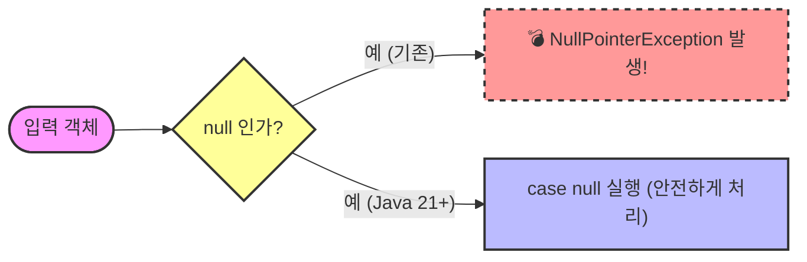

layout: basic
title: "6.5 switch 문의 null 처리"
nav_order: 5
parent: "Chapter 06. 조건문"
grand_parent: "Part 01. 자바 언어의 기초"
---

# 6.5 switch 문의 null 처리

자바 17까지는 표현값이 `null`일 경우 switch 문에서 `NullPointerException`이 발생했지만, 자바 21부터는 다음과 같이 레이블에 `null`을 지정해서 예외를 발생시키지 않고 `null`을 처리할 수 있게 되었다.



```java
switch (object) {
    case null -> { ... } // object가 null일 경우 선택
    case null, default -> { ... } // object가 null이거나 위의 case가 선택되지 않은 경우 선택
}
```
