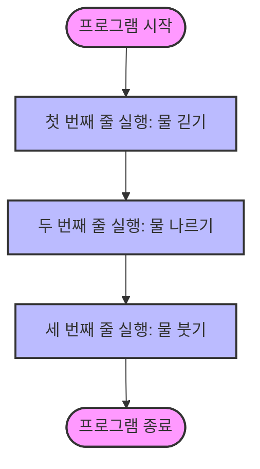
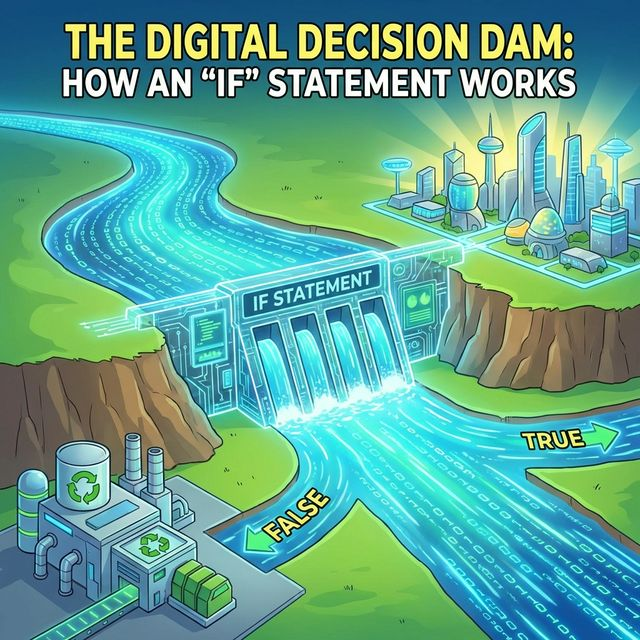
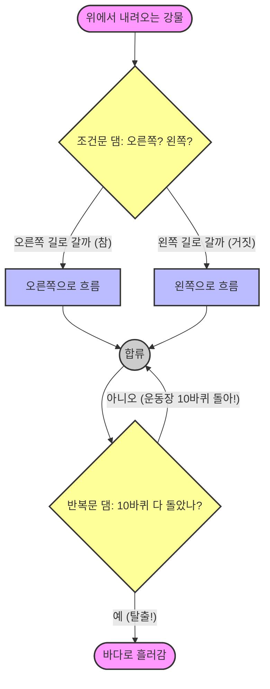

# 6.1 코드 실행 흐름 제어

## 1. 물 흐르듯 실행되는 코드 🌊

자바 프로그램은 기본적으로 `main()` 메소드의 첫 줄부터 마지막 줄까지 **위에서 아래로** 순서대로 실행됩니다.
마치 강물이 위에서 아래로 흐르는 것과 같습니다.

## 2. 댐을 만들어 흐름 바꾸기 (제어문) 🚧

하지만 항상 위에서 아래로만 흐르면 재미없는 프로그램밖에 못 만듭니다.
상황에 따라 물길을 바꾸거나(조건문), 물을 가둬서 빙빙 돌려야(반복문) 할 때도 있습니다.

이런 역할을 하는 것이 **제어문(Control Statement)**입니다.

*   **조건문 (`if`, `switch`)**: "오른쪽 길로 갈까, 왼쪽 길로 갈까?" (갈림길)
*   **반복문 (`for`, `while`)**: "운동장 10바퀴 돌아!" (뺑뺑이)
