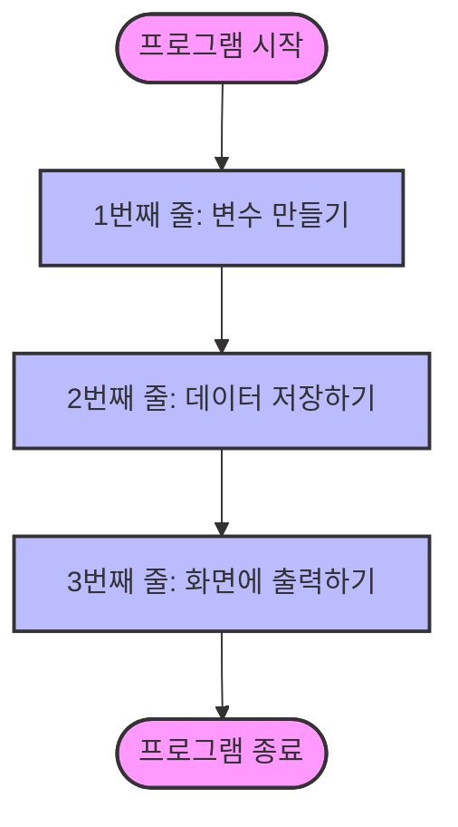
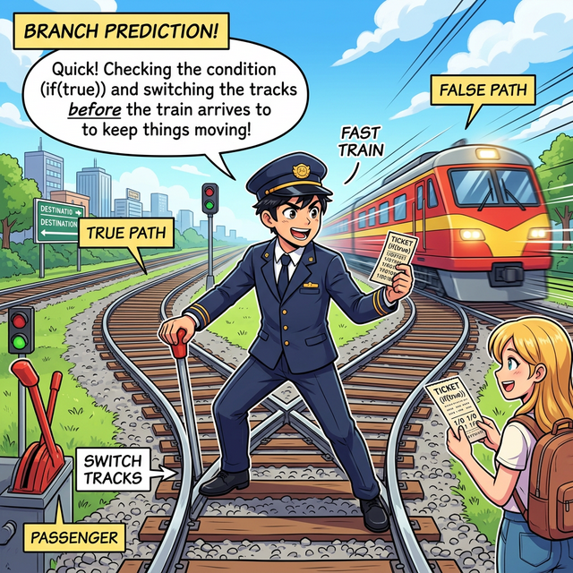

# 6.1 코드 실행 흐름 제어 (Control Flow)

## 1. 기본 원리: 위에서 아래로 떨어지는 강물 🌊

자바 프로그램은 초보자가 글을 읽는 것과 완전히 똑같은 방식으로 실행됩니다. `main()` 메소드의 첫 번째 줄(코드)부터 마지막 줄까지 **위에서 아래로 단 한 줄도 빠짐없이 차례대로** 실행됩니다. 
이는 폭포수가 높은 곳에서 낮은 곳으로 떨어지는 자연의 법칙과 비슷합니다.

```mermaid
flowchart TD
    Start([프로그램 시작]) --> Step1[1번째 줄: 변수 만들기]
    Step1 --> Step2[2번째 줄: 데이터 저장하기]
    Step2 --> Step3[3번째 줄: 화면에 출력하기]
    Step3 --> End([프로그램 종료])

    style Start fill:#f9f,stroke:#333,stroke-width:2px
    style End fill:#f9f,stroke:#333,stroke-width:2px
    style Step1 fill:#bbf,stroke:#333,stroke-width:2px
    style Step2 fill:#bbf,stroke:#333,stroke-width:2px
    style Step3 fill:#bbf,stroke:#333,stroke-width:2px
```

---

## 2. 컴퓨터 두뇌(CPU)는 어떻게 코드를 읽을까? 🧠

우리가 짠 코드는 컴퓨터 메모리(RAM)라는 거대한 도서관의 책장 칸마다 번호(100번지, 104번지..)를 하나씩 부여받아 일렬로 보관됩니다.

CPU(중앙 처리 장치) 안에는 **`Program Counter (PC, 프로그램 카운터)`** 라고 불리는 아주 부지런한 작업 지시서(포인터)가 있습니다. 이 PC 녀석은 기본적으로 번호를 `+1` 씩 증가시키며 다음 읽을 책(코드)의 위치만 죽어라 찾아냅니다. 덕분에 코드가 위에서 아래로 순서대로 실행될 수 있는 기계적 원리가 완성되는 것입니다.

---

## 3. 흐름 바꾸기: 기차역의 선로 변환기 (제어문) 🚂

컴퓨터 프로그램은 기본적으로 메모리를 순차적으로 읽고 실행합니다. 하지만 모든 프로그램이 한 줄로 순차적으로만 실행되는 것은 아닙니다. 
우리의 일상생활을 생각해 볼까요? "비가 오면 우산을 쓰고, 비가 오지 않으면 그냥 나간다"처럼 상황(조건)에 따라서 다르게 대응해야 하는 일들이 무수히 많습니다. 

프로그램 역시 동작하면서 변하는 상태와 데이터에 따라서 특정 경로로 분기하여 다양한 흐름을 처리해야만 합니다. 이렇게 상황에 맞게 물결(흐름)을 강제로 틀어버리는 강력한 도구가 바로 **제어문(Control Statement)** 입니다.

기차역에서 기차의 방향을 상황에 맞게 바꿔주는 열차장(선로 변환기)을 상상해 보세요.

웹툰 속 열차장은 승객의 티켓(조건)을 검사한 뒤, 조건이 '참(`true`)'이라면 곧바로 철로 레버를 조작하여 기차의 방향을 목적지로 틀어버립니다! 필요 없는 코드(거짓일 때 가는 길)는 아예 밟지도 않고 통과해버리는 것이죠.

### 💡 하드웨어에서는 무슨 일이 일어날까? (JUMP 명령)

소프트웨어에서 우리가 `if`나 `for` 같은 제어문을 쓰면, 기계어 세상에서는 **JUMP 명령**으로 변환됩니다. 
CPU의 작업 지시서(PC)가 `104번지` 코드를 읽다가 조건이 거짓이라는 걸 깨달으면, `108번지`를 읽는 대신 곧바로 `116번지`로 강제 점프(순간이동)를 해버립니다! 이걸 컴퓨터 구조 용어로 **분기 지시(Branch Instruction)** 라고 부릅니다.

아래 애니메이션을 보면서 프로그램 단위에서 메모리 번지수가 어떻게 건너 뛰어지는지 눈으로 직접 확인해 보세요.

### 제어문의 종류
이처럼 프로그램 카운터(PC)의 순간이동을 만들어내는 마법 같은 제어문은 크게 두 가지로 나뉩니다.

*   **조건문 (`if`, `switch`)**: "오른쪽 길로 갈까, 왼쪽 길로 갈까?" (교차로)
*   **반복문 (`for`, `while`, `do-while`)**: "이 구간을 10번 뺑뺑이 돌아라!" (회전 교차로)

앞으로 이어질 챕터에서 이 선로 변환기들의 조작법을 자세히 하나씩 배워보겠습니다.

---

## 코딩 영단어 학습 📝

코딩에서 영어 단어의 의미만 정확히 이해해도 절반은 성공입니다! 오늘 배운 핵심 영단어들을 다시 한번 짚고 넘어가 볼까요?

*   **`Control Flow`**: 제어 흐름. (프로그램의 실행 순서를 제어하는 것)
*   **`Statement`**: 구문, 문장. (컴퓨터에게 내리는 하나의 명령 단위)
*   **`Condition`**: 조건. (어떤 일이 일어나기 위해 갖추어야 할 상태)
*   **`Branch`**: 분기. (조건에 따라 실행 경로가 여러 갈래로 나뉘는 것)
