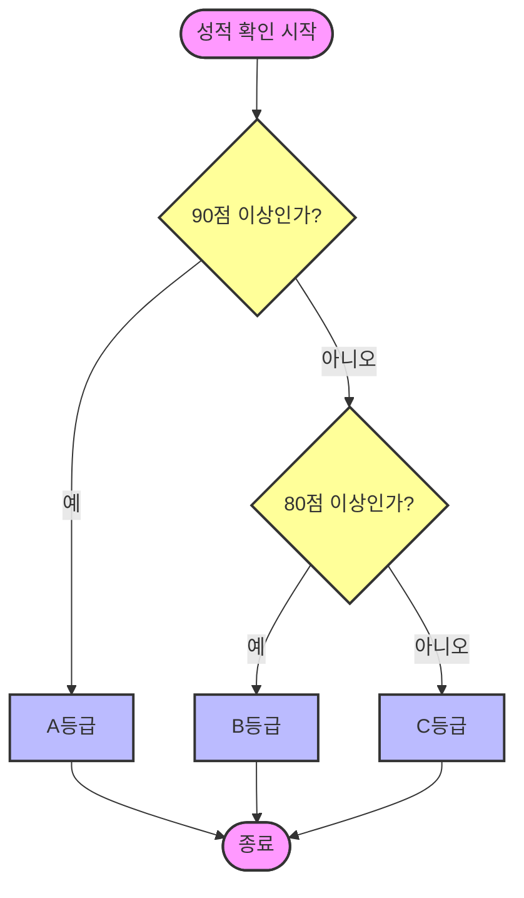

# 6.2 if 문

## 1. 갈림길 만들기 🛣️

**"만약(if) ~라면, 이걸 해라"**
가장 기본적인 조건문입니다.


```java
int score = 90;

if (score >= 90) {
    System.out.println("참 잘했어요!");
}
```

## 2. 양자택일 (`if-else`)

**"만약 ~라면 A를 하고, 아니면(else) B를 해라"**
모 아니면 도, 둘 중 하나를 무조건 선택해야 할 때 씁니다.

```java
if (score >= 60) {
    System.out.println("합격");
} else {
    System.out.println("불합격");
}
```

## 3. 다자택일 (`else if`)

**"A야? 아니면 B야? 그것도 아니면 C야?"**
여러 개의 갈림길이 있을 때 씁니다.



```java
if (score >= 90) {
    System.out.println("A등급");
} else if (score >= 80) {
    System.out.println("B등급");
} else {
    System.out.println("C등급");
}
```

> **주의**: 위에서부터 차례대로 조건을 검사하다가, 하나라도 맞으면 나머지는 쳐다보지도 않고 건너뜁니다.
