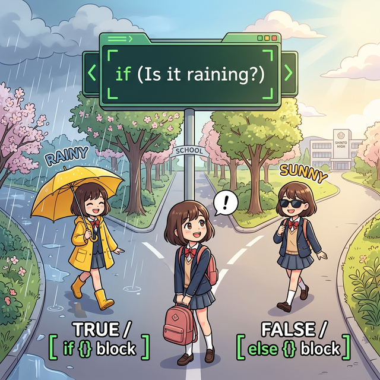
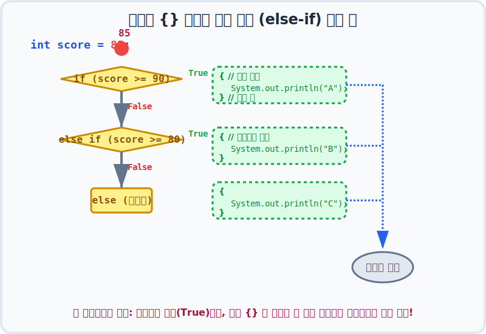
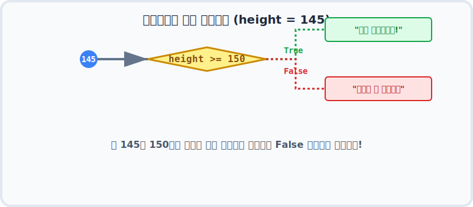
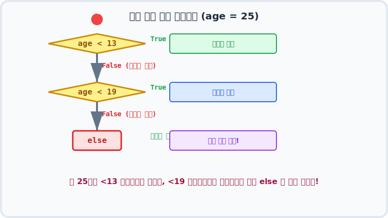

# 6.2 if 문 (조건에 따른 분기)

가장 기본적이고, 프로그래밍에서 절대 빠질 수 없는 핵심 문법입니다. **"만약(if) ~라면, 이걸 해라"** 라는 뜻으로, 컴퓨터에게 직접 판단력을 심어주는 도구입니다.

> **💡 재미있는 사실: 순서도(Flowchart)에서 조건문은 왜 '마름모(◇)' 기호를 쓸까요?**
> 컴퓨터 알고리즘이나 순서도를 그릴 때 판단/조건문은 항상 **마름모(Diamond)** 모양으로 그립니다. 그 유래는 기호가 가진 **기하학적 형태**에 있습니다. 일반적인 직사각형(□)은 입구 하나, 출구 하나로 단순 직진하는 행동을 뜻합니다. 반면 마름모(◇)는 위에서 데이터가 하나 들어왔을 때, **양옆이나 아래의 뾰족한 모서리들을 통해 여러 갈래 길(True / False 등)로 쪼개져서 나가는 모습(분기)** 을 직관적으로 표현하기에 가장 완벽하고 안정적인 도형이기 때문입니다!


---

## 1. 코드 블록 `{}` 과 들여쓰기 🧱

`if` 문을 본격적으로 들어가기 전에 절대 잊어선 안 될 **중괄호 `{}` 방**의 법칙을 알아봅시다.

*   **코드 블록 (Code Block):** 조건이 '참(`true`)'일 때 묶어서 실행할 코드들을 중괄호 `{ }` 로 철저히 감싸주어야 합니다. 이 괄호 안의 무리는 한 몸통처럼 움직입니다.
*   **들여쓰기 (Indentation):** 중괄호 방 안에 들어간 코드는 무조건 키보드의 **Tab키**를 한 번 눌러서 안쪽으로 들여쓰기를 해야 합니다. 그래야만 "아~ 이 코드는 방 안에 속해 있구나!" 하고 한눈에 파악할 수 있습니다.

---

## 2. 단일 갈림길 (`if`) 🛣️

가장 기본적인 형태입니다. 조건식이 `true`이면 `{}` 안의 블록을 실행하고, `false`이면 아무런 행동도 하지 않고 무시하여 지나갑니다.

```java
int score = 90;

if (score >= 90) {                     // 1. 조건 검사: 90점 이상인가? (True)
    System.out.println("참 잘했어요!");  // 2. 들여쓰기 된 블록 안의 코드 강제 실행
    System.out.println("장학금 지급");   // 3. 같은 블록이므로 함께 실행
} // 중괄호 닫기 (블록 종료)

System.out.println("코드 종료");         // 4. 이건 블록 밖이므로 조건과 무관하게 무조건 실행
```

---

## 3. 양자택일 (`if - else`) 🌂🕶️

조건에 따라 A행동을 하거나, 아니면 무조건 B행동을 해야 하는 모 아니면 도 상황에 사용합니다.



위 웹툰 주인공처럼 등굣길 갈림길에 섰을 때:
1. `"비가 오는가? (True)"` ➔ 왼쪽 길로 빠져서 노란 우산을 쓰는 블록 `{}` 실행
2. `"비가 오지 않는가? (False)"` ➔ 묻지도 따지지도 않고 오른쪽 `else` 길로 빠져 선글라스를 끼는 블록 `{}` 실행

```java
boolean isRaining = true;

if (isRaining) {              // 참일 때 갈 길
    System.out.println("노란 우산을 쓴다.");
} else {                      // 거짓일 때 무조건 갈 길
    System.out.println("선글라스를 낀다.");
}
```

---

## 4. 다자택일 연쇄 분기 (`if - else if - else`) 🚦

**"A야? 아니면 혹시 B야? 그것도 아니면 C야?"**
성적 구간(A, B, C, F 등급)처럼 갈림길이 3개 이상일 때 연쇄적으로 조건을 달 수 있습니다.



위 애니메이션 흐름표의 핵심은 위에서부터 한 칸씩 순서대로 검문을 지나간다는 점입니다! 위쪽 검문소에서 합격(True) 판정을 받으면, 그 즉시 해당하는 파이프 안의 코드 `{}` 만 실행하고 **가차 없이 나머지 아랫쪽 껍데기 검문소들은 쳐다보지도 않고 통째로 건너뛰어(점프) 버립니다!**

```java
int score = 85;

if (score >= 90) {                  // 첫 번째 검문 (1순위 질문)
    System.out.println("A등급");
} else if (score >= 80) {           // 90점이 정답이 아니면 그제서야 물어봄 (2순위)
    System.out.println("B등급");     // 85점은 여기서 참이므로 출력하고 루프 탈출!
} else if (score >= 70) {           // 여긴 아예 질문도 하지 않고 무시됨
    System.out.println("C등급");
} else {                            // 모든 조건에 실패하면 짬통처럼 모이는 곳
    System.out.println("F등급");
}
```

---

## 5. 중첩 `if` 문 (조건 안의 조건) 🪆

조건 방 `{}` 안에 또 다른 조건 방 `{}` 을 러시아 인형(마트료시카)처럼 계속 만들어 낼 수도 있습니다. 이를 **중첩(Nested) 조건문**이라고 부릅니다. 세밀한 2차 심사가 필요할 때 쓰입니다. 

중괄호 방 안에 또 방이 생겼으니, **들여쓰기도 한 단계가 더 깊어집니다(Tab 키 2번).**

```java
int score = 95;
boolean isAbsent = false; // 결석 여부

// 1차 심사문
if (score >= 90) { 
    System.out.println("일단 A등급 후보군입니다.");
    
    // 2차 정밀 심사문 (A등급 후보들만 진입하는 방)
    if (isAbsent == false) {         // 결석을 안 했으면 (True)
        System.out.println("최종: A+ 등급입니다!");
    } else {                         // 결석을 1번이라도 했으면
        System.out.println("최종: A0 등급입니다.");
    }

} else {          
    System.out.println("A등급을 받지 못했습니다.");
}
```

> **👨‍💻 무한 중첩 금지:**
> 이런 식으로 `if` 안에 `if`, 그 안에 또 `if`를 3단계 이상 깊이로 파고들면, 들여쓰기가 우측으로 무한히 밀리면서 극도로 지저분한 이스케이프(Escape) 코드가 되어버립니다. 3단계가 넘어갈 조짐이 보이면 조건식에 논리 연산자(`&&`, `||`)를 활용하여 깔끔하게 합치는 것을 추천합니다!

---

## 6. 조건문의 양면성: 유연성 vs 성능 ⚖️

프로그램을 만들 때 조건문을 얼마나 적절하게 사용하느냐에 따라 프로그램의 성격이 크게 달라질 수 있습니다.

### 👍 장점: 무한한 상황 대처 능력 (유연성)
*   프로그램이 단순히 하나의 정해진 길만 가는 깡통 로봇이 아니라, **사용자의 다양한 입력이나 예측할 수 없는 상황에 유연하게 대처하는 지능**을 갖게 됩니다.
*   에러가 발생할 만한 상황(예: 입력값이 0일 때, 파일이 없을 때)을 미리 조건문으로 막아주면 프로그램이 갑자기 뻗어버리는 것을 방지하는 **방어적 프로그래밍**이 가능해집니다.

### 👎 단점: CPU의 피로도 증가 (실행 성능 저하)
*   **분기 예측 실패(Branch Prediction Penalty):** 앞서 배운 것처럼 조건문은 CPU(Program Counter)의 강제 점프를 유발합니다. CPU는 평소에 "아마 이 길로 갈 거야"라고 미리 짐작해서 코드를 로딩해두는데(분기 예측), 조건문이 너무 복잡해서 예측이 틀려버리면 로딩해 둔 코드를 다 버리고 처음부터 다시 읽어와야 하므로 **실행 속도가 뚝 떨어집니다.**
*   가독성 하락: 불필요하게 `if-else`가 수십 개씩 도배된 코드는 유지보수하는 동료 개발자에게 큰 고통을 줍니다. (이럴 때는 다형성이나 디자인 패턴으로 해결하는 것이 좋습니다.)

**결론:** 조건문은 프로그램에 지능을 불어넣는 필수불가결한 도구지만, 너무 남발하면 컴퓨터와 동료 개발자 모두를 지치게 만들 수 있으니 **꼭 필요한 분기만 명확하게 짜는 설계**가 중요합니다!

---

## 7. 바이브 코딩(Vibe Coding): AI와 함께하는 조건문 실습 🤖

요즘 대세인 AI 코딩 어시스턴트(ChatGPT, Claude, Gemini 등)를 활용하여 자연어로 자바 코드를 생성해보는 실습입니다. 아래의 **'프롬프트(명령어)'** 를 복사해서 AI에게 그대로 붙여넣기 해보세요!

### 🎯 실습 1. 놀이공원 롤러코스터 탑승 조건 (if-else)

> **🗣️ 학생 프롬프트 (AI에게 이렇게 명령해 보세요):**
> "자바(Java) 언어로 놀이공원 롤러코스터 탑승 가능 여부를 알려주는 프로그램을 만들어줘. 
> 내 키(height) 변수는 145이고, 
> 만약 키가 150 이상이면 '탑승 가능합니다!'를 출력하고, 아니면 '키가 작아서 탑승할 수 없습니다.'를 출력해 줘."

**[AI가 생성할 자바 코드 예측]**
```java
public class Rollercoaster {
    public static void main(String[] args) {
        int height = 145;

        if (height >= 150) {
            System.out.println("탑승 가능합니다!");
        } else {
            System.out.println("키가 작아서 탑승할 수 없습니다.");
        }
    }
}
```

**[코드 실행 흐름 애니메이션]**


**[실행 결과]**
```text
키가 작아서 탑승할 수 없습니다.
```

---

### 🎯 실습 2. 극장 요금 계산기 (다중 분기 else if)

> **🗣️ 학생 프롬프트 (AI에게 이렇게 명령해 보세요):**
> "자바로 극장 요금을 계산하는 if-else if 문 예제를 만들어줘.
> 나이(age) 변수는 25살이야.
> 1. 나이가 13세 미만이면 '어린이 요금: 7,000원'
> 2. 나이가 13세 이상이고 19세 미만이면 '청소년 요금: 10,000원'
> 3. 그 외의 나이(19세 이상)면 '성인 요금: 15,000원'을 출력하도록 조건문을 상세히 작성해 줘."

**[AI가 생성할 자바 코드 예측]**
```java
public class CinemaTicket {
    public static void main(String[] args) {
        int age = 25;

        if (age < 13) {
            System.out.println("어린이 요금: 7,000원");
        } else if (age < 19) {  // 이미 위에서 13세 미만은 걸러졌으므로 '13세 이상' 조건은 생략 가능
            System.out.println("청소년 요금: 10,000원");
        } else {
            System.out.println("성인 요금: 15,000원");
        }
    }
}
```

**[코드 실행 흐름 애니메이션]**


**[실행 결과]**
```text
성인 요금: 15,000원
```

---

## 코딩 영단어 학습 📝

코딩에서 영어 단어의 의미만 정확히 이해해도 절반은 성공입니다! 오늘 배운 핵심 영단어들을 다시 한번 짚고 넘어가 볼까요?

*   **`If`**: 만약 ~라면. (주어진 조건이 참일 때 블록 안의 코드를 실행)
*   **`Else`**: 그 외에, 그렇지 않으면. (if 조건이 거짓일 때 무조건 실행되는 예비 경로)
*   **`Block`**: 블록. (중괄호 `{}`로 묶인 코드의 뭉치, 하나의 실행 단위)
*   **`Nested`**: 중첩된. (if문 안에 또 다른 if문이 들어있는 형태)
*   **`Indentation`**: 들여쓰기. (코드의 계층 구조를 시각적으로 보여주기 위해 탭(Tab)이나 공백을 띄우는 것)
