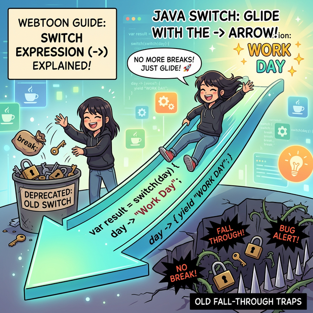

# 6.4 (심화) 개선된 switch 문 (Java 12+) ✨

> **💡 알림:** 이 챕터는 자바 12 버전 이상부터 사용할 수 있는 최신 문법을 다룹니다. 초보자분들은 6.3장의 기본 `switch` 문법(콜론 `:` 과 `break;` 사용)을 먼저 완벽히 이해하신 후 이 장을 보시는 것을 추천합니다!

---

## 1. 굿바이 `break;`! 화살표(`->`)의 등장 🚀

과거의 자바 개발자들은 "아니 굳이 매번 `break;` 를 꼭 써야 해? 너무 귀찮고 빼먹기도 쉽잖아!" 라며 불만을 가졌습니다. `break;`를 실수로 빼먹으면 폭포수처럼 코드가 밑으로 흘러내려버리는(Fall-through) 끔찍한 버그가 발생했기 때문입니다.

그래서 **Java 12** 버전부터는 코드를 훨씬 간결하고 안전하게 짤 수 있는 **'화살표(`->`) Switch 표현식(Expression)'** 이 새롭게 만들어졌습니다.



**기존 기본형과의 핵심 차이점:**
1.  **화살표(`->`) 사용:** 케이스 뒤에 콜론(`:`) 대신 화살표(`->`)를 씁니다.
2.  **`break` 영구 퇴출!:** 화살표 함수는 해당 조건이 맞으면 **블록 하나만 딱 실행하고 알아서 깔끔하게 조건문을 탈출**합니다. 즉, 의도치 않은 폭포수 현상(Fall-through)이 구조적으로 불가능해집니다.
3.  **여러 조건 묶기:** `case 1, 2, 3 ->` 처럼 쉼표(`,`)를 써서 여러 조건을 아주 쉽게 한 줄로 합칠 수 있습니다.

---

## 2. 기본형과 개선형 비교해 보기 🔍

가장 단순한 예제로 예전 방식과 최신 방식이 어떻게 달라졌는지 눈으로 확인해 봅시다.

### 🚫 옛날 방식 (기본 switch)
```java
// 기존 방식은 코드가 길고 break를 일일이 써야 합니다.
switch(grade) {
    case 'A':
    case 'a':
        System.out.println("우수 회원입니다.");
        break; // 탈출!
    case 'B':
    case 'b':
        System.out.println("일반 회원입니다.");
        break; // 탈출!
    default:
        System.out.println("손님입니다.");
}
```

### ✨ 최신 방식 (화살표 switch)
```java
// 최신 방식은 쉼표로 묶고 화살표로 직행합니다. 코드가 절반으로 줄어듭니다!
switch(grade) {
    case 'A', 'a' -> System.out.println("우수 회원입니다.");
    case 'B', 'b' -> System.out.println("일반 회원입니다.");
    default -> System.out.println("손님입니다.");
}
```

---

## 3. 값을 만들어내는 마법: Switch 표현식 (Expression) 🎁

질문하신 **`변수 = switch() { ... }`** 형태는 바로 이 개선된 `switch` 문의 핵심이자 꽃입니다! 
이 문법은 Java 12, 13에서 프리뷰 형태로 등장했다가 **Java 14 버전부터 정식으로 확정(Standardized)** 되었습니다.

프로그래밍에서 **표현식(Expression)** 이란 계산을 통해 **하나의 결과값(Value)** 을 만들어내는 코드를 말합니다.
즉, 기존의 `switch`는 어떤 '행동'을 하기 위한 명령어 집합(Statement)이었지만, 이제는 `switch` 문 전체가 1500, "콜라" 같은 **하나의 거대한 값(데이터)으로 변신**하여 곧바로 변수에 대입할 수 있게 된 것입니다.

### 🎯 실습: 자판기 요금 계산기 (값을 반환하는 Switch)

가장 강력한 신기능입니다. 변수 선언 시 이퀄(`=`) 뒤에 바로 `switch`를 붙여서 결과값을 받아냅니다.

> **🗣️ 학생 프롬프트 (AI에게 이렇게 명령해 보세요):**
> "Java 14 정식 기능인 Switch 표현식(Expression)을 써서 자판기 음료 가격을 변수에 바로 넣는 예제를 줘. 
> 문자열 변수 drink가 '콜라'야.
> switch 자체가 값을 반환하도록 화살표(->) 우측에 바로 숫자를 적고, 그 결과를 int price 변수에 대입해 줘.
> 콜라나 사이다면 1500, 환타면 1200, 나머진 0을 반환하게 짜 줘."

**[AI가 생성할 자바 코드 예측]**
```java
public class VendingPrice {
    public static void main(String[] args) {
        String drink = "콜라";

        // 우와! switch 문 전체가 마치 하나의 계산된 '값'처럼 취급되어 price 변수에 쏙 들어갑니다.
        // System.out.println을 쓰지 않고 화살표 우측에 '결과 데이터'만 적어냅니다.
        int price = switch (drink) {
            case "콜라", "사이다" -> 1500;
            case "환타" -> 1200;
            default -> 0;
        }; // 주의점! 변수에 값을 대입하는 명령문이 끝난 것이므로, switch의 마지막 중괄호 뒤에 세미콜론(;)이 필수입니다!

        System.out.println("선택하신 " + drink + "의 가격은 " + price + "원 입니다.");
    }
}
```

**[실행 결과]**
```text
선택하신 콜라의 가격은 1500원 입니다.
```

---

## 4. `yield` 키워드 (Java 13+) 🔑

만약 화살표(`->`) 우측에서 코드를 여러 줄 작성해야 하는데(중괄호 `{}` 사용), 그 여러 줄의 연산 끝에 최종적으로 하나의 '값'을 바깥으로 던져주며(반환하며) 끝내려면 어떻게 해야 할까요? 

원래는 `return`을 써야 할 것 같지만, Java 13부터는 `switch` 블록 안에서 값을 반환할 때는 **`yield`**(산출하다, 넘겨주다)라는 새로운 전용 키워드를 사용하도록 규칙이 정해졌습니다.

```java
int score = 85;

String grade = switch (score / 10) {
    case 10, 9 -> "A";
    case 8 -> {
        System.out.println("아깝네요! 조금만 더 하면 A입니다.");
        yield "B"; // 여러 줄(중괄호 안)의 코드 실행 후 마지막에 "B"라는 값을 밖으로 산출함!
    }
    default -> "C";
};
```

이처럼 `yield`는 복잡한 로직을 거친 뒤에 최종 결과값을 내뱉어주는 역할을 합니다.
