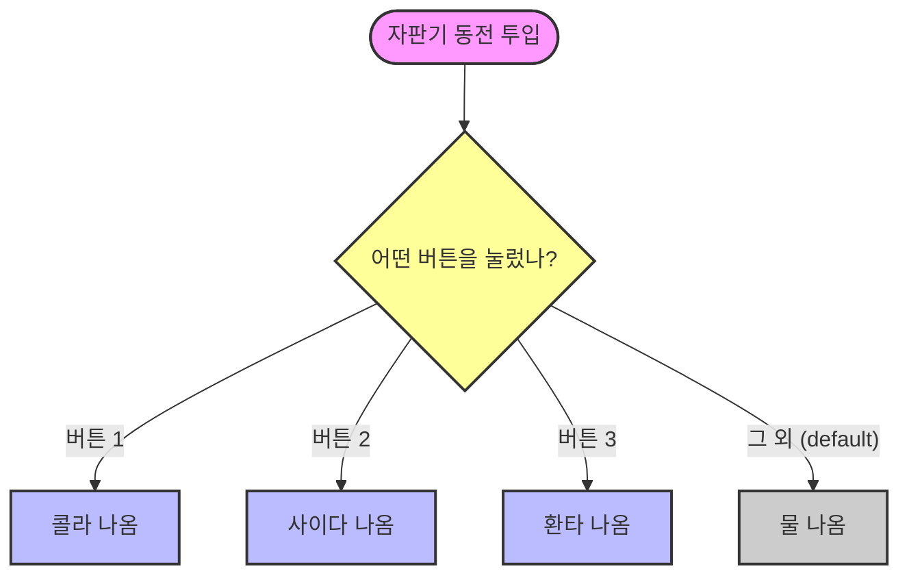

# 6.3 switch 문

## 1. 자판기 버튼 누르기 🎰

`if` 문은 "이거 맞아? 아니면 저거?" 하고 하나씩 물어보는 스무고개와 같습니다.
반면 `switch` 문은 **"값이 1이면 여기, 2면 저기"** 하고 딱딱 정해진 곳으로 바로 이동합니다.
마치 자판기 버튼을 누르면 해당 음료수가 바로 나오는 것과 비슷합니다.



```java
int num = 1;

switch(num) {
    case 1:
        System.out.println("1번이 나왔습니다.");
        break;
    case 2:
        System.out.println("2번이 나왔습니다.");
        break;
    default:
        System.out.println("1도 2도 아닙니다.");
}
```

## 2. `break` (탈출!)

`case` 끝에는 반드시 **`break;`**를 써줘야 합니다.
안 그러면 멈추지 않고 밑에 있는 코드까지 줄줄이 실행됩니다(Fall-through).
(물론 의도적으로 `break`를 뺄 때도 있지만, 대부분은 실수입니다.)

## 3. `default`

`if` 문의 `else`와 같습니다.
어떤 `case`에도 해당하지 않을 때 실행됩니다.
