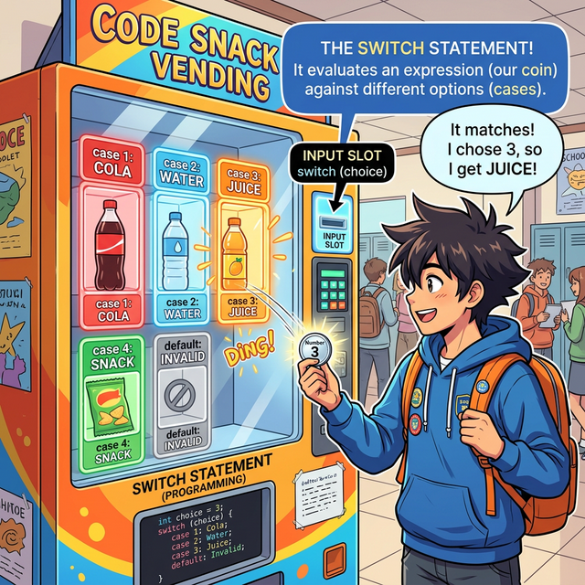
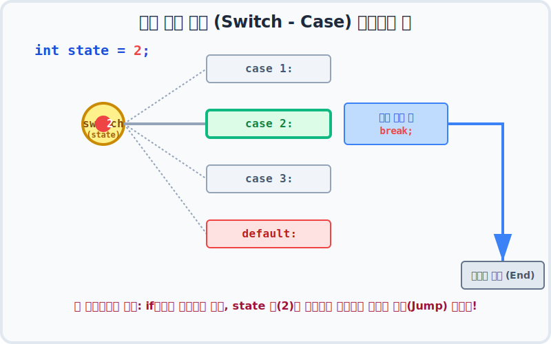
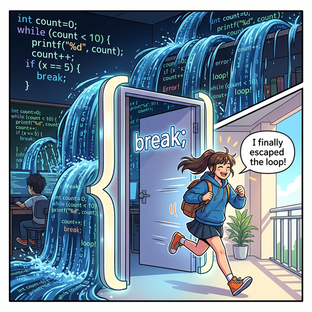

# 6.3 switch 문 (상태 기반 분기)

`if` 문이 "참(True)이냐 거짓(False)이냐?"를 묻는 스무고개라면, `switch` 문은 **"네가 지금 가진 값(상태)이 뭐야? 아, 2번이야? 그럼 2번 방으로 바로 들어가!"** 하고 곧바로 꽂아버리는 **상태 기반 라우터(Router)** 입니다.

---

## 1. 자판기 버튼 누르기 (동작 원리) 🎰

`switch` 문의 핵심은 조건을 하나하나 읽어보며 내려가는 `if-else if`와 다르게, 변수가 가진 값(`state`)에 해당하는 `case` 구간으로 **점프(Jump)** 한다는 점입니다. 마치 자동판매기에서 버튼을 누르면 해당 음료수가 바로 떨어지는 것과 완벽히 같습니다.



*   `if` 문 방식: "너 1번 버튼이니? (아뇨) 너 2번 버튼이니? (아뇨) 너 3번 버튼이니? (네!) ➔ 음료 3번 배출"
*   `switch` 문 방식: "너 무슨 버튼 눌렀어? (3번이요) ➔ **바로 음료 3번으로 직행 및 배출!**"

### 💡 파이프라인 애니메이션
아래 데이터 흐름을 보면 하나씩 찔러보는 것이 아니라, 입력된 값(`2`)의 라인으로 곧바로 직행하는 모습을 볼 수 있습니다.



---

## 2. 구조 및 문법 📐

```java
int button = 2; // 학생이 누른 자판기 버튼 

switch (button) {           // "누른 버튼(상태값)이 뭐야?"
    case 1:                 // "1번 상태라면 여기부터 실행해라"
        System.out.println("콜라가 나왔습니다.");
        break;              // "볼일 다 봤으면 스위치 문을 탈출해라!"
    
    case 2:                 // "2번 상태라면 (학생이 누른 버튼)"
        System.out.println("사이다가 나왔습니다."); // <- 이 위치로 바로 점프하여 실행됨
        break;              // <- 실행 후 탈출!
    
    case 3:
        System.out.println("환타가 나왔습니다.");
        break;

    default:                // "위의 case 중 아무것도 일치하지 않는다면 (if의 else 역할)"
        System.out.println("버튼을 잘못 누르셨습니다.");
}
```

---

## 3. 핵심 규칙: `break`의 마법 🚪

`switch` 문에서 가장 주의해야 할 녀석이자 뗄레야 뗄 수 없는 짝꿍이 바로 **`break;` (탈출 명령어)** 입니다.

### 🛑 `break`의 진정한 의미: "가장 가까운 제어문을 산산조각 내고 탈출하라!"
컴퓨터 과학에서 `break`는 단순히 멈추라는 뜻이 아니라, 자신이 속해 있는 방(`switch`나 반복문 블록 `{}`)을 완전히 부수고 바깥으로 빠져나가라는(Escape) 뜻입니다. 



`switch` 문은 똑똑하게 해당 번호로 점프하는 것까지는 잘하지만, **거기서 알아서 멈출 줄은 모릅니다.** 
만약 `case 2`에 도착해서 "사이다"를 출력했는데 밑에 `break`가 없다면 어떻게 될까요? 브레이크 고장 난 자동차처럼 밑으로 줄줄 흘러내리면서 `case 3`의 "환타", 심지어 `default`까지 싸그리 다 거치며 실행해 버립니다. 이처럼 코드가 아래로 폭포수처럼 쏟아져 내리는 현상을 가리켜 **폴스루(Fall-through)** 라고 부릅니다.

물방울이 밑으로 다 새어버리는 것을 막기 위해, 각 `case` 블록의 마지막에는 반드시 `break;` 를 자물쇠처럼 걸어서 **"내 블록이 끝났으니 쿨하게 조건문을 빠져나가라!"** 고 컴퓨터에게 명시적으로 알려주어야만 대참사를 막을 수 있습니다.

> **💡 실무 활용 팁 (의도적인 폴스루):**
> 초보자에겐 실수지만, 고수들은 이 '멈추지 않는 폭포수 성질'을 오히려 역이용합니다.
> `case 1: case 2: case 3: System.out.println("1분기입니다."); break;` 처럼 1, 2, 3월의 상태문을 합쳐서 짤 때 `break`를 고의로 생략하여 코드를 묶어버리는 세련된 스킬을 구사하기도 합니다.

---

## 4. 바이브 코딩(Vibe Coding): AI와 함께하는 실습 🤖

AI 프롬프트를 활용하여 `switch` 문과 `break` 규칙을 가진 실습 예제를 만들어봅시다!

### 🎯 실습 1. 월별 계절 판독기 (고의적 폴스루 활용)

> **🗣️ 학생 프롬프트 (AI에게 이렇게 명령해 보세요):**
> "자바(Java) 언어로 이번 달(month)이 무슨 계절인지 알려주는 프로그램을 짜줘.
> 변수 month는 4야.
> switch-case 문을 사용하고, break를 의도적으로 생략하는 폴스루(Fall-through) 기법을 써서 3~5월은 '봄', 6~8월은 '여름', 9~11월은 '가을', 12~2월은 '겨울'이라고 출력되게 해 줘."

**[AI가 생성할 자바 코드 예측]**
```java
public class SeasonChecker {
    public static void main(String[] args) {
        int month = 4;

        switch (month) {
            case 3:
            case 4:  // <- 4번으로 점프 후, 밑으로 흘러내려가 실행됨!
            case 5:
                System.out.println("따뜻한 봄입니다. 🌱");
                break; // 여기서 탈출!
            
            case 6: case 7: case 8:
                System.out.println("더운 여름입니다. ☀️");
                break;
                
            case 9: case 10: case 11:
                System.out.println("시원한 가을입니다. 🍁");
                break;
                
            case 12: case 1: case 2:
                System.out.println("추운 겨울입니다. ⛄");
                break;
                
            default:
                System.out.println("존재하지 않는 달입니다.");
        }
    }
}
```

**[실행 결과]**
```text
따뜻한 봄입니다. 🌱
```

---

### 🎯 실습 2. 신호등 색상 판독기 (문자열 `String` 활용)

> **🗣️ 학생 프롬프트 (AI에게 이렇게 명령해 보세요):**
> "자바 언어로 신호등 색상을 판독하는 switch 문 예제를 짜줘.
> 변수 color는 '초록'으로 설정하고,
> '빨강'이면 '정지하세요.', '노랑'이면 '주의하세요.', '초록'이면 '출발하세요.' 라고 출력되게 해줘. 
> 그 외의 색상은 '잘못된 신호입니다.' 라고 처리해 줘."

**[AI가 생성할 자바 코드 예측]**
```java
public class TrafficLight {
    public static void main(String[] args) {
        String color = "초록";

        switch (color) {
            case "빨강":
                System.out.println("정지하세요. 🛑");
                break;
            case "노랑":
                System.out.println("주의하세요. ⚠️");
                break;
            case "초록":
                System.out.println("출발하세요. 🟢");
                break;
            default:
                System.out.println("잘못된 신호입니다. ❓");
        }
    }
}
```

**[실행 결과]**
```text
출발하세요. 🟢
```

---

### 🎯 실습 3. ATM 기기 메뉴 선택기 (정수형 활용)

> **🗣️ 학생 프롬프트 (AI에게 이렇게 명령해 보세요):**
> "자바 언어로 ATM 기기 메뉴를 선택하는 switch-case 문 예제를 만들어줘.
> 변수 menuNumber는 2로 설정하고,
> 1 번이면 '예금 조회를 선택하셨습니다.', 
> 2 번이면 '현금 출금을 선택하셨습니다.', 
> 3 번이면 '계좌 이체를 선택하셨습니다.' 
> 그 외의 번호는 '잘못된 번호를 입력하셨습니다.' 라고 출력되게 해줘."

**[AI가 생성할 자바 코드 예측]**
```java
public class MenuSelector {
    public static void main(String[] args) {
        int menuNumber = 2;

        switch (menuNumber) {
            case 1:
                System.out.println("예금 조회를 선택하셨습니다. 💳");
                break;
            case 2:
                System.out.println("현금 출금을 선택하셨습니다. 💵");
                break;
            case 3:
                System.out.println("계좌 이체를 선택하셨습니다. 💸");
                break;
            default:
                System.out.println("잘못된 번호를 입력하셨습니다. ❌");
        }
    }
}
```

**[실행 결과]**
```text
현금 출금을 선택하셨습니다. 💵
```

---

---

> **💡 객체 지향 프로그래밍(OOP)에서의 `switch` 문 고도화: 상태 패턴(State Pattern)**
> 현업에서 `switch` 문 안에 `case`가 수십 개씩 늘어나면 코드가 너무 길어지고 관리가 힘들어집니다. 이럴 때 자바와 같은 객체 지향 언어에서는 **'상태 패턴(State Pattern)'** 이라는 디자인 패턴(설계 기법)을 사용하여 지저분한 `switch` 문을 아예 없애버리고, 각각의 상태를 독립된 객체(클래스)로 분리하여 훨씬 깔끔하고 유지보수하기 쉬운 코드로 대체하기도 합니다. (이는 나중에 '객체 지향' 파트에서 다루게 됩니다!)
