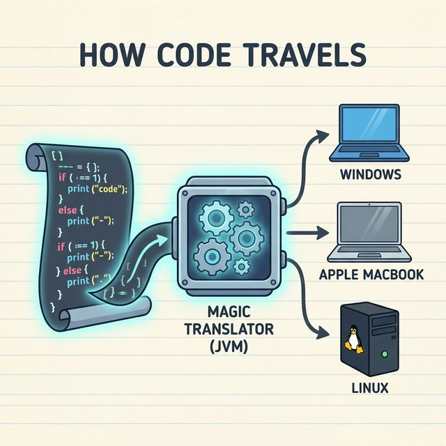
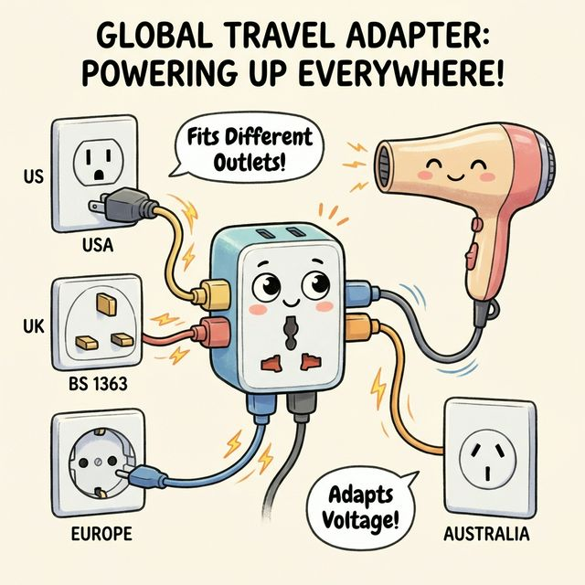
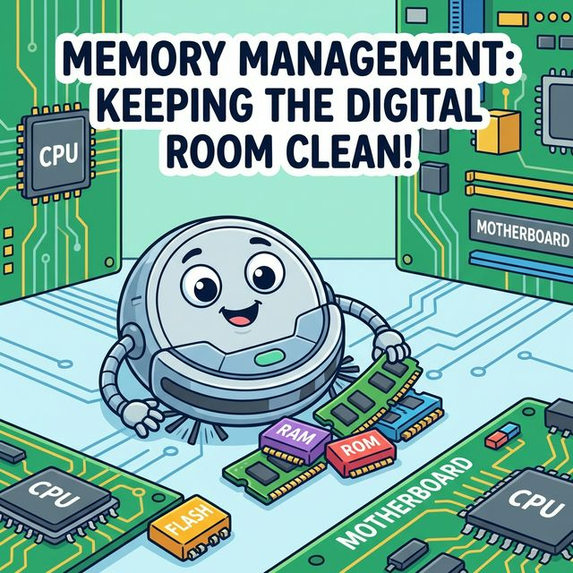
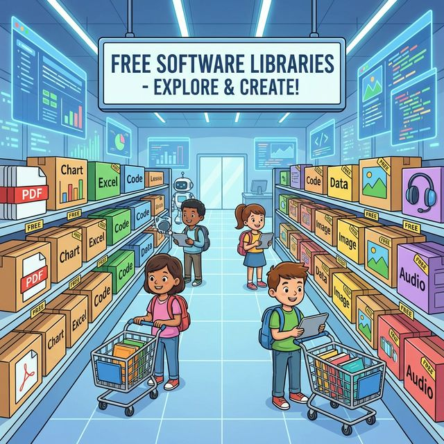

# 1.3 자바의 특징

자바(Java)가 1995년 발표된 이후 지금까지 전 세계 개발자들에게 가장 사랑받는 언어로 자리 잡은 이유는 무엇일까요?
자바만의 강력한 매력 포인트 4가지를 소개합니다. 💎

---

## 1. 이식성: 어디서든 실행된다 (WORA) 🌏

> **"Write Once, Run Anywhere" (한 번 작성하면, 어디서든 실행된다)**

### 1) 개념
일반적인 프로그램(C/C++ 등)은 윈도우용, 맥용, 리눅스용을 각각 따로 만들어야 합니다.
하지만 자바는 **JVM(자바 가상 머신)**이라는 만능 통역사가 있어서, 운영체제(OS)의 종류에 상관없이 **하나의 소스 코드**로 어디서든 실행할 수 있습니다.



### 2) 비유: "만능 여행용 어댑터"
*   해외여행을 갈 때 나라마다 콘센트 모양이 다릅니다(110V, 220V 등). 이때 **멀티 어댑터** 하나만 있으면 전 세계 어디를 가든 내 드라이기를 꽂아 쓸 수 있습니다.
*   자바 프로그램이 **드라이기**라면, JVM은 **멀티 어댑터** 역할을 합니다.



### 3) 실행 구조 시각화

```mermaid
graph TD
    Source[자바 소스 코드] -->|컴파일| Bytecode[바이트 코드 (.class)]
    Bytecode --> WinJVM[윈도우용 JVM]
    Bytecode --> MacJVM[맥용 JVM]
    Bytecode --> LinJVM[리눅스용 JVM]
    
    WinJVM -->|실행| WinOS[Windows]
    MacJVM -->|실행| macOS[macOS]
    LinJVM -->|실행| Linux[Linux]
    
    style Bytecode fill:#ff9,stroke:#333
    style WinJVM fill:#bef,stroke:#333
    style MacJVM fill:#bef,stroke:#333
    style LinJVM fill:#bef,stroke:#333
```

---

## 2. 객체지향 언어: 조립식 프로그래밍 🧱

### 1) 개념
자바는 **객체지향 프로그래밍(OOP, Object-Oriented Programming)** 언어입니다.
프로그램을 통짜로 짜는 것이 아니라, 타이어, 엔진, 핸들 같은 **부품(객체)**을 먼저 만들고, 이들을 **조립**해서 완성품(프로그램)을 만드는 방식입니다.


### 2) 비유: "레고 블록 성 만들기"
*   거대한 성을 한 덩어리의 점토로 빚는다면, 성문이 부서졌을 때 성 전체를 다시 빚어야 할 수도 있습니다.
*   하지만 **레고 블록**으로 성을 만들었다면, 성문 블록만 쏙 빼서 새것으로 **교체(유지보수)**하면 됩니다. 이것이 자바의 강력한 **재사용성**과 **유지보수성**입니다.


---

## 3. 메모리 자동 관리: 청소 로봇 탑재 🧹

### 1) 개념
C언어 같은 과거의 언어는 개발자가 메모리를 빌려 썼으면, 반드시 직접 반납(해제)해야 했습니다. 만약 까먹으면 컴퓨터 메모리가 꽉 차서 멈추는 **메모리 누수(Memory Leak)** 사고가 발생했습니다.
자바는 **가비지 컬렉터(Garbage Collector)**라는 **지능형 청소 로봇**이 내장되어 있어서, 쓰지 않는 메모리를 알아서 찾아내 싹 치워줍니다.



### 2) 비유: "호텔 룸 서비스"
*   우리가 호텔에서 밥을 먹고 그릇을 방치해도, 룸 서비스 직원이 와서 깨끗이 치워줍니다. 손님(개발자)은 식사(코딩)에만 집중하면 됩니다.
*   **개발자**: "메모리? 난 몰라, 가비지 컬렉터가 알아서 하겠지!" (실제로 그렇습니다)


---

## 4. 풍부한 무료 라이브러리: 다이소 같은 생태계 🏪

### 1) 개념
자바는 전 세계 수백만 명의 개발자가 사용하는 만큼, 이미 만들어진 **오픈소스 라이브러리**가 엄청나게 많습니다.
PDF 만들기, 엑셀 파일 읽기, 복잡한 그래프 그리기 등 상상하는 대부분의 기능은 이미 누군가가 만들어서 무료로 공개해 두었습니다.



### 2) 비유: "대형 마트의 밀키트"
*   요리(개발)를 할 때 농사를 짓고 소를 키울 필요가 없습니다. 마트(라이브러리 저장소)에 가서 잘 손질된 재료(라이브러리)를 사 와서 조리법대로 끓이기만 하면 훌륭한 요리가 완성됩니다.

