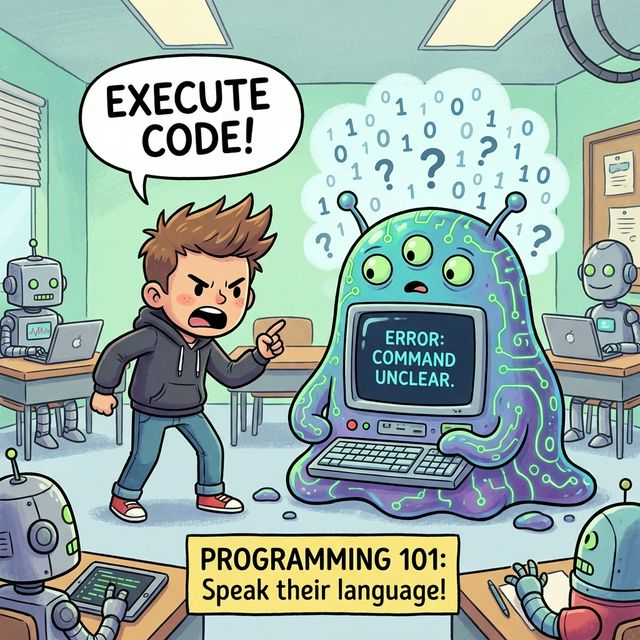

# 1.1 프로그래밍 언어와 자바

컴퓨터와 대화하려면 어떻게 해야 할까요?
우리가 사용하는 **'프로그래밍 언어'**가 바로 그 열쇠입니다. 🔑

---

## 1. 사람과 컴퓨터의 대화: 소통의 벽 🗣️

### 1) 문제점
컴퓨터는 전기가 통하면 `1`, 안 통하면 `0`으로 인식하는 단순한 기계입니다.


마치 **외계인**과 같습니다. 
우리가 아무리 "화면 켜줘!", "계산해줘!"라고 외쳐도 컴퓨터는 알아듣지 못합니다.
컴퓨터는 `10110100...` 같은 **기계어(Machine Language)**만 이해하기 때문입니다.



### 2) 해결책: 통역사 등장
사람의 말(한국어, 영어)을 컴퓨터의 말(기계어)로 바꿔주는 **통역사**가 필요합니다.
이것이 바로 **프로그래밍 언어(Programming Language)**입니다.


### 3) 소통 과정 시각화

```mermaid
graph LR
    Human[사람<br>(개발자)] -->|소스 코드<br>(Java)| Language[프로그래밍 언어<br>(통역사)]
    Language -->|기계어<br>(010110)| Computer[컴퓨터<br>(기계)]
    
    style Human fill:#f9f,stroke:#333
    style Language fill:#ff9,stroke:#333
    style Computer fill:#bef,stroke:#333
```

---

## 2. 고급 언어 vs 저급 언어 📊

프로그래밍 언어는 **누구의 언어에 더 가깝냐**에 따라 두 가지로 나뉩니다.

### 1) 저급 언어 (Low-Level Language)
*   **기계(컴퓨터) 친화적 언어**입니다. (예: 기계어, 어셈블리어)
*   컴퓨터가 바로 이해해서 속도가 매우 빠르지만, 사람이 배우기에는 너무 어렵고 복잡합니다.
*   **비유**: 외계인이 쓰는 말을 직접 배워서 대화하는 것과 같습니다. `(0101001...)`


### 2) 고급 언어 (High-Level Language)
*   **사람 친화적 언어**입니다. (예: **Java**, C, Python)
*   사람이 쓰는 영어 단어(`if`, `while`, `print`)를 사용해서 읽고 쓰기 쉽습니다.
*   **컴파일러(Compiler)**라는 번역기가 이것을 기계어로 바꿔줍니다.
*   우리가 배울 **자바(Java)**는 대표적인 고급 언어입니다.


---

## 3. 왜 자바(Java)인가요? ☕️

수많은 고급 언어 중에서도 왜 자바를 배울까요?

1.  **전 세계 1위**: 기업에서 가장 많이 사용하는 언어입니다. (취업에 유리합니다!)
2.  **강력한 생태계**: 이미 만들어진 무료 도구(라이브러리)가 엄청나게 많습니다.
3.  **안정성**: 은행, 공공기관 등 신뢰가 중요한 시스템에서 주로 사용됩니다.
