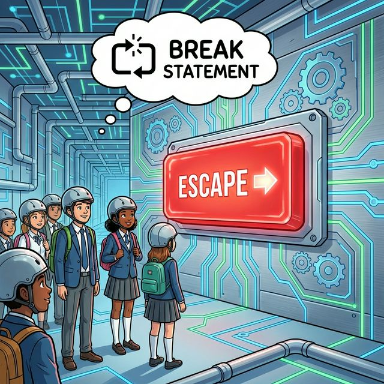
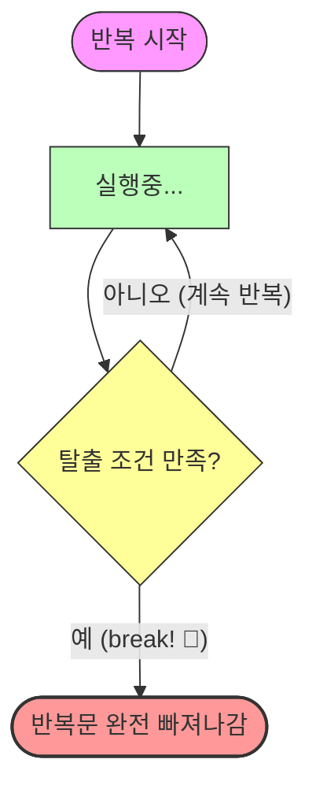

# 7.4 break 문

## 1. 탈출 버튼 🛑

반복문(`for`, `while`)을 실행하다가 **즉시 멈추고 밖으로 나가고 싶을 때** 사용합니다.
마치 비상 탈출 버튼과 같습니다.





```java
while(true) { // 무한 반복
    int num = (int)(Math.random() * 6) + 1;
    System.out.println(num);
    
    if(num == 6) {
        break; // 6이 나오면 즉시 종료!
    }
}
System.out.println("프로그램 종료");
```

가장 가까운 반복문 하나만 빠져나옵니다.
