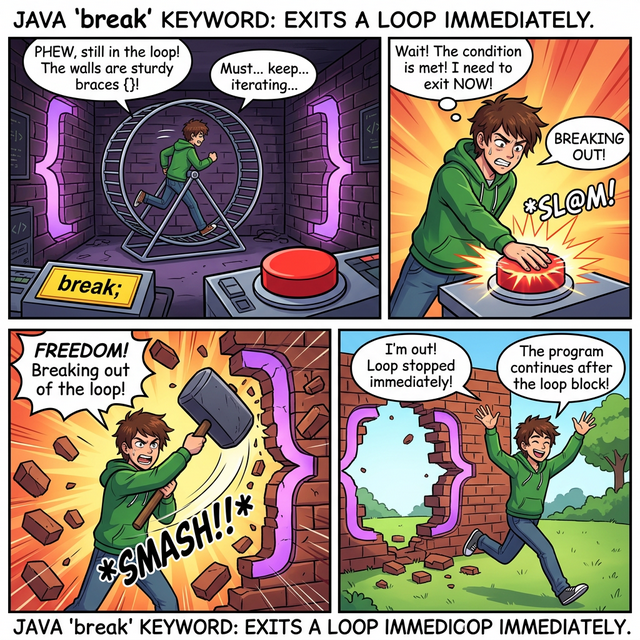
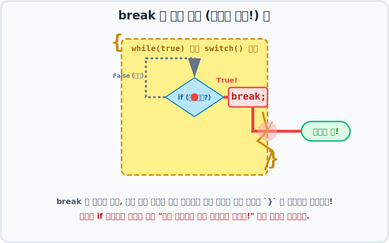
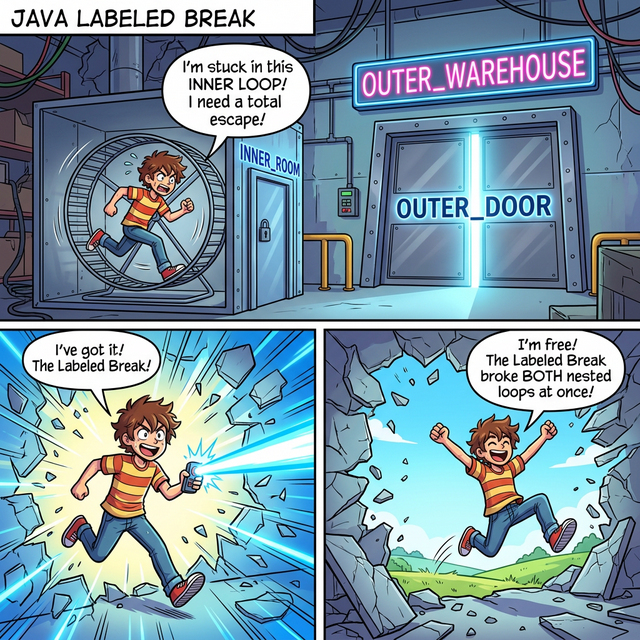
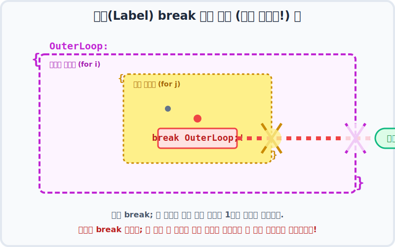

# 7.4 break 문 (방 탈출의 귀재 🔨)

## 1. 중괄호 `{ }` 벽을 부수고 나가는 망치

`break` 문은 한마디로 **"코드 블록 `{ }` 방을 강제로 부수고 탈출하는 비상 망치"** 입니다.
우리가 이전에 배운 선택문 `switch` 와, 반복문 `for`, `while`, `do-while` 의 가장 친한 단짝 친구입니다.



위 그림처럼 쳇바퀴(반복문)를 빙글빙글 돌고 있다가도, `break;` 명령어를 마주치는 순간 **즉시 하던 일을 모두 멈추고 가장 가까운 우측 중괄호 `}` 벽을 깨부수고 바깥 세상으로 탈출**합니다. `break;` 밑에 아직 실행 안 된 수천 줄의 코드가 남아있어도 가차 없이 무시합니다!

---

## 2. break의 탈출 원리 ✨

`break` 는 보통 무작정 쓰이지 않고, **"어떤 특별한 참(True) 조건이 발생했을 때만 탈출해!"** 라는 뜻으로 `if` 조건문과 한 세트로 묶여서 쳇바퀴 속에 잠복해 있습니다.



1. 특정 조건을 물어보는 `if` 문을 통과합니다.
2. 조건이 거짓(False)이면, `break` 는 발동하지 않고 회색 공처럼 평화롭게 쳇바퀴를 계속 돕니다.
3. 그러다 폭탄(True 조건)이 터져 `break;` 가 발동하면, 빨간 공처럼 쳇바퀴를 이탈하여 우측 중괄호 `}` 밖으로 즉각 점프해 버립니다.

---

## 3. 언제 써야 할까? (주요 사용처)

1.  **`switch` 문에서:** `case` 에 진입해서 코드를 실행한 후, 밑에 있는 다른 `case`들을 무시하고 스위치 블록 `{}` 밖으로 나갈 때 사용합니다. (3.3 switch 문 챕터 참조)
2.  **의도적인 무한 루프 `while(true)` 제어:** 사용자 입력을 끝없이 받거나, 게임 엔진을 계속 돌리다가, 사용자가 "종료"를 눌렀을 때 루프를 끄기 위해 사용합니다.
3.  **데이터 탐색 중단:** 배열이나 데이터베이스에서 원하는 값 1개를 찾기 위해 `for` 문을 돌리다가, **드디어 값을 찾았다면?** 더 이상 뒤를 뒤질 필요가 없습니다! 이럴 때 `break` 로 즉시 탈출하여 CPU 시간을 절약합니다.

---

## 4. 바이브 코딩(Vibe Coding): AI와 함께 방 탈출 실습 🤖

주사위를 무한정 던지다가 '6'이 나오면 기뻐하며 쳇바퀴를 탈출하는 예제를 만들어 보겠습니다.

### 🎯 실습 1. 주사위 6을 찾아라! (`while(true)` + `break`)

> **🗣️ 학생 프롬프트 (AI에게 이렇게 명령해 보세요):**
> "자바 break문을 설명하기 위한 코드를 짜줘.
> while(true) 로 무한 루프를 만들어.
> 루프 안에서 (int)(Math.random() * 6) + 1 을 해서 1부터 6 사이의 숫자를 랜덤으로 뽑은 뒤 출력해.
> 그리고 if 조건문으로 만약 뽑힌 숫자가 6이라면, "6이 나와서 탈출합니다!" 라고 출력하고 break; 를 써서 루프를 탈출해.
> 루프 바깥쪽의 마지막 줄에는 "프로그램 종료" 라고 적어 줘."

**[AI가 생성할 자바 코드 예측]**
```java
public class BreakExample {
    public static void main(String[] args) {
        
        System.out.println("주사위를 무한히 던집니다. 6이 나오면 탈출합니다!");

        while(true) { // 무한 쳇바퀴 가동!
            int num = (int)(Math.random() * 6) + 1;
            System.out.println("나온 숫자: " + num);
            
            // 탈출 조건 감시역
            if(num == 6) {
                System.out.println("🚨 6이 나와서 루프를 탈출합니다! (Break 발동)");
                break; // 이 순간, 즉시 가장 가까운 '}' 밖으로 순간이동!
            }
            
            // 만약 6이 안 나왔다면 아래 코드가 실행되면서 다시 위로 올라감
            System.out.println("다음 주사위를 준비합니다...\n");
        } // <- 이 중괄호 벽을 부수고 나감!

        // 탈출 성공 후 도착하는 곳
        System.out.println("프로그램을 안전하게 종료합니다.");
    }
}
```

**[실행 결과 예시 (매번 다름!)]**
```text
주사위를 무한히 던집니다. 6이 나오면 탈출합니다!
나온 숫자: 2
다음 주사위를 준비합니다...

나온 숫자: 4
다음 주사위를 준비합니다...

나온 숫자: 6
🚨 6이 나와서 루프를 탈출합니다! (Break 발동)
프로그램을 안전하게 종료합니다.
```

---

### 🎯 실습 2. 커피 자판기 무한 영업 (`while(true)` + `break`)

자판기는 전원이 뽑히기 전까지 손님을 무한히 기다려야 합니다. 하지만 "종료" 버튼을 누르거나 재료가 다 떨어지면 영업을 중지(break)해야 합니다.

> **🗣️ 학생 프롬프트 (AI에게 이렇게 명령해 보세요):**
> "자바 while(true)와 break문을 사용해서 커피 자판기 루프를 만들어줘.
> 문자열 변수 command를 선언하고, Scanner로 입력을 받아.
> 입력을 받기 전에 "커피를 뽑으시겠습니까? (네/종료): " 라고 물어봐.
> 만약 사용자가 "종료"라고 입력했다면, "자판기 영업을 종료합니다."라고 출력하고 break; 로 루프를 탈출해줘.
> "네"라고 입력하면 "☕ 따뜻한 커피가 나왔습니다!" 라고 출력해줘."

**[AI가 생성할 자바 코드 예측]**
```java
import java.util.Scanner;

public class CoffeeMachine {
    public static void main(String[] args) {
        Scanner scanner = new Scanner(System.in);
        System.out.println("🤖 자판기 전원이 켜졌습니다.");

        while(true) {
            System.out.print("커피를 뽑으시겠습니까? (네/종료): ");
            String command = scanner.nextLine();

            if (command.equals("종료")) {
                System.out.println("🛑 자판기 영업을 종료합니다.");
                break; // 쳇바퀴 탈출!
            }
            
            if (command.equals("네")) {
                System.out.println("☕ 따뜻한 커피가 나왔습니다!\n");
            } else {
                System.out.println("잘못된 입력입니다.\n");
            }
        }
        
        System.out.println("기계가 완전히 꺼졌습니다.");
        scanner.close();
    }
}
```

### 🎯 실습 3. ATM 출금 마지노선 (`for` + `break`)

반복 횟수가 정해져 있는 `for`문 안에서도, 치명적인 위험이 감지되면 끝까지 돌지 않고 중간에 강제로 끊어버려야 할 때 `break`를 씁니다.

> **🗣️ 학생 프롬프트 (AI에게 이렇게 명령해 보세요):**
> "자바 for문과 break를 써서 ATM 출금 시뮬레이션을 만들어줘.
> 잔액(balance)은 처음에 10000원으로 설정해둬.
> for문으로 1번부터 5번까지 차례대로 3000원씩 출금을 시도해. (총 5회 반복)
> 만약 출금하려는 순간 남은 잔액이 3000원보다 적다면 (balance < 3000), "잔액이 부족하여 더 이상 출금할 수 없습니다."라고 경고한 뒤 break; 로 반복문을 완전히 취소하고 나가줘.
> 무사히 출금되면 남은 잔액을 출력해줘."

**[AI가 생성할 자바 코드 예측]**
```java
public class AtmWithdrawal {
    public static void main(String[] args) {
        int balance = 10000; // 초기 잔액 만원
        int withdrawAmount = 3000; // 1회 출금액 삼천원

        System.out.println("통장 잔액: " + balance + "원");

        for (int i = 1; i <= 5; i++) {
            System.out.println(i + "회차 출금 시도 중...");

            // 위험 감지! 돈이 모자라면 즉시 루프 파괴!
            if (balance < withdrawAmount) {
                System.out.println("🚨 삐빅! 잔액이 부족하여 더 이상 출금할 수 없습니다!");
                break; // 남은 횟수 상관없이 무조건 쳇바퀴 밖으로 튕겨나감!
            }

            balance -= withdrawAmount;
            System.out.println("출금 성공! 남은 잔액: " + balance + "원\n");
        }

        System.out.println("출금 처리가 모두 종료되었습니다.");
    }
}
```

---

## 5. 심화: 이중 반복문 완전 탈출 (이름표 달기 🏷️)

방탈출 게임을 생각해 봅시다. 작은 방(안쪽 `for`문)에서 자물쇠 하나를 풀고 탈출했다고 곧바로 바깥 자유(프로그램 종료)일까요? 아닙니다! 공장(바깥쪽 `for`문) 안에 작은 텐트(안쪽 `for`문)를 치고 일할 때, 일반적인 `break`는 **자기를 직접 감싸고 있는 가장 안쪽 텐트(가장 가까운 우측 `}`) 딱 1개만 부수고 나갑니다.** 

여전히 큰 건물 안이라는 뜻이죠. 바깥 건물까지 한 번에 부수고 나가고 싶다면 **'이름표(Label)' 원격 스위치**를 써야 합니다.



위 그림처럼, 바깥쪽 큰 건물 문에다가 `OUTER_DOOR` 라는 이름표를 붙여놓고, 안쪽 작은 방에서 리모컨으로 `break OUTER_DOOR;` 를 누르는 순간 레이저가 두꺼운 건물 벽을 한 번에 다 뚫고 완전 바깥으로 탈출시키는 원리입니다!

### 💡 이름표 달고 탈출하는 흐름도



1. 바깥쪽 반복문 시작 지점(위)에 `원하는이름:` 처럼 콜론(`:`)을 붙여 이름표를 답니다.
2. 안에서 탈출하고 싶을 때 `break 원하는이름;` 을 씁니다.
3. 가장 가까운 `}` 가 아니라, **그 이름표가 붙은 반복문의 닫히는 `}` 바깥으로 완전히 워프(Warp)합니다!**

### 🎯 실습 2. 범인 몽타주 찾기 완전 종료! (`Label` + `break`)

이중 루프 안에서 범인을 드디어 찾았는데, 바깥쪽 루프가 계속 돌면 안 되겠죠?

> **🗣️ 학생 프롬프트 (AI에게 이렇게 명령해 보세요):**
> "자바에서 이중 for문과 레이블(Label)이 들어간 break문을 쓰는 예제를 짜줘.
> 바깥쪽 for문 머리에 'SearchLabel:' 이라고 레이블을 달아.
> 바깥쪽 for문은 i 변수로 1부터 3까지 돌아. 안쪽 for문은 j 변수로 1부터 3까지 돌아.
> 안쪽 루프에서 만약 i==2 이고 j==2 라면 "범인(2,2) 발견!" 이라고 출력하고 'break SearchLabel;' 을 발동시켜.
> 루프를 최종 탈출한 다음 줄에는 "수색 종료" 라고 적어줘."

**[AI가 생성할 자바 코드 예측]**
```java
public class LabeledBreakExample {
    public static void main(String[] args) {
        
        System.out.println("경찰 몽타주 수색을 시작합니다.");

        // 🏷️ 바깥쪽 루프 전체에 "SearchLabel" 이라는 이름(레이블)표를 답니다!
        SearchLabel: 
        for(int i=1; i<=3; i++) {
            
            for(int j=1; j<=3; j++) {
                System.out.println("수색 중... (구역 " + i + "-" + j + ")");
                
                // 만약 구역 2-2에서 범인을 찾았다면?
                if(i == 2 && j == 2) {
                    System.out.println("🚨 범인(2-2) 발견!! 모든 부대는 즉시 수색을 중단하고 철수하라!");
                    
                    // 안쪽 for문만 멈추는 게 아니라, SearchLabel 이 붙은 전체 큰 for문을 부수고 나갑니다!
                    break SearchLabel; 
                }
            }
        } 
        // 👆 break SearchLabel; 을 맞으면 코드가 이쪽으로 팅겨져 나옵니다.

        System.out.println("수색 종료. 경찰서로 복귀합니다.");
    }
}
```

**[실행 결과 예시]**
```text
경찰 몽타주 수색을 시작합니다.
수색 중... (구역 1-1)
수색 중... (구역 1-2)
수색 중... (구역 1-3)
수색 중... (구역 2-1)
수색 중... (구역 2-2)
🚨 범인(2-2) 발견!! 모든 부대는 즉시 수색을 중단하고 철수하라!
수색 종료. 경찰서로 복귀합니다.
```

만약 `SearchLabel`이 없었다면 어떻게 되었을까요? 구역 2-2를 탈출해도, 안쪽 루프만 멈췄을 뿐 밖의 `i`가 3으로 올라가면서 다시 반복되어 `구역 3-1, 3-2, 3-3` 을 쓸데없이 또 수색했을 것입니다.

**현업 팁:** `Label` 기능은 알고리즘 테스트나 다차원 배열 데이터를 탐색할 때 가끔 유용하지만, 코드가 복잡해 보일 수 있어 남용하진 않고 꼭 필요할 때(여러 겹을 찢고 나올 때) 필살기로 주로 사용된답니다!
