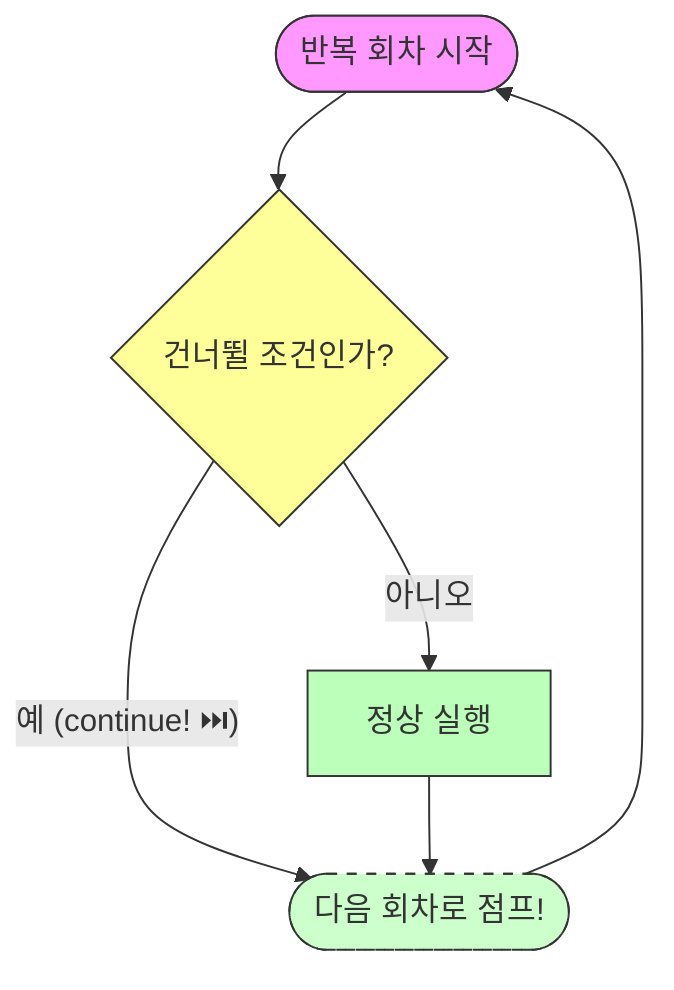

# 7.5 continue 문

## 1. 이번만 건너뛰기 ⏭️

반복문을 아예 종료하는(`break`) 것이 아니라,
**"이번 바퀴만 쉬고 다음 바퀴로 넘어가라"**는 뜻입니다.



```java
// 1부터 10까지 짝수만 출력하기
for(int i=1; i<=10; i++) {
    if(i % 2 != 0) { // 홀수라면
        continue; // 밑에 코드는 실행하지 말고 다음 숫자로 넘어가!
    }
    System.out.println(i); // 짝수만 출력됨
}
```
