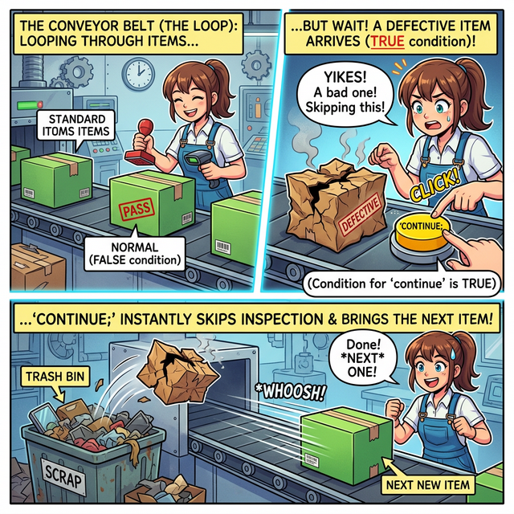
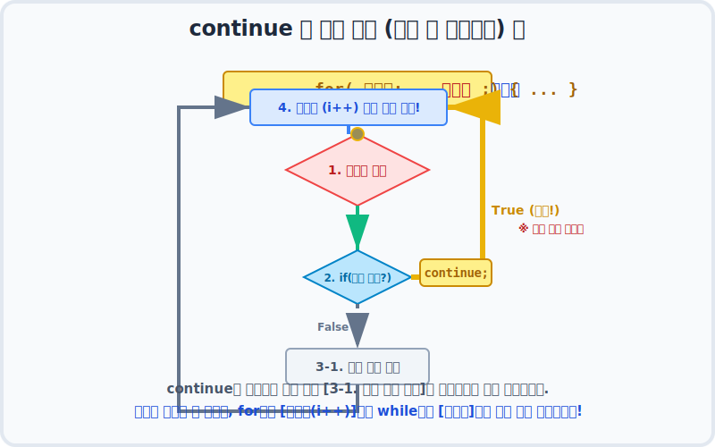

# 7.5 continue 문 (이번 턴은 무효! ⏭️)

## 1. 불량품은 골라내고 컨베이어 벨트를 돌려라!

앞서 배운 `break` 가 "건물이 불탔으니 완전히 방을 폭파시키고 탈출해!" 라면, **`continue`** 문은 **"이 부품은 불량이니까 이번 차례 작업만 건너뛰고, 바로 다음 부품 가져와!"** 하는 공장장의 지시와 같습니다.

루프의 쳇바퀴를 완전히 멈추지 않고, **특정 조건일 때만 밑에 있는 코드 처리를 생략**하고 싶을 때 아주 유용하게 쓰입니다.



웹툰을 보세요! 공장 라인(반복문)을 타고 물건이 쏟아져 들어오고 있습니다.
정상적인 물건은 통과시켜서 포장 로봇이 도장(밑에 줄 코드)을 찍습니다.
그런데 **불량품(특정 조건 True)** 이 발견되면 작업자는 **`continue;` 버튼**을 누릅니다. 그러면 포장 로봇은 작업을 무시해버리고, 컨베이어 벨트 모터가 위잉! 하고 돌아 즉시 다음 물건(다음 턴)을 대령합니다.

---

## 2. continue의 시간 이동 경로 ⏱️

`continue` 버튼이 눌렸을 때, 과연 코드는 어디로 튕겨 나갈까요? `break`처럼 중괄호 `}` 밖으로 나갈까요? 아닙니다!

정답은 **"다음 턴을 준비하는 맨 위쪽 출발선(조건식/증감식)으로 순간이동한다!"** 입니다. 



위의 애니메이션처럼 `for` 문 안에서 `continue`가 발동(노란색 공)하면, 바로 밑에 있던 3번 구역 코드 시야에서 완전히 사라지면서 맨 꼭대기의 **4번 구역(증감식 `i++` 부분)** 으로 솟구쳐 올라갑니다.

> **💡 반복문 종류별 코드가 향하는 위치! (매우 중요)**
> *   **`for` 문에서 `continue` 발동 시:** 맨 끝의 **증감식(`i++`)** 으로 바로 점프합니다!
> *   **`while`, `do-while` 문에서 `continue` 발동 시:** 맨 위(혹은 바닥)의 **조건식(`i < 10`)** 검사소로 바로 점프합니다!

---

## 3. 언제 쓰나요? (주요 사용처)

코드 블록 내부에 복잡하고 거대한 `if-else` 문 지옥을 피하기 위해, 이른바 **'입구 컷(Early Return/Continue)' 패턴**을 만들 때 주로 사용합니다.

게시판 댓글 1,000개를 화면에 뿌리는 루프를 돈다고 칩시다.
중간에 '차단된 사용자'의 댓글이나 '삭제된 댓글' 인지 `if`문으로 검사해서 "삭제된 댓글이면 화면에 그리는 코드를 무시하고(`continue`) 다음 댓글로 넘어가라!" 라고 지시할 때 가장 완벽한 해답이 됩니다.

---

## 4. 바이브 코딩(Vibe Coding): AI와 함께 필터링 실습 🤖

1부터 10까지 숫자를 출력하되, 아주 심술궂게 "짝수"는 전부 버리고 "홀수"만 골라내어 화면에 찍어내는 프로그램을 완성해봅시다. 

### 🎯 실습 1. 짝수는 버리고 홀수만 필터링하기! (`for` + `continue`)

> **🗣️ 학생 프롬프트 (AI에게 이렇게 명령해 보세요):**
> "자바 continue 문을 설명하는 코드를 만들어줘.
> for 문을 사용해서 i를 1부터 10까지 반복되게 만들어.
> 루프 안에서 if(i % 2 == 0) 을 써서 짝수인지 검사해.
> 만약 짝수라면 짝수라는 뜻이니까 continue; 를 써서 밑에 코드를 건너뛰게 만들어.
> if 문 아래에는 System.out.println(i); 를 적어. (continue가 발동하지 않은 홀수만 출력될 거야!)"

**[AI가 생성할 자바 코드 예측]**
```java
public class ContinueExample {
    public static void main(String[] args) {
        
        System.out.println("컨베이어 벨트 가동! 홀수만 포장합니다.");

        // 1부터 10까지 10번 반복하는 쳇바퀴
        for(int i = 1; i <= 10; i++) {
            
            // 검사소: 혹시 이 숫자가 2로 나누어 떨어지는 짝수인가?
            if(i % 2 == 0) {
                // 불량품(짝수) 발견! 밑에 포장 코드 무시하고 바로 다음 숫자(i++)로 가라!
                continue; 
            }
            
            // 짝수라면 여기까지 코드가 도달조차 하지 못합니다.
            // 고로 이건 100% 홀수일 때만 실행됩니다!
            System.out.println("📦 포장 완료: " + i);
        }
        
        System.out.println("공장 가동 종료.");
    }
}
```

**[실행 결과 예시]**
```text
컨베이어 벨트 가동! 홀수만 포장합니다.
📦 포장 완료: 1
📦 포장 완료: 3
📦 포장 완료: 5
📦 포장 완료: 7
📦 포장 완료: 9
공장 가동 종료.
```

2, 4, 6, 8, 10 은 어디로 갔을까요? `continue` 레이저를 맞고 포장되기도 전에 바로 다음 바퀴로 쫓겨났습니다.
이처럼 `continue`는 코드의 복잡성을 줄이고 예외 케이스(짝수)를 가뿐히 골라내는 훌륭한 핀셋 역할을 합니다!

---

## 코딩 영단어 학습 📝

코딩에서 영어 단어의 의미만 정확히 이해해도 절반은 성공입니다! 오늘 배운 핵심 영단어들을 다시 한번 짚고 넘어가 볼까요?

*   **`Continue`**: 컨티뉴, 계속하다. (현재 바퀴의 남은 코드를 건너뛰고 바로 다음 바퀴(턴)로 넘어가는 명령어)
*   **`Filter`**: 필터, 걸러내다. (조건에 맞지 않는 불량품 데이터나 예외 상황을 스킵하는 행위)
*   **`Skip`**: 스킵, 건너뛰다.
