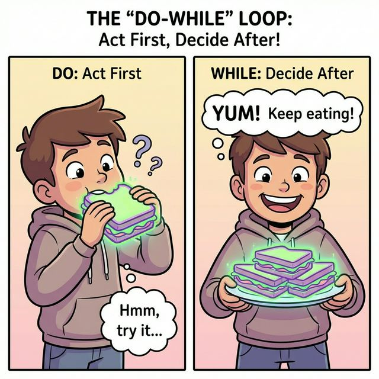

# 7.3 do-while 문

## 1. 일단 한 번 해보고 생각하기 🤔

`while` 문은 시작할 때 조건을 검사해서, 처음부터 조건이 안 맞으면 아예 실행을 안 합니다.
하지만 **`do-while`** 문은 **일단 무조건 한 번은 실행**하고 나서, 계속할지 검사합니다.

**비유**: "일단 한 입 먹어봐. 맛있으면 더 먹어."



```mermaid
flowchart TD
    Start([시작]) --> Run[실행 블록 (무조건 1회 실행)]
    
    Run --> Cond{조건식 검사}
    
    Cond -- "참 (true)" --> Run
    Cond -- "거짓 (false)" --> End([종료])
    
    style Start fill:#f9f,stroke:#333,stroke-width:2px
    style End fill:#ccc,stroke:#333,stroke-width:2px
    style Cond fill:#ff9,stroke:#333,stroke-width:2px
    style Run fill:#bfb,stroke:#333,stroke-width:2px
```

```java
import java.util.Scanner;

Scanner scanner = new Scanner(System.in);
String inputString;

do {
    System.out.println("명령어를 입력하세요: "); // 무조건 한 번은 물어봄
    inputString = scanner.nextLine();
    System.out.println("입력값: " + inputString);
} while( ! inputString.equals("q") ); // "q"를 입력하지 않는 동안 계속 반복

System.out.println("프로그램 종료");
```
