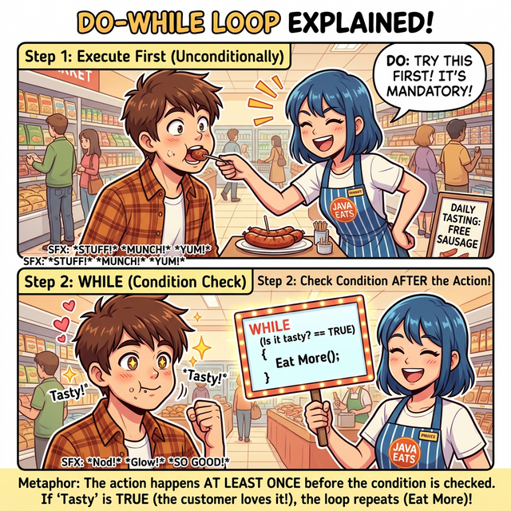
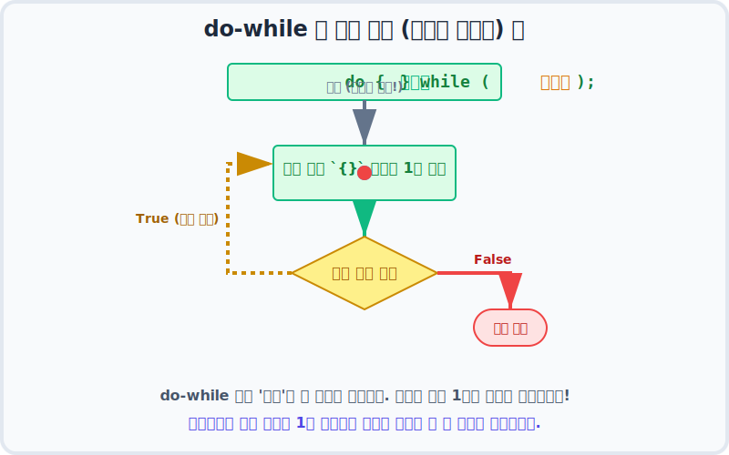

# 7.3 do-while 문 (일단 한 번 해보고 생각하기!)

## 1. 마트 시식 코너의 법칙 🌭

`while` 문이 "조건이 안 맞으면 아예 시작도 안 하는 깐깐한 문지기" 라면, **`do-while`** 문은 **"일단 무조건 한 번은 들여보내 줄게. 그 다음부터 계속할지 말지 결정해!"** 라고 말하는 관대한 문지기입니다.

가장 완벽한 비유는 **마트의 시식 코너**입니다. 



1. 시식 코너 아주머니는 손님이 오면 **지도 따지지도 않고 일단 입에 소시지를 하나 넣어줍니다. (`do` : 무조건 1회 실행)**
2. 손님이 오물오물 씹어보고 맛을 느낍니다.
3. 아주머니가 묻습니다. **"어때, 맛있어? 더 먹을래?" (`while` : 조건 검사)**
4. 맛있으면(True) 1번으로 돌아가 하나 더 먹고, 맛없으면(False) 미련 없이 떠납니다.

---

## 2. do-while 문 해부학 (먼저 때리고 나중에 묻는다) 🥊

구조를 보면 왜 '선(先)실행 후(後)검사' 라고 불리는지 직관적으로 알 수 있습니다.

```java
// 변수 선언
boolean isTasty = false; 

// 시작하자마자 일단 중괄호 { } 안으로 돌진합니다!
do {
    System.out.println("일단 소시지를 하나 먹습니다. 냠냠.");
    
    // 이 시점에서 isTasty 의 상태를 결정하는 코드가 들어갑니다.
} while ( isTasty ); // 다 먹고 나서야 평가합니다. 조심: 끝에 세미콜론(;) 필수!
```

이 흐름을 애니메이션으로 보면 `while` 문과 확실히 다른 점을 알 수 있습니다.



가장 큰 특징은 **맨 처음에 진입할 때 조건 검사소가 없다는 것**입니다. 그냥 하이패스로 통과해서 코드를 한 번 시원하게 실행한 뒤, 쳇바퀴 맨 밑바닥에서 다음 바퀴를 돌지 말지 결정합니다.

> **💡 주의:** `while(조건식)` 뒤에 평소와 다르게 **세미콜론(`;`)** 이 붙는다는 점을 꼭 잊지 마세요!

---

## 3. 언제 써야 할까? (사용자 눈치 보기 👀)

실무에서 `do-while` 문이 압도적으로 활약하는 곳은 바로 **'사용자 메뉴 입력 검사'** 입니다.

프로그램을 켜면 일단 사용자에게 메뉴(1번: 시작, 2번: 설정, 3번: 종료)를 화면에 **최소 1번은 보여줘야** 사용자가 뭘 누를지 알 수 있습니다. 즉, 검사하기 전에 일단 "메뉴 출력 및 입력받기" 동작이 선행되어야만 하는 상황에 `do-while` 문이 찰떡궁합입니다.

### 🎯 실습 1. 스마트폰 패턴 잠금 해제 흉내내기

사용자가 올바른 비밀번호를 입력할 때까지 계속 물어보는 예제입니다. 일단 무조건 한 번은 암호를 대라고 물어봐야겠죠?

> **🗣️ 학생 프롬프트 (AI에게 이렇게 명령해 보세요):**
> "자바 do-while문을 써서 비밀번호 맞히기 게임을 짜줘.
> 정답 비밀번호는 "1234"야.
> do 블록 안에서 Scanner로 "비밀번호를 입력하세요: " 라고 묻고 입력을 받아.
> while 조건식에서는 (입력한 비밀번호가 "1234"가 아닐 동안) 계속 루프를 돌게 해.
> 루프를 무사히 빠져나오면 "잠금이 해제되었습니다!" 라고 출력해 줘."

**[AI가 생성할 자바 코드 예측]**
```java
import java.util.Scanner;

public class PasswordUnlock {
    public static void main(String[] args) {
        Scanner scanner = new Scanner(System.in);
        String inputPwd;
        String correctPwd = "1234";

        System.out.println("🔒 스마트폰이 잠겨 있습니다.");

        // 일단 묻고 봅니다. (do)
        do {
            System.out.print("비밀번호 4자리를 입력하세요: ");
            inputPwd = scanner.nextLine();
            
            if (!inputPwd.equals(correctPwd)) {
                System.out.println("❌ 삐빅! 비밀번호가 틀렸습니다. 다시 시도하세요.\n");
            }
        } while ( !inputPwd.equals(correctPwd) ); 
        // 👆 입력한 비밀번호가 "1234"가 "아닌 동안" 계속 쳇바퀴를 돕니다.

        // 정답을 맞혀서 while 조건이 False가 되면 이곳으로 탈출!
        System.out.println("🔓 철칵! 잠금이 해제되었습니다 환영합니다!");
    }
}
```

**[실행 결과 예시]**
```text
🔒 스마트폰이 잠겨 있습니다.
비밀번호 4자리를 입력하세요: 0000
❌ 삐빅! 비밀번호가 틀렸습니다. 다시 시도하세요.

비밀번호 4자리를 입력하세요: 1111
❌ 삐빅! 비밀번호가 틀렸습니다. 다시 시도하세요.

비밀번호 4자리를 입력하세요: 1234
🔓 철칵! 잠금이 해제되었습니다 환영합니다!
```

이처럼 사용자 입력 값의 유효성을 검사하고, 틀리면 다시 입력하라고 무한히 괴롭히는(?) UI를 만들 때 `do-while` 문은 아주 강력한 무기가 됩니다!
