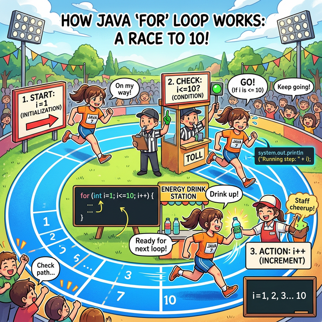
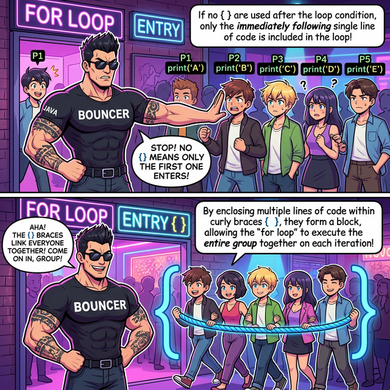

# 7.1 for 문 (셀 수 있는 반복의 제왕)

## 1. 달리기 트랙의 3원칙 🏃‍♂️

`for` 문은 **"운동장 10바퀴 뛰어!"** 처럼 내가 **몇 번을 반복할지 횟수(Count)를 명확히 알고 있을 때** 사용하는 가장 완벽한 형태의 반복문입니다. 
앞 장에서 배운 CPU 클럭 사이클의 핵심 단계(초기화, 조건검사, 증감)를 단 **한 줄의 코드** 안에 모두 압축해 놓은 아주 다루기 쉬운 녀석입니다.



위 그림처럼 마치 육상 트랙을 도는 선수와 같습니다. 
어디서 출발할지(초기화), 언제까지 뛸지(조건식), 한 바퀴 뛸 때마다 카운트를 어떻게 올릴지(증감식)를 처음에 다 정해놓고 신나게 달립니다. 때문에 코드를 읽는 사람도 "아, 이 코드는 딱 10번만 돌고 끝나는구나!" 라고 한눈에 파악하기가 가장 좋습니다.

---

## 2. for 문의 해부학 (CPU 쳇바퀴와 판박이!) 🔬

`for` 문은 코드 한 줄에 3개의 부품이 세미콜론(`;`)으로 나뉘어 들어갑니다.

```java
//     ① 초기화식      ② 조건식      ④ 증감식
for ( int i = 1;     i <= 10;     i++ ) {
    
    // ③ 실행문 (조건이 참일 때 달리는 구간)
    System.out.println(i + "바퀴째 돌고 있습니다.");
    
}
```

이 코드가 실행되는 순서는 이전 챕터에서 본 CPU 4단계 쳇바퀴 사이클과 정확히 일치합니다:

1.  **① 초기화식 (`int i=1`)**: 트랙 출발선에 서서 카운터를 `1`로 맞춥니다. **(루프가 시작될 때 딱 한 번만 실행됨!)**
2.  **② 조건식 (`i<=10`)**: "지금 내가 10바퀴 이하인가?" 심판에게 확인받습니다. 참(True)이면 통과, 거짓(False)이면 쳇바퀴가 박살나고(종료) 밖으로 튕겨 나갑니다.
3.  **③ 실행문 (중괄호 `{ }` 내부)**: 심판이 통과시켰으니 실제로 달립니다. (글자를 화면에 출력합니다.)
4.  **④ 증감식 (`i++`)**: 다 달렸으니 카운터를 1 늘립니다. 그리고 재빨리 다시 **②번 심판(조건식)** 한테 가서 또 뛰어도 되는지 묻습니다.

`① ➔ (② ➔ ③ ➔ ④) ➔ (② ➔ ③ ➔ ④) ... ➔ ②번에서 탈락할 때까지 반복!`

---

## 3. 바이브 코딩(Vibe Coding): AI와 함께하는 실습 🤖

눈으로만 보지 마시고, 횟수가 정해진 반복 작업을 AI가 어떻게 코드로 짜주는지 직접 확인해 봅시다!

### 🎯 실습 1. 카운트다운 타이머 (숫자 감소시키기)

`for` 문의 카운트는 무조건 더하기(+)만 되는 것이 아닙니다. 빼기(-)로 거꾸로 셀 수도 있습니다!

> **🗣️ 학생 프롬프트 (AI에게 이렇게 명령해 보세요):**
> "자바 언어의 for문을 사용해서 로켓 발사 카운트다운을 짜줘.
> 초기화식은 i를 5로 하고, 조건식은 i가 1 이상일 때까지로 해.
> 증감식은 1씩 감소하도록(i--) 해 줘.
> 글자는 '발사 5초 전!', '발사 4초 전!' 이런 식으로 나오게 출력해 줘."

**[AI가 생성할 자바 코드 예측]**
```java
public class CountDown {
    public static void main(String[] args) {
        // 5부터 1까지 거꾸로 5번 반복합니다.
        for (int i = 5; i >= 1; i--) {
            System.out.println("발사 " + i + "초 전!");
        }
        System.out.println("🚀 로켓 발사!");
    }
}
```

---

### 🎯 실습 2. 1부터 10까지의 합계 구하기 (누적 계산)

가장 많이 쓰이는 패턴 중 하나입니다. 반복문을 돌면서 특정 변수에 값을 계속 더해나가는 방식입니다.

> **🗣️ 학생 프롬프트:**
> "자바 for문을 사용해서 1부터 10까지의 숫자들을 모두 더한 합계를 구하는 코드를 짜줘.
> for문 바깥에 int sum = 0; 이라는 지갑 변수를 먼저 만들고,
> for문을 1부터 10까지 돌리면서 sum 지갑에 i 값을 계속 누적해서 더해줘 (sum += i).
> 마지막에 총합만 딱 한 번 출력되게 해 줘."

**[AI가 생성할 자바 코드 예측]**
```java
public class Summation {
    public static void main(String[] args) {
        int sum = 0; // 누적해서 더할 지갑을 준비합니다.

        // 1부터 10까지 10번 반복합니다.
        for (int i = 1; i <= 10; i++) {
            sum = sum + i; // 또는 sum += i; (현재 지갑 돈에 새로운 i 값을 더해서 다시 지갑에 넣음)
            // System.out.println(i + "를 더했습니다. 현재 합계: " + sum); // 궁금하면 주석을 풀어보세요!
        }
        
        System.out.println("1부터 10까지의 총합은: " + sum);
    }
}
```

---

### 🎯 실습 3. 중첩 for문 (쳇바퀴 안의 쳇바퀴, 구구단)

`for` 문의 진정한 무서움이자 매력은, 쳇바퀴 안에 또 다른 쳇바퀴를 넣을 수 있다는 것입니다. 이를 **중첩(Nested) for 문**이라고 부릅니다.
시계의 톱니바퀴를 생각하면 쉽습니다. 바깥쪽 큰 톱니바퀴(시침)가 1번 깍깍 움직일 때, 안쪽 작은 톱니바퀴(분침)는 60번을 미친 듯이 돌아야 합니다. 즉, 전체 작업 횟수가 수학적으로 **곱하기**가 됩니다.

> **🗣️ 학생 프롬프트:**
> "자바 중첩 for문을 사용해서 구구단 2단부터 9단까지 출력하는 코드를 짜줘.
> 바깥쪽 for문은 변수 m이 2부터 9까지 늘어나고 (단수 역할),
> 그 안에 있는 안쪽 for문은 변수 n이 1부터 9까지 늘어나게 (곱하는 수 역할) 해 줘.
> 안쪽 for문 안에서 m * n 을 구해서 출력해 줘."

**[AI가 생성할 자바 코드 예측]**
```java
public class MultiplicationTable {
    public static void main(String[] args) {
        
        // 바깥쪽 쳇바퀴 (시침 역할: 2단 ~ 9단)
        for (int m = 2; m <= 9; m++) {
            System.out.println("\n*** " + m + "단 ***"); // 단이 바뀔 때마다 제목 출력
            
            // 안쪽 쳇바퀴 (분침 역할: x1 ~ x9) - 바깥쪽 m이 '한 번' 도는 동안 안쪽 n은 '9번'을 돕니다!
            for (int n = 1; n <= 9; n++) {
                // 구구단 계산 및 출력
                System.out.println(m + " x " + n + " = " + (m * n));
            }
        }
    }
}
```

이 코드를 실행해 보시면, CPU가 눈 깜짝할 사이에 72번(8단 * 9번)의 연산을 끝내고 전체 구구단을 화면에 뿌려주는 컴퓨터의 엄청난 위력을 체감하실 수 있습니다!

---

## 4. 중괄호 `{}` 의 비밀: 단일 문장 vs 코드 블록 🧱

초보자들이 가장 많이 하는 실수 중 하나가 바로 중괄호 `{}` 를 생략했을 때 벌어지는 일입니다.



### ⚠️ 단일 반복문 (중괄호 생략)
만약 반복해서 실행할 코드가 **딱 1줄**뿐이라면, 중괄호 `{ }` 를 생략할 수 있습니다.

```java
// 중괄호가 없으면 for 문은 오직 "바로 밑의 1줄"만 자기 식구로 인정합니다.
for (int i = 1; i <= 3; i++)
    System.out.println(i + "초"); // 이 줄만 3번 반복됨
    
System.out.println("땡!");    // 들여쓰기를 했더라도 이 줄은 for 문과 무관함! 그냥 마지막에 1번만 실행됨.
```

### 🔒 블록 반복문 (중괄호 필수)
하지만, 실행해야 할 코드가 2줄 이상이라면 **반드시 중괄호 `{ }` 로 묶어서 (코드 블록)** 어디까지가 쳇바퀴 안쪽인지 컴퓨터에게 알려줘야 합니다.

```java
for (int i = 1; i <= 3; i++) {
    System.out.println(i + "초"); // 3번 반복
    System.out.println("땡!");    // 3번 반복
} // 여기까지가 쳇바퀴!
```

> **💡 권장 코딩 스타일 (Best Practice):**
> 실무에서는 "코드가 1줄이더라도 무조건 중괄호를 쓴다"는 규칙을 준수합니다. 줄바꿈이나 들여쓰기를 수정하다가 예기치 않은 버그가 발생하는 것을 차단하기 위해서입니다. 초보자일수록 **무조건 중괄호를 치는 습관**을 들이는 것이 좋습니다!

---

## 5. 중첩 for 문의 진수: 별 찍기 (모양 만들기) ⭐

쳇바퀴 안의 쳇바퀴(중첩 for문)를 가장 완벽하게 훈련할 수 있는 전통적인 코딩 연습이 바로 '포문의 꽃'이라 불리는 **다양한 모양의 별 찍기**입니다.

바깥쪽 `for` 문은 **'줄(행, Row)'** 을 바꾸는 역할을 하고, 안쪽 `for` 문은 해당 줄에서 **'별을 몇 개나 찍을지(열, Column)'** 결정합니다.



### 🎯 실습 4. 직각 삼각형 별 찍기

> **🗣️ 학생 프롬프트 (AI에게 이렇게 명령해 보세요):**
> "자바 중첩 for문을 사용해서 5줄짜리 직각 삼각형(왼쪽 아래가 직각인 모양) 별 찍기 코드를 짜줘.
> 바깥쪽 for문 변수 i는 1부터 5까지 늘어나고 (줄 바꿈 역할),
> 안쪽 for문 변수 j는 1부터 i까지 늘어나게 (별 출력 역할) 해 줘.
> 안쪽 루프에서는 별(*)을 print 하고, 안쪽 루프가 끝나면 바깥 루프에서 println()으로 줄바꿈을 해 줘."

**[AI가 생성할 자바 코드 예측]**
```java
public class StarTriangle {
    public static void main(String[] args) {
        // 바깥쪽 루프: 총 5줄(행)을 만듭니다.
        for (int i = 1; i <= 5; i++) {
            
            // 안쪽 루프: 현재 줄 번호(i)만큼 별을 찍습니다. 
            // i가 1일 땐 1개, i가 2일 땐 2개...
            for (int j = 1; j <= i; j++) {
                System.out.print("*"); // ln이 빠진 print를 써서 옆으로 이어 붙입니다.
            }
            
            System.out.println(); // 해당 줄의 별을 다 찍었으면 다음 줄로 넘어갑니다!
        }
    }
}
```

**[실행 결과]**
```text
*
**
***
****
*****
```

---

### 🎯 실습 5. 역직각 모양 (오른쪽 정렬 별 찍기)

이번에는 조금 더 머리를 써야 합니다. 별을 찍기 전에 텅 빈 공백(" ")을 먼저 출력해서 별들을 쭈욱 오른쪽으로 밀어내야 합니다. 즉, 한 줄 안에서 **공백 찍는 루프**와 **별 찍는 루프**가 나란히 돌아가야 합니다.

> **🗣️ 학생 프롬프트:**
> "자바로 5줄짜리 오른쪽 정렬 직각 삼각형 별 찍기를 중첩 for문으로 짜줘.
> 바깥쪽 for문 i는 1부터 5까지 늘어나.
> 바깥 for문 안에는 안쪽 for문이 2개 나란히 필요해.
> 첫 번째 안쪽 for문은 (5 - i) 번만큼 공백(" ")을 print 하고,
> 두 번째 안쪽 for문은 i 번만큼 별("*")을 print 해 줘.
> 한 줄이 끝나면 println()으로 줄바꿈을 해."

**[AI가 생성할 자바 코드 예측]**
```java
public class StarRightTriangle {
    public static void main(String[] args) {
        // 총 5줄
        for (int i = 1; i <= 5; i++) {
            
            // 1. 공백 찍기 루프: 점점 줄어들어야 합니다. (4개, 3개, 2개, 1개, 0개)
            for (int j = 1; j <= 5 - i; j++) {
                System.out.print(" ");
            }
            
            // 2. 별 찍기 루프: 점점 늘어나야 합니다. (1개, 2개, 3개, 4개, 5개)
            for (int k = 1; k <= i; k++) {
                System.out.print("*");
            }
            
            // 3. 모양 완성을 위한 줄바꿈
            System.out.println();
        }
    }
}
```

**[실행 결과]**
```text
    *
   **
  ***
 ****
*****
```

이처럼 프로그래밍의 연산 논리력을 기르는 데 '별 찍기'만큼 훌륭한 훈련이 없으니, 코드를 살짝살짝 수정해가며 피라미드 모양, 마름모 모양도 꼭 스스로 도전해 보세요!

---

## 6. 🚨 주의: for 문 카운터로 `float`을 쓰지 마세요!

`for` 문의 카운터 변수(주로 `i`)에는 왜 항상 `int` (정수)만 사용할까요?

소수점을 다루는 실수 타입(`float`, `double`)은 컴퓨터 내부에서 값을 정확하게 저장하지 못하고 **근사치(대략적인 값)** 로 저장하는 태생적인 한계(IEEE 754 부동 소수점 방식)가 있기 때문입니다. 

따라서 `float` 변수에 0.1을 10번 더한다고 해서 컴퓨터가 정확히 `1.0` 이라고 인식하지 못할 수 있습니다. 예를 들어 `0.9999999` 나 `1.0000001` 로 계산되어 버리면, 조건식(`i <= 1.0`)의 결과가 예상과 다르게 나와서 쳇바퀴가 덜 돌거나, 최악의 경우 **무한 루프(영원히 끝나지 않는 쳇바퀴)** 에 빠지게 됩니다.

### 🎯 실습 6. 실수형 카운터의 배신 (오류 체험하기)

> **🗣️ 학생 프롬프트:**
> "자바 for문에서 카운터 변수를 정수(int)가 아니라 실수(float)로 쓰면 어떤 문제가 발생하는지 보여주는 오류 예제를 짜줘.
> 초기화식은 float x = 0.1f 로 하고, 조건식은 x <= 1.0f 로 해줘.
> 증감식은 x += 0.1f 로 0.1씩 증가하게 해.
> 그리고 반복문 안에서 현재 x 값을 출력하게 해서, 과연 정확히 10번만 돌고 끝나는지 확인해 보게 짜 줘."

**[AI가 생성할 자바 코드 예측]**
```java
public class FloatCounter {
    public static void main(String[] args) {
        System.out.println("0.1씩 증가시키며 1.0 이하일 때까지 반복합니다.");
        
        // 주의: 절대 실무에서 이렇게 루프 카운터를 float로 잡지 마세요!
        for (float x = 0.1f; x <= 1.0f; x += 0.1f) {
            System.out.println("현재 x의 값: " + x);
        }
    }
}
```

**[실행 결과]**
```text
0.1씩 증가시키며 1.0 이하일 때까지 반복합니다.
현재 x의 값: 0.1
현재 x의 값: 0.2
현재 x의 값: 0.3
현재 x의 값: 0.4
현재 x의 값: 0.5
현재 x의 값: 0.6
현재 x의 값: 0.70000005  <-- 여기서부터 오차가 눈에 띄게 발생합니다!
현재 x의 값: 0.8000001
현재 x의 값: 0.9000001
```

**충격적인 결과 분석:**
우리의 예상대로라면 마지막에 `1.0` 이 찍히고 총 10줄이 출력되어야 합니다. 하지만 오차가 누적되어 9번째 줄에서 값이 `0.9000001` 이 되었고, 여기에 0.1을 더한 10번째 값은 `1.0000001` 이 되어버립니다. 
조건식이었던 `x <= 1.0f` 에서 `1.0000001` 은 `1.0` 보다 크기 때문에 거짓(False) 판정을 받아 **마지막 10번째 바퀴를 돌지 못하고 강제 종료** 당해버린 것입니다.

> **💡 금과옥조 기억하기:**
> 반복문의 카운터 변수(`i`)는 특별한 이유가 없다면 **무조건 `int` (또는 `long`) 정수형**만 사용해야 합니다!
