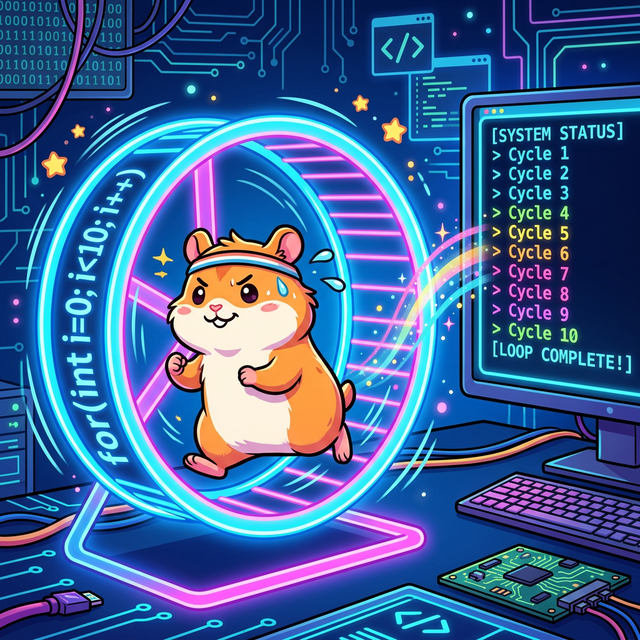
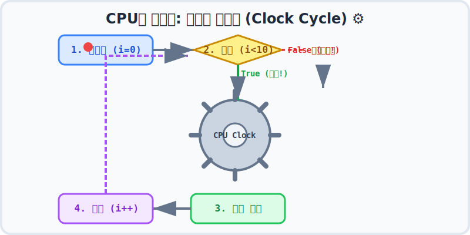

# Chapter 07. 반복문 (Loops)

## 1. 반복문이란? 끝없는 쳇바퀴 🐹

컴퓨터가 인간보다 압도적으로 뛰어난 단 한 가지 능력이 있다면, 그것은 바로 **"지루한 단순 반복 작업을 빛의 속도로 불평 없이 해낸다는 것"** 입니다.
10만 줄짜리 문서를 복사 붙여넣기 한다고 상상해 볼까요? 사람은 며칠이 걸리겠지만, 컴퓨터는 단 1초면 충분합니다.

이렇게 똑같은 코드를 원하는 만큼 반복하게 만들어주는 문법이 바로 **반복문 (Loop)** 입니다.

웹툰 속 귀여운 햄스터가 `for`라는 쳇바퀴를 벗어나지 못하고 10바퀴를 꼬박 채울 때까지 계속 뛰는 것처럼, 컴퓨터도 우리가 설정한 '조건'이 끝날 때까지 쳇바퀴 안의 코드를 무한 반복해서 실행합니다. 

---

## 2. 컴퓨터 하드웨어(CPU)의 쳇바퀴: Clock Cycle ⚙️

우리가 소프트웨어에서 `for`문이나 `while`문을 작성하면, 컴퓨터 내부(CPU)에서는 어떤 일이 벌어질까요?

CPU는 심장 박동처럼 **클럭(Clock)** 이라는 전기 신호에 맞춰 규칙적으로 뜁니다.
우리가 탈출 조건(예: 10바퀴만 돌아라)을 정해주지 않으면, CPU는 전원이 켜져 있는 한 수억 번, 수백억 번 이 클럭 사이클을 돌며 쳇바퀴 안의 코드를 반복 실행합니다. 

단순히 뱅글뱅글 도는 것이 아니라, 4단계의 치밀한 사이클 구조를 가집니다:

1. **초기화 (Init)**: 햄스터가 달리기 전 "나는 0바퀴부터 시작할거야" 라고 카운터를 0으로 맞춥니다.
2. **조건 판단 (Condition)**: "지금 내가 10바퀴를 채웠나?" 매번 뛰기 전에 검사합니다. (못 채웠으면 3번으로, 다 채웠으면 쳇바퀴를 강제로 탈출합니다!)
3. **코드 실행 (Execution)**: 진짜로 달립니다. (내가 시킨 반복 코드 1번 실행)
4. **증감 (Increment)**: 1바퀴를 뛰었으므로, 카운터를 `+1` 시킵니다. 그리고 다시 2번(조건 검사)으로 돌아갑니다.

---

## 3. 이번 챕터에서 배울 내용

기본 원리(쳇바퀴 사이클)는 완벽하게 똑같지만, 상황에 따라 유용하게 쓸 수 있는 다양한 모양의 쳇바퀴 3총사와 부속품들을 배울 것입니다.

### 반복문 3총사
*   **[7.1 for 문](./for)**: "운동장 10바퀴 돌아!" 처럼 **반복 횟수가 명확할 때** 쓰기 좋은 가장 완벽한 쳇바퀴입니다.
*   **[7.2 while 문](./while)**: "비가 그칠 때까지 돌아!" 처럼 횟수보다는 **조건이 만족되는 내내** 무한정 돌리고 싶을 때 사용합니다.
*   **[7.3 do-while 문](./do-while)**: 무조건 일단 한 바퀴는 뛰고 나서 조건을 검사하는 특이한 쳇바퀴입니다.

### 반복문 제어 (브레이크와 점프)
*   **[7.4 break 문](./break)**: 10바퀴를 다 안 채웠더라도, 비상사태가 발생하면 쳇바퀴를 '즉시 부시고 탈출' 해버리는 강력한 폭탄입니다.
*   **[7.5 continue 문](./continue)**: 달리다가 힘들면, 이번 바퀴는 무효 처리(점프)하고 바로 다음 바퀴 세팅(증감)으로 넘어가 버리는 스킵 기술입니다.
