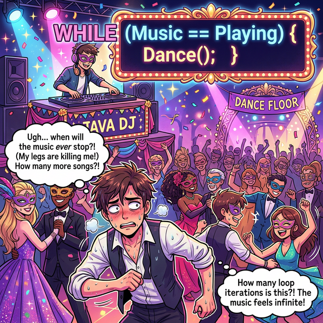
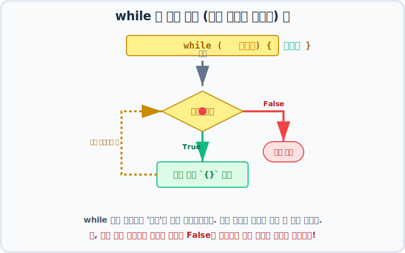

# 7.2 while 문 (끝날 때까지 끝난 게 아니다!)

## 1. 횟수보다는 '조건'이 중요한 무도회장 �🕺

`for` 문이 "정확히 10바퀴 뛰어!" 처럼 횟수가 정해진 육상 트랙이었다면, `while` 문은 **"음악이 끝날 때까지 계속 춤춰!"** 처럼 **언제 끝날지 횟수는 알 수 없으나, 특정 조건이 유지되는 동안 계속 반복해야 할 때** 사용하는 가장 기본적인 반복문입니다.



위 그림의 클럽처럼 "음악이 재생 중인가?(True/False)"라는 하나의 조건(Condition)만을 따집니다. 초기화나 증감식 같은 별도의 부품을 문법 자체에 강제하지 않기 때문에 자유도가 아주 높습니다.

---

## 2. while 문 해부학 (조건 하나면 충분해) 🔬

`while` 문은 영어 단어 뜻 그대로 "~하는 동안 계속" 쳇바퀴를 돕니다.

```java
// 음악 상태 변수
boolean isMusicPlaying = true;

// 조건검사: 소괄호 ( ) 안이 true 인 '동안' 계속 중괄호 { } 내부를 실행
while ( isMusicPlaying ) {
    System.out.println("신나게 춤을 춥니다! 💃");
    
    // (언젠가는 DJ가 음악을 끄는 코드가 들어와야 무한 루프에 안 빠짐!)
}
```

이 흐름은 조건 검사를 가장 먼저 시작합니다.



`for` 문처럼 4단계 사이클(초기화➜조건➜실행➜증감)을 꼭 지킬 필요가 없습니다. 그저 **(조건검사 ➔ 코드실행) ➔ (조건검사 ➔ 코드실행)** 의 아주 심플한 2박자 사이클을 무한 반복하다가, 어느 순간 검사관이 "거짓(False)!" 을 외치면 즉시 루프를 탈출합니다.

---

## 3. for 문 vs while 문 (언제 무엇을 쓸까?) 🤔

초보자분들이 가장 많이 하는 질문입니다. 사실 `for` 문으로 짜는 코드는 100% `while` 문으로 바꿀 수 있고, 그 반대도 가능합니다. 하지만 **'목적'** 에 따라 어울리는 도구가 다릅니다.

*   **`for` 🏃‍♂️ (카운팅 반복):** 도는 **횟수**가 코드에 명확히 보일 때 유리합니다. 예를 들어 "배열의 처음부터 끝까지", "1부터 10까지 누적합" 같은 작업에 찰떡입니다.
*   **`while` 🔄 (조건 의존적 반복):** 횟수보다는 **특정 사건**이 일어날 때까지를 통제할 때 유리합니다. "사용자가 `exit`를 입력할 때까지", "통신 연결이 끊어질 때까지", "게임에서 캐릭터의 체력이 0이 될 때까지" 와 같은 불확실한 반복에 찰떡입니다.

---

## 4. 🚨 주의: 치명적인 무한 루프(Infinite Loop)의 늪

`while` 문에서 가장 조심해야 할 유일한 적은 바로 **'무한 루프'** 입니다.
조건식이 영원히 참(True)으로 남도록 코드를 짜버리면, CPU는 폭주하고(팬 소리가 커지고) 프로그램이 영원히 정지하지 않고 먹통이 됩니다.

```java
int energy = 100;
while (energy > 0) {
    System.out.println("에너지가 있어서 달립니다!");
    // 치명적 실수: 달렸으면 energy를 빼야 하는데, 안 뺐습니다!
    // energy는 영원히 100이므로, 컴퓨터가 뻗을 때까지 출력됩니다.
}
```

---

## 5. 바이브 코딩(Vibe Coding): AI와 함께 횟수 예측 불가 실습 🤖

AI에게 프롬프트를 내려 언제 끝날지 모르는 `while` 문을 직접 경험해 봅시다!

### 🎯 실습 1. 주사위 던지기 게임 (6이 나올 때까지)

게임에서 언제 6이 나올지는 아무도 모릅니다. 단 1번 만에 나올 수도 있고, 100번을 던져야 나올 수도 있죠. 이럴 때가 바로 `while` 문이 출동할 타이밍입니다.

> **🗣️ 학생 프롬프트 (AI에게 이렇게 명령해 보세요):**
> "자바 while문을 사용해서 주사위 6이 나올 때까지 계속 던지는 코드를 짜줘.
> 맨 처음 int dice = 0; 이라고 변수를 만들고,
> while 조건식은 'dice 가 6이 아닐 동안(dice != 6)'으로 해 줘.
> while문 안에서는 (int)(Math.random() * 6) + 1 을 사용해서 1~6 사이의 새로운 랜덤 숫자를 dice 에 넣고, 현재 던진 숫자를 출력해.
> 루프가 끝나면 마지막에 '축하합니다! 드디어 6이 나왔습니다!' 라고 출력해 줘."

**[AI가 생성할 자바 코드 예측]**
```java
public class DiceGame {
    public static void main(String[] args) {
        int dice = 0; // 아직 안 던짐

        System.out.println("주사위 놀이를 시작합니다. 6이 나오면 끝납니다!");

        // dice가 6이 아닌 "동안(while)" 계속 반복합니다.
        while (dice != 6) {
            // 자바에서 1~6의 랜덤 주사위 굴리기 
            // (Math.random()은 0.0 ~ 0.999.. 사이 실수를 주므로 6을 곱하고 1을 더해 정수로 깎아냅니다)
            dice = (int)(Math.random() * 6) + 1; 
            System.out.println("주사위를 굴렸습니다. 나온 눈: " + dice);
        }

        // 루프를 탈출했다는 것은, 조건식(dice != 6)이 드디어 거짓이 되었다 = 즉 dice가 6이라는 뜻!
        System.out.println("🎉 축하합니다! 드디어 6이 나왔습니다!");
    }
}
```

이 코드를 여러 번 실행해 보시면, 매번 쳇바퀴를 도는 횟수(출력되는 줄 수)가 달라지는 것을 직접 눈으로 확인하실 수 있습니다. 이것이 바로 `while` 문의 묘미입니다!

---

## 6. 의도적인 무한 루프와 탈출구 (`while(true)` & `break`) 🚪

앞서 무한 루프는 컴퓨터를 다운시키는 '위험한 버그'라고 설명했지만, 반대로 이를 **적극적으로 활용하는 경우**도 굉장히 많습니다.

24시간 돌아가야 하는 웹 서버, 사용자가 '종료' 버튼을 누르기 전까지 계속 실행되어야 하는 게임이나 채팅 프로그램들은 모두 내부에 거대한 **의도된 무한 루프**를 가지고 있습니다.

```java
// 의도적인 무한 루프 만들기
while (true) {
    // 1. 사용자 입력 대기
    // 2. 입력받은 명령 처리
    // 3. 만약 사용자가 "종료"를 입력했다면? -> 루프 탈출!
}
```

이럴 때 쳇바퀴를 부수고 강제로 빠져나오게 해주는 비상 탈출 버튼이 바로 **`break;`** 키워드입니다. (`switch` 문에서 배웠던 그 `break`와 동일한 역할입니다!)

### 🎯 실습 2. 메아리 채팅봇 (종료할 때까지 무한 반복)

사용자가 키보드로 치는 말을 그대로 앵무새처럼 따라 하다가, "종료"라고 치면 프로그램이 완전히 끝나는 예제를 만들어 봅시다.

> **🗣️ 학생 프롬프트 (AI에게 이렇게 명령해 보세요):**
> "자바 while문을 사용해서 의도적인 무한 루프(while(true))를 도는 메아리(Echo) 봇을 짜줘.
> 루프 안에서 Scanner를 사용해서 사용자의 입력을 문장(String)으로 받아.
> 만약 사용자가 입력한 글자가 "종료"라면, break; 를 써서 무한 루프를 탈출해 줘.
> "종료"가 아니라면 사용자가 친 글자를 다시 화면에 그대로 메아리처럼 출력해 줘."

**[AI가 생성할 자바 코드 예측]**
```java
import java.util.Scanner;

public class EchoLoop {
    public static void main(String[] args) {
        Scanner scanner = new Scanner(System.in);
        System.out.println("🤖 앵무새 봇이 켜졌습니다. (끝내려면 '종료' 입력)");

        // 의도적인 무한 루프 시작!
        while (true) {
            System.out.print("당신: ");
            String input = scanner.nextLine(); // 키보드 입력 대기

            // 탈출 조건 검사!
            if (input.equals("종료")) {
                System.out.println("🤖 앵무새 봇이 잠듭니다...");
                break; // 쳇바퀴를 강제로 부수고 루프 바깥으로 탈출합니다!
            }

            // 탈출하지 않았다면 메아리 치기
            System.out.println("앵무새: " + input);
        }

        // break를 만나면 코드가 이쪽으로 건너뜁니다.
        System.out.println("프로그램이 완전히 종료되었습니다.");
    }
}
```

**[실행 결과 예시]**
```text
🤖 앵무새 봇이 켜졌습니다. (끝내려면 '종료' 입력)
당신: 안녕
앵무새: 안녕
당신: 밥 먹었어?
앵무새: 밥 먹었어?
당신: 종료
🤖 앵무새 봇이 잠듭니다...
프로그램이 완전히 종료되었습니다.
```

이렇게 `while(true)` 와 `break` 의 조합은 현업에서 가장 많이 쓰이는 필수 테마 중 하나이므로 꼭 손가락으로 익혀 두시기 바랍니다!

---

## 코딩 영단어 학습 📝

코딩에서 영어 단어의 의미만 정확히 이해해도 절반은 성공입니다! 오늘 배운 핵심 영단어들을 다시 한번 짚고 넘어가 볼까요?

*   **`While`**: 와일. (~하는 동안. 조건식이 참(True)인 동안 계속 반복하는 명령어)
*   **`Condition`**: 컨디션, 조건. (루프를 계속 돌릴지 탈출할지 결정하는 기준식)
*   **`Infinite Loop`**: 무한 루프. (탈출 조건을 잘못 설정하여 영원히 끝나지 않는 버그 현상)
*   **`Echo`**: 에코, 메아리. (입력받은 값을 그대로 다시 출력해 주는 동작)
