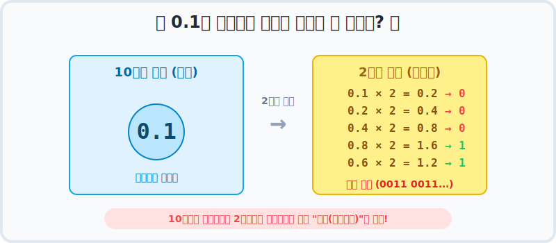

# 3.4 정확한 계산은 정수 연산으로 🎯

산술 연산을 완벽하게 오차 없이 계산하고 싶다면 실수 타입(`float`, `double`)을 피하고 정수 타입(`int`, `long`)을 사용하는 것이 가장 좋습니다. 돈(금융)과 관련된 계산에서는 특히 치명적일 수 있습니다.

---

## 1. 부동 소수점(실수)의 치명적인 단점

컴퓨터 메모리(상자)에는 한계가 있지만, 수학에서 소수점 아래 숫자는 **무한(Infinity)** 할 수 있습니다.

### 왜 0.1을 정확히 담을 수 없을까?
사람이 쓰는 10진수에서 `0.1`은 아주 깔끔한 유한소수입니다. 하지만 이것을 컴퓨터가 이해하는 `2진수` 로 바꾸려면 계속 2를 곱해서 정수부를 취해야 하는데, 이 과정이 **무한히 반복(0.0001100110011...)**되게 됩니다.



결국 컴퓨터(IEEE 754 표준 설계)는 자신의 메모리 한계(32bit 또는 64bit)까지만 이 소수를 저장하고 **나머지를 잘라내어 반올림(근사치 표현)** 해버립니다. 여기서 미세한 오차가 발생합니다.



다음 예제를 살펴보겠습니다. 사과 1개를 10조각(0.1)으로 자른 뒤, 그 중 7조각(0.7)을 뺀 나머지 3조각(0.3)을 `result` 변수에 저장하려고 합니다.

**[예제: AccuracyExample1.java]**
```java
package ch03.sec04;

public class AccuracyExample1 {
    public static void main(String[] args) {
        int apple = 1;
        double pieceUnit = 0.1;
        int number = 7;
        
        double result = apple - number * pieceUnit;
        
        System.out.println("사과 1개에서 남은 양: " + result);
    }
}
```

**실행 결과**
```
사과 1개에서 남은 양: 0.29999999999999993
```

출력된 결과를 보면 `result` 변수의 값이 깔끔하게 `0.3`이 되지 않는 것을 확인할 수 있습니다. 

---

## 2. 해결책: "정수로 바꿔서 계산하라" 💡

이러한 부동 소수점의 오차 함정을 피하는 가장 완벽한 방법은, **소수점을 없애고 정수(int, long)로 스케일업(Scale-up)하여 연산**한 뒤, 출력할 때만 소수점을 찍어주는 것입니다.

0.1 단위 조각을 계산하지 말고, 아예 사과 하나를 "10" 이라는 정수로 취급해버리면 됩니다.

**[예제: AccuracyExample2.java]**
```java
package ch03.sec04;

public class AccuracyExample2 {
    public static void main(String[] args) {
        int apple = 1;
        int totalPieces = apple * 10;  // 1.0을 10으로 취급 (스케일업)
        int number = 7;                // 0.7을 7로 취급
        
        int result = totalPieces - number; // 정수 연산 10 - 7 = 3
        
        System.out.println("10조각에서 남은 조각: " + result);
        System.out.println("사과 1개에서 남은 양: " + result / 10.0); // 마지막에만 소수로 나눔
    }
}
```

**실행 결과**
```
10조각에서 남은 조각: 3
사과 1개에서 남은 양: 0.3
```

> **🔥 금융권 개발자 필수 상식 🔥**
> 은행, 핀테크 등 1원의 오차도 허용할 수 없는 돈 계산을 할 때는 `double`을 쓰면 절대로 안 됩니다. **`int` / `long`** 을 사용하여 "원"이나 "전" 단위의 정수로 바꾸어 연산하거나, 자바에서 제공하는 기본 무한정밀도 클래스인 **`BigDecimal`** 을 사용해야만 합니다!
