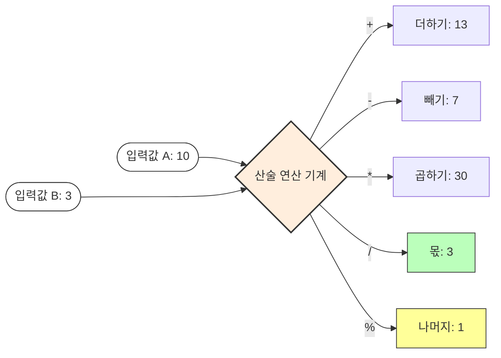
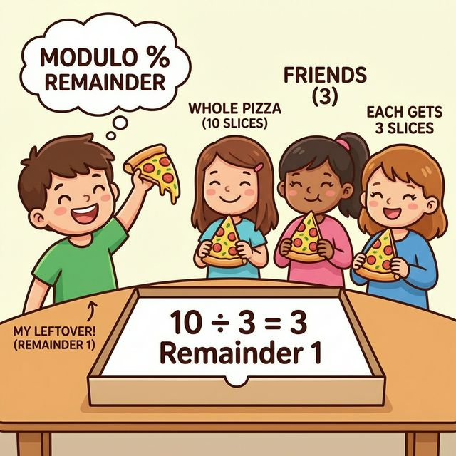
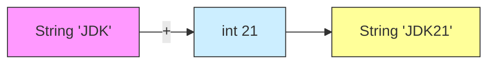

# 5.2 산술 연산자 (Arithmetic Operators)

수학 시간에 배운 사칙연산(`+`, `-`, `*`, `/`)을 프로그램에서 어떻게 사용하는지 알아봅니다.
그리고 수학에는 없지만 프로그래밍에서 매우 중요한 **나머지 연산자(`%`)**의 비밀도 파헤쳐 봅시다. ➗

---

## 1. 사칙연산과 나머지 🧮

### 1) 기본 연산자
자바는 5가지 기본 산술 연산자를 제공합니다.

| 연산자  | 이름        | 설명                             | 예시 (a=10, b=3) | 결과              |
| :-----: | :---------- | :------------------------------- | :--------------- | :---------------- |
| **`+`** | 더하기      | 값을 더합니다.                   | `10 + 3`         | `13`              |
| **`-`** | 빼기        | 값을 뺍니다.                     | `10 - 3`         | `7`               |
| **`*`** | 곱하기      | 값을 곱합니다. (`x` 아님)        | `10 * 3`         | `30`              |
| **`/`** | 나누기 (몫) | 나누고 난 **몫**을 구합니다.     | `10 / 3`         | `3` (3.333 아님!) |
| **`%`** | **나머지**  | 나누고 난 **나머지**를 구합니다. | `10 % 3`         | `1`               |

### 2) 산술 기계 (계산 과정 시각화)



*   **용도**:
    *   `/`: 빵 10개를 3명에게 똑같이 나눠줄 때 한 사람이 받는 개수
    *   `%`: 다 나눠주고 남은 빵의 개수 (짝수/홀수 판별, 배수 확인 등에 필수!)



---

## 2. 주의: 정수 나눗셈의 함정 ⚠️

프로그래밍 초보자가 가장 많이 하는 실수입니다.
**정수끼리 나누면 결과도 무조건 정수(몫)**가 나옵니다. 소수점은 과감히 버려집니다.

```java
int a = 10;
int b = 4;

System.out.println(a / b); // 출력: 2 (2.5가 아님!)
```

### 해결 방법 ✅
소수점까지 정확하게 계산하려면, 숫자 중 최소한 하나는 실수(`double`)여야 합니다.

```java
System.out.println(10 / 4.0);   // 2.5 (성공)
System.out.println(10.0 / 4);   // 2.5 (성공)
System.out.println((double)10 / 4); // 2.5 (강제 변환 후 계산)
```

---

## 3. 문자열 더하기 (연결) 🔗

`+` 연산자는 숫자를 더하는 기능뿐만 아니라, **글자를 이어 붙이는 풀(Glue)** 역할도 합니다.

### 1) 개념
문자열이 하나라도 섞여 있으면, 나머지 숫자들도 모두 문자열로 변해서 이어 붙습니다.



### 2) 코드 예시
```java
String str1 = "JDK" + 21;      // "JDK21"
String str2 = "3" + 3.0;       // "33.0" (숫자 6.0 아님!)
String str3 = "A" + "B";       // "AB"
```

> **우선순위 주의**: 앞에서부터 순서대로 계산됩니다.
> `System.out.println(1 + 2 + "3");` 👉 `"33"` (1+2=3, 3+"3"="33")
> `System.out.println("1" + 2 + 3);` 👉 `"123"` ("1"+2="12", "12"+3="123")
