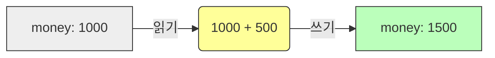

# 5.6 대입 연산자 (Assignment Operators)

변수에 값을 저장하거나, 저장된 값을 수정할 때 사용하는 연산자입니다.

---

## 1. 기본 대입 연산자 (`=`) 📥

### 1) 개념
"오른쪽의 값을 왼쪽의 변수에 저장하라"는 명령입니다.
수학의 "같다"와는 전혀 다른 의미입니다.

```java
int score = 80; // 80을 score 상자에 넣어라
```

---

## 2. 복합 대입 연산자 (Compound Assignment) ⚡️

### 1) 개념
산술 연산(`+`, `-`, `*`, `/`)과 대입 연산(`=`)을 한 번에 처리하는 **단축키**입니다.
코드를 더 짧고 간결하게 만들어줍니다.

### 2) 비유: "저금통"
*   **기본**: "내 저금통에 있는 돈을 꺼내서 500원을 더한 뒤에 다시 저금통에 넣어라." (`money = money + 500`)
*   **복합**: "내 저금통에 500원 더 넣어라." (`money += 500`)

### 3) 종류 및 변환 표

|  연산자  | 풀어쓴 코드 | 설명                       |
| :------: | :---------- | :------------------------- |
| **`+=`** | `A = A + B` | A에 B를 더해서 저장        |
| **`-=`** | `A = A - B` | A에서 B를 빼서 저장        |
| **`*=`** | `A = A * B` | A에 B를 곱해서 저장        |
| **`/=`** | `A = A / B` | A를 B로 나눈 몫을 저장     |
| **`%=`** | `A = A % B` | A를 B로 나눈 나머지를 저장 |

### 4) 실행 흐름 시각화



---

## 3. 코드 예시

```java
int money = 1000;

money += 500;  // 1500 (1000 + 500)
money -= 200;  // 1300 (1500 - 200)
money *= 2;    // 2600 (1300 * 2)
money /= 100;  // 26   (2600 / 100)
```
