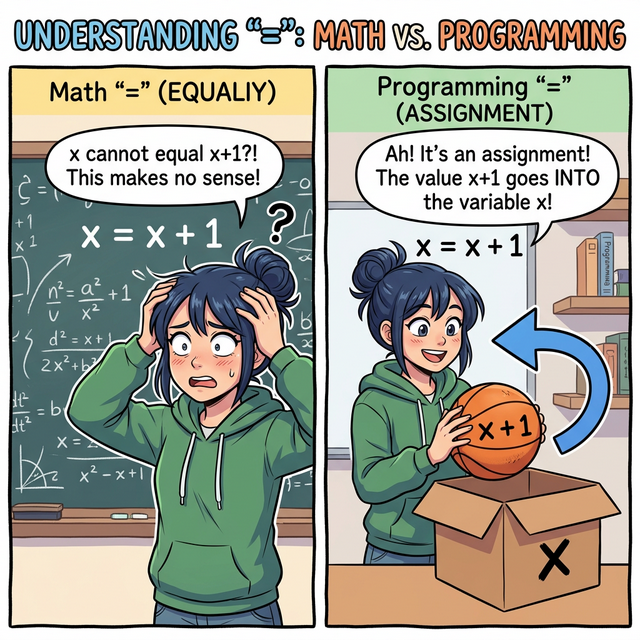

# 5.6 대입 연산자 (Assignment Operators)

프로그래밍에서 가장 흔하게 쓰이면서도, 초보자들이 수학 기호와 헷갈려 가장 많이 실수하는 연산자가 바로 **대입 연산자(`=`)** 입니다.

---

## 1. 기본 대입 연산자 (`=`) 📥

### 1) 수학의 `=` vs 프로그래밍의 `=`

수학 시간의 `=`는 "왼쪽과 오른쪽이 똑같다"라는 상태를 의미합니다. 하지만 컴퓨터 프로그래밍에서 `=` 기호는 **명령문**입니다!



웹툰을 보세요! 프로그래밍 세상(자바)에서 `=` 기호는 무조건 **오른쪽에 있는 데이터 수식을 다 계산해서, 왼쪽에 있는 상자(변수)에 집어넣어라!** 라는 강력한 동작 명령입니다.
그래서 우리는 이 기호를 '같다'가 아니라 **'대입(Assignment)하다'** 라고 부릅니다.

```java
// 수학에서는 말이 안 되지만, 프로그래밍에서는 아주 흔한 정상 코드!
int x = 5;
x = x + 1; 
```

위 코드를 해석하면:
1. 내 앞의 `x` 상자에 `5`가 들어있었습니다.
2. `=` 기호 오른쪽부터 먼저 봅니다. 원래 들어있던 `x` 값(`5`)에 `1`을 더합니다. -> `6`
3. 그 `6`이라는 새로운 값을 왼쪽의 `x` 상자에 통째로 다시 욱여넣습니다. (원래 있던 5는 부서지고 6으로 덮어씌워짐)

---

## 2. 복합 대입 연산자 (Compound Assignment) ⚡️

### 1) 귀차니즘이 만든 발명품

개발자들은 타자 치는 것을 극도로 귀찮아합니다. 
방금 봤던 `x = x + 1;` 이나 `money = money + 500;` 처럼 내 변수가 식의 양쪽에 똑같이 두 번 등장하는 경우가 너무 많았습니다. 
그래서 사칙연산(`+`, `-`, `*`, `/`)과 대입 연산(`=`)을 하나로 합친 **단축키(복합 대입 연산자)** 를 발명했습니다.



위 애니메이션처럼 일반 공식은 "저금통 배를 가르고, 돈을 꺼내서, 밖에서 더한 뒤, 다시 배를 꿰매서 넣는" 번거로운 스텝(2단계)을 가집니다.
반면 **복합 대입 연산자 (`+=`)** 는 배를 가를 필요 없이, **저금통 입구 위로 동전을 쏙 밀어 넣기만 하면 알아서 내부에 누적(+500)되는 아주 깔끔한 방식(1단계)** 입니다.

---

### 2) 복합 대입 연산자 총정리 표 (##별 분류)

어떤 연산을 단축하느냐에 따라 다양한 모양이 존재합니다. 수학 공식을 단축시킨 코드로 읽는 연습을 해보세요!

#### ## A. 더하기, 빼기 계열
가장 많이 쓰이는 일상적인 누적치, 잔액 계산에 쓰입니다.

| 단축 연산자 | 원래 코드 (풀어쓴 모습) | 실제 의미 |
| :---: | :--- | :--- |
| `money += 500;` | `money = money + 500;` | 기존 잔액에 500원을 **더해서 누적**하라. |
| `money -= 200;` | `money = money - 200;` | 기존 잔액에서 200원을 **깎아서 누적**하라. |

#### ## B. 곱하기, 나누기 계열
크기가 배율로 커지거나 줄어드는 계산에 쓰입니다.

| 단축 연산자 | 원래 코드 (풀어쓴 모습) | 실제 의미 |
| :---: | :--- | :--- |
| `size *= 2;`  | `size = size * 2;`    | 기존 크기를 2배로 **뻥튀기해서 저장**하라. |
| `size /= 10;` | `size = size / 10;`   | 기존 크기를 10등분으로 **자른 몫을 저장**하라. |

#### ## C. 나머지 계열
순환하는 패턴이나 홀수/짝수 판별 시 누적할 때 쓰입니다.

| 단축 연산자 | 원래 코드 (풀어쓴 모습) | 실제 의미 |
| :---: | :--- | :--- |
| `time %= 60;` | `time = time % 60;`   | 60으로 나누고 **남은 짜투리(나머지)만 저장**하라. |

---

## 3. 실전 예제 코드로 확인하기

위에서 배운 5가지 복합 대입 연산자가 실제로 코딩에서는 어떻게 쓰이는지 자바 예제로 확인해 봅시다.

**[예제: AssignmentOperatorExample.java]**
```java
package ch05.sec06;

public class AssignmentOperatorExample {
    public static void main(String[] args) {
        int result = 0; // 텅 빈 상자 준비
        
        // 1. += 연산자
        result += 10;   // result = 0 + 10; => 10
        System.out.println("result += 10: " + result);

        // 2. -= 연산자
        result -= 5;    // result = 10 - 5; => 5
        System.out.println("result -= 5: " + result);

        // 3. *= 연산자
        result *= 3;    // result = 5 * 3; => 15
        System.out.println("result *= 3: " + result);

        // 4. /= 연산자
        result /= 2;    // result = 15 / 2; => 7 (정수 나눗셈은 소수점 버림)
        System.out.println("result /= 2: " + result);

        // 5. %= 연산자
        result %= 4;    // result = 7 % 4; => 3 (7을 4로 나누면 나머지가 3)
        System.out.println("result %= 4: " + result);
    }
}
```

**실행 결과**
```text
result += 10: 10
result -= 5: 5
result *= 3: 15
result /= 2: 7
result %= 4: 3
```

이처럼 변수 이름을 두 번 쓰지 않고도 아주 간결하고 우아하게 코드를 설계할 수 있습니다. 앞으로 실무에서 코딩할 때는 `money = money + 500;` 대신 무조건 `money += 500;` 을 사용하는 습관을 들이세요!
