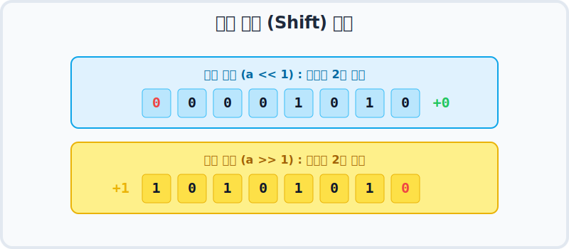

# 3.9 비트 이동 연산자 (Bit Shift)

비트 이동 연산자는 컴퓨터 메모리 안에 들어있는 진짜 0과 1 데이터(비트)들을 통째로 왼쪽이나 오른쪽으로 한 칸씩 밀어버리는(Shift) 아주 특수한 연산자입니다. 

우선 아래 흥미로운 웹툰부터 하나 볼까요?


웹툰 속 학생들이 뭔가 엄청난 수학 꼼수(치트키)를 발견한 것 같죠? 
지금부터 이들이 왜 저렇게 기뻐하는지, **비트 이동 연산자가 가진 숨겨진 마법 같은 힘(x2, /2 효과)** 을 하나씩 파헤쳐 보겠습니다.

---

## 1. 왼쪽으로 밀기: `<<` (곱하기 2의 마법 ✨)

기호 `<<` 는 비트들을 왼쪽으로 원하는 칸 수만큼 통째로 밀어 이동시키는 연산자입니다.

### 💡 왜 곱하기 2가 될까요?

우리가 쓰는 10진수에서 숫자를 왼쪽으로 한 칸 밀고 끝에 0을 붙이면 어떻게 되나요? 
`5` ➔ `50` (10배가 됨!)
`14` ➔ `140` (10배가 됨!)

컴퓨터가 쓰는 2진수도 똑같습니다! 2진수에서 비트를 왼쪽으로 한 칸 밀면 **정확히 2배**가 커집니다.
두 칸 밀면 `2 × 2 = 4배`, 세 칸 밀면 `2 × 2 × 2 = 8배`가 커집니다.



> **[공식]** `a << b` ➔ `a × (2의 b승)` 과 완벽히 똑같은 결과가 나옵니다.

---

## 2. 오른쪽으로 밀기: `>>` (나누기 2의 마법 🔪)

기호 `>>` 는 비트들을 오른쪽으로 원하는 칸 수만큼 밀어 이동시키는 연산자입니다.

우리가 쓰는 10진수에서 끝자리를 하나 버리면 어떻게 되나요? (소수점은 버린다고 칠 때)
`500` ➔ `50` (10으로 나눈 몫!)

마찬가지로 2진수에서 비트를 오른쪽으로 1칸 밀어서 끝자리를 벼랑 끝으로 떨어뜨리면 **정확히 2로 나눈 몫**이 됩니다. (나머지는 사라집니다.)

> **[공식]** `a >> b` ➔ `a ÷ (2의 b승)` 과 완벽히 똑같은 결과가 나옵니다.

---

## 3. 컴퓨터는 왜 굳이 밀어서 계산할까요? 🏎️

"그냥 `* 2` 하거나 `/ 2` 하면 되는데, 굳이 왜 비트를 미는 복잡한 짓을 하나요?"

바로 **엄청난 계산 속도** 때문입니다! 
컴퓨터 입장에서 `*` 나 `/` 기호를 보고 곱하기 구구단을 수행하는 것보다, 메모리판 통째로 위치만 옆으로 쓱- 밀어버리는 비트 이동(`<<`, `>>`) 연산이 **수십 배 가까이 처리 속도가 압도적으로 빠릅니다.** 

그래서 게임 엔진이나 아주 빠른 계산이 필요한 시스템에서는 `* 2` 대신에 의도적으로 `<< 1` 을 사용하는 고수들의 치트키로 쓰입니다.

---

## 4. 자바 코드로 직접 확인하기

논리가 진짜인지 코드로 증명해 봅시다.

**[예제: BitShiftMathExample.java]**
```java
package ch03.sec09;

public class BitShiftMathExample {
    public static void main(String[] args) {
        
        // --- 1. 왼쪽 이동 (<<) : 곱하기 효과 ---
        int num1 = 1;
        int result1 = num1 << 3; // 1을 왼쪽으로 3칸 밀기
        int result2 = num1 * (int) Math.pow(2, 3); // 1 * (2의 3승)
        
        System.out.println("1 << 3 결과: " + result1);
        System.out.println("1 * 2^3 결과: " + result2);
        
        // --- 2. 오른쪽 이동 (>>) : 나누기 효과 ---
        int num2 = -8;
        int result3 = num2 >> 3; // -8을 오른쪽으로 3칸 밀기
        int result4 = num2 / (int) Math.pow(2, 3); // -8 / (2의 3승)
        
        System.out.println("-8 >> 3 결과: " + result3);
        System.out.println("-8 / 2^3 결과: " + result4);
    }
}
```

**실행 결과**
```text
1 << 3 결과: 8
1 * 2^3 결과: 8
-8 >> 3 결과: -1
-8 / 2^3 결과: -1
```

이처럼 일반적인 사칙연산 곱하기/나누기와, 비트 이동 연산의 결과가 완벽하게 똑같다는 것을 증명했습니다! (물론 속도는 비트 연산자가 압도적으로 빠릅니다)

---

## 5. 심화: 억울한 우측 이동 `>>>` (자바에만 있음!)

자바에는 `>>` 외에도 화살표가 3개 달린 `>>>` 라는 특별한 우측 이동 연산자가 하나 더 있습니다.
보통 `>>` 연산자는 음수를 밀 때, 앞자리의 빈 공간을 기존 부호(음수면 1)로 계속 채워 넣으면서 부호를 유지해 주려고 배려합니다. 

하지만 `>>>` 녀석은 **"부호고 뭐고 난 무조건 빈칸은 0으로 다 밀어버릴 거야!"** 라며 제일 왼쪽에 생기는 빈칸을 차가운 0으로만 채웁니다. 결과적으로 음수를 `>>>` 로 밀면 양수(0)로 강제 변경되어 어마어마하게 큰 엉뚱한 숫자가 나와버립니다.

```java
int result = -8 >>> 3;
//00011111 11111111 11111111 11111111 (십진수: 536870911)
```

이 `>>>` 연산은 나중에 네트워크 통신이나 암호화 처리 등에서 원본 바이너리 바이트(Byte) 자체를 조작할 때 요긴하게 쓰입니다.
