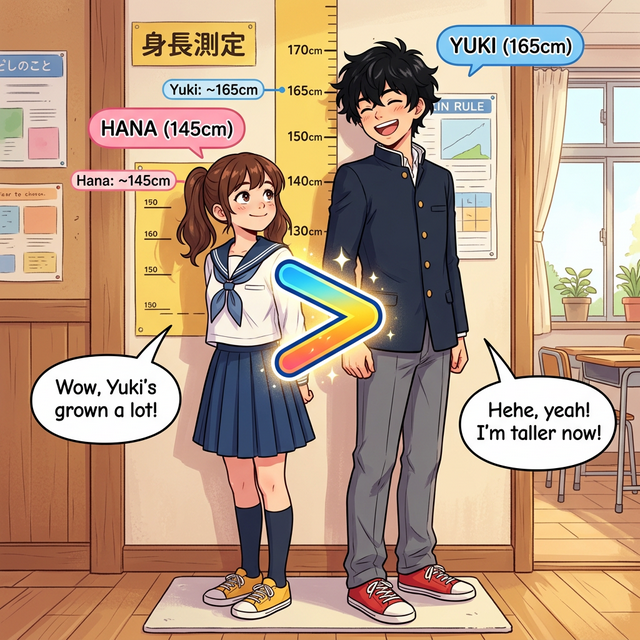
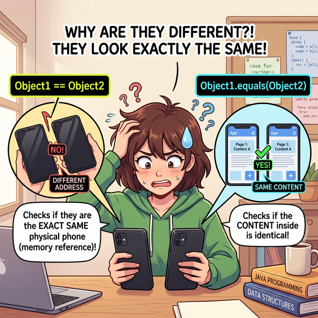
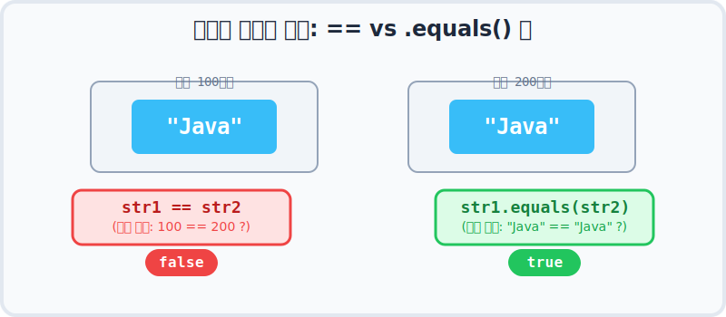

# 5.4 비교 연산자 (Comparison Operators)

"누가 더 키가 큰가요?", "내 비밀번호와 똑같은가요?" 처럼 두 개의 값을 놓고 비교해보는 것이 바로 **비교 연산자**입니다! 
결과는 복잡하게 나올 것 없이 무조건 **"맞아!(true)"** 아니면 **"아니야!(false)"** 두 가지로만 나옵니다. 

마치 스무고개 게임을 하는 것처럼 컴퓨터에게 "이 녀석이 저 녀석보다 작니?" 라고 물어보는 과정이에요.

---

## 1. 크기 비교 (숫자 비교하기) ⚖️

우리가 초등학교, 중학교 수학 시간에 배웠던 부등호 기호들을 컴퓨터에서도 똑같이 사용합니다. 
(단, 키보드에는 `≤`, `≥` 기호가 없어서 부등호 옆에 `=`를 붙여서 `<=`, `>=` 형태로 쓰기로 약속했어요!)



위 그림처럼 서로 등을 맞대고 키를 재는 것과 완벽하게 똑같은 원리입니다!

| 연산자 | 어떤 뜻일까요? | 예시 질문 (a=10, b=5 일 때) | 대답 (결과) |
| :---: | :--- | :--- | :--- |
| **`>`** | **크다 (초과)**: 왼쪽이 오른쪽보다 커? | `10 > 5` | `true` (맞아!) |
| **`>=`** | **크거나 같다 (이상)**: 왼쪽이 크거나 같아? | `10 >= 10` | `true` (응, 같아!) |
| **`<`** | **작다 (미만)**: 왼쪽이 오른쪽보다 작아? | `10 < 5` | `false` (아닌데?) |
| **`<=`** | **작거나 같다 (이하)**: 작거나 같아? | `10 <= 5` | `false` (아니야!) |

### 컴퓨터 속의 "양팔 저울" ⚖️
컴퓨터는 비교를 할 때, 머릿속으로 양쪽 접시에 값을 올려놓고 어느 쪽이 더 무거운지(큰지) 확인하는 양팔 저울을 떠올립니다. 숫자를 올려놓았을 때 저울이 기울어지는 방향에 따라 true와 false가 결정됩니다!



---

## 2. 등가 비교 (완전히 똑같은가?) 🤝

이번에는 크기가 아니라 **"둘이 완전히 똑같이 생겼는가?"** 아니면 **"서로 다르게 생겼는가?"** 를 물어볼 때 쓰는 연산자입니다.

| 연산자 | 어떤 뜻일까요? | 예시 질문 | 대답 (결과) |
| :---: | :--- | :--- | :--- |
| **`==`** | **같다**: 둘이 완전 똑같아? | `10 == 10` | `true` (맞아!) |
| **`!=`** | **다르다**: 둘이 서로 달라? (`!`는 Not의 의미) | `10 != 5` | `true` (응, 달라!) |

> 🚨 **초보자들이 가장 많이 하는 실수! (반드시 기억하세요)**
> 수학 시간에는 `=` 하나만 써도 "같다"라는 뜻이었죠? 
> 하지만 자바 프로그래밍에서 **`=` 하나는 "오른쪽 값을 왼쪽에 저장시켜라!(대입)"** 라는 뜻입니다. 
> 진짜로 둘이 같은지 물어보려면 **반드시 `=`를 두 번 써서 `==`** 라고 해야 컴퓨터가 알아듣습니다!

---

## 3. 😱 초보자 탈곡기: 비교 연산의 치명적인 함정 3가지와 해결책!

비교 연산자는 언뜻 보면 세상에서 가장 쉬워 보입니다. "그냥 `==` 찍으면 끝 아니야?" 라고 생각하겠지만, 수많은 입문 학생들이 여기서 멘탈이 붕괴됩니다. 자바 세계에서는 **자료형(타입)에 따라 엄청난 반전**이 숨어 있거든요. 하나씩 해결책과 함께 알아볼까요?

### 함정 1: 실수 비교 통수 "엥? 0.1이 0.1이 아니라고?!" 🥶
- **문제 발생**: `3 == 3.0`은 정수 3과 실수 3.0을 비교하는 거라 당연히 `true`가 나옵니다 (자동 형변환 지원). 
그런데 `0.1f == 0.1` 에서는 충격적이게도 **`false`** 가 나와버립니다!
- **왜 그럴까요?**: 컴퓨터가 소수(실수)를 메모리에 저장할 때는 크기에 한계가 있어서 뒷자리를 대충 반올림한 **비슷한 근사값**을 욱여넣습니다. (이전 챕터 "정확한 계산은 정수 연산으로" 참조). 
가벼운 그릇인 `float`(0.1f)가 억지로 담아둔 숫자와, 큰 그릇인 `double`(0.1)이 억지로 담아둔 숫자는 **미세한 뒷자리 오차**가 서로 달라져 버린 겁니다.
- **✅ 해결책**:
   1. 피연산자를 모두 같은 작은 타입인 `float`로 **강제 형변환(Casting)**을 해주고 나서 비교해야 합니다. 예: `(float)0.1 == 0.1f` 
   2. 혹은 둘 다 10을 곱해서(스케일업) **소수를 떼어버리고 완벽한 정수 형태로 만든 뒤** 비교하세요!

### 함정 2: 포장된 정수(Integer) 통수 "똑같이 300원인데 다르다고?!" 📦
- **문제 발생**: 자바에는 가벼운 알맹이 숫자(`int`)가 있고, 숫자를 상자에 예쁘게 포장해서 도장을 찍은 객체 형태(`Integer`)가 있습니다.
`int a = 300;` 과 `Integer b = 300;` 을 `a == b`로 묻어보면 자바가 포장지를 알아서 뜯어주어 `true`가 나옵니다.
그런데 상자끼리 비교하겠다고 **`Integer c = 300;` 과 `Integer d = 300;` 을 `c == d`로 물어보면 눈물 나게도 `false`가 나옵니다.**
- **왜 그럴까요?**: 포장된 상자(객체/참조형)끼리 `==` 기호로 검사하면, 내용물인 300원이 같은지가 궁금한 게 아니라 **"그거 아예 물리적으로 똑같은 상자 공장에서 찍어낸 같은 박스야?!"** 라고 상자(메모리 주소)를 물어보기 때문입니다. 서로 다른 두 박스이므로 무조건 `false`입니다.
> (※ 참고로 자바가 메모리를 아끼려고 -128 ~ 127 사이의 작은 숫자는 똑같은 낡은 박스를 재활용합니다... 그래서 이 구간에서는 `==` 가 `true`가 나오는 함정도 파놓았습니다! 악마 같죠?)
- **✅ 해결책**: 
   상자에 담긴 값(Object)을 비교할 때는 내용물을 까서 보여주는 **마법의 주문 `.equals()` 를 사용**해야 합니다! `c.equals(d)` 처럼요!

### 함정 3: 문자열(String) 통수 "비밀번호가 같은데 왜 로그인이 안돼?!" 📱
- **문제 발생**: 회원가입 때 적은 "Java"와, 이제 막 로그인하려고 타건한 "Java"를 `==` 로 비교하면 `false`가 나와서 절대 로그인이 되지 않습니다. 
- **왜 그럴까요?**: 문자열(String)도 위 2번 함정의 **"포장된 상자(참조형)"** 기 때문입니다.

아래 웹툰을 보면서 이해해 볼까요?



겉보기에 완전히 똑같이 생긴 쌍둥이 스마트폰 2대가 있다고 상상해 보세요. (화면에는 둘 다 "Java"라고 적혀 있습니다!)
- **`==` 로 검사하면?** "어라? 1번 폰과 2번 폰은 집 주소가 다른 다른 기계네!" 하고 가차 없이 `false`를 뱉습니다. 

- **✅ 해결책**:
기계가 달라도 화면 속 글자(내용물)가 "Java"로 똑같은지를 알고 싶다면, 무조건 문자 뒤에 점(`.`)을 찍고 **`str1.equals(str2)`** 라는 마법 주문을 외워야 합니다!

```java
String str1 = "Java";
String str2 = new String("Java"); // 내용물은 같지만, 아예 새로운 빈 박스에 포장해서 메모리에 생성함!

System.out.println(str1 == str2);      // false (포장된 박스와 집 주소가 다르잖아!) ❌
System.out.println(str1.equals(str2)); // true (오, 박스를 뜯어보니 글자 내용물은 똑같네!) ✅
```

### 눈으로 보는 문자열 메모리 비교 방식

아래 애니메이션을 통해 `==` (물리적 주소 검사) 와 `.equals()` (내용물 검사) 가 컴퓨터 속에서 어떻게 다르게 일하는지 직접 확인해 보세요! 

