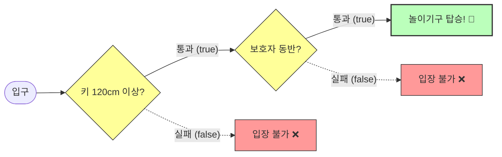
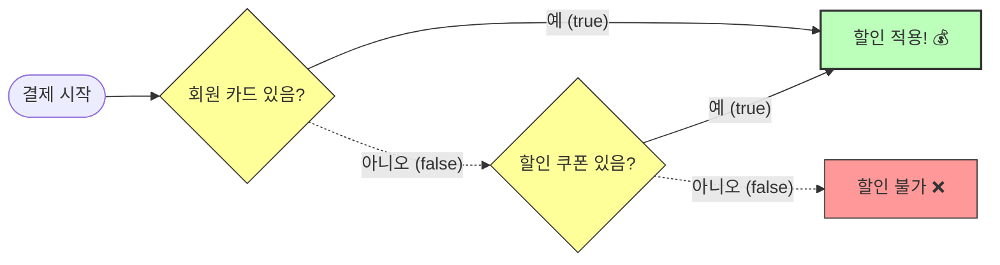

# 5.5 논리 연산자 (Logical Operators)

여러 개의 조건(True/False)을 조합해서 복잡한 판단을 내릴 때 사용합니다.
**"그리고(AND)", "또는(OR)", "아니오(NOT)"** 3가지만 기억하면 됩니다.

---

## 1. AND 연산자 (`&&`) : 둘 다 만족해야 통과! 🤝

### 1) 개념
두 조건이 **모두 참(true)**이어야 결과가 참이 됩니다. 하나라도 거짓이면 거짓입니다.

### 2) 비유: "놀이공원 입장"
*   조건 1: 키가 120cm 이상이어야 한다.
*   조건 2: **그리고(&&)**, 보호자가 동반해야 한다.
*   둘 다 만족해야 놀이기구를 탈 수 있습니다.



### 3) 진리표
|   A   |   B   | 결과 (A && B) | 설명                 |
| :---: | :---: | :-----------: | :------------------- |
| true  | true  |   **true**    | 둘 다 참이니까 통과! |
| true  | false |   **false**   | B가 거짓이라 탈락    |
| false | true  |   **false**   | A가 거짓이라 탈락    |
| false | false |   **false**   | 둘 다 거짓이라 탈락  |

---

## 2. OR 연산자 (`||`) : 하나라도 있으면 통과! 👐

### 1) 개념
두 조건 중 **하나라도 참(true)**이면 결과가 참이 됩니다. 둘 다 거짓일 때만 거짓입니다.
(파이프 기호 `|`를 2번 씁니다. 엔터키 위에 있는 `\`를 Shift 누르고 입력)

### 2) 비유: "할인 혜택"
*   조건 1: 회원 카드가 있거나,
*   조건 2: **또는(||)**, 쿠폰이 있다.
*   둘 중 하나만 있어도 할인을 받을 수 있습니다.



### 3) 진리표
|   A   |   B   | 결과 (A \|\| B) | 설명                      |
| :---: | :---: | :-------------: | :------------------------ |
| true  | true  |    **true**     | 둘 다 있으니 당연히 통과! |
| true  | false |    **true**     | A가 있으니 통과           |
| false | true  |    **true**     | B가 있으니 통과           |
| false | false |    **false**    | 둘 다 없어서 탈락         |

---

## 3. NOT 연산자 (`!`) : 청개구리 🐸

### 1) 개념
참을 거짓으로, 거짓을 참으로 뒤집습니다.

### 2) 예시
```java
boolean isRaining = true;

if (!isRaining) { // 비가 오지 않는다면 (NOT true -> false)
    System.out.println("산책 가자!");
}
```

---

## 4. 효율적인 계산 (Short Circuit) ⚡️

자바는 똑똑해서 **결과가 이미 확실하면 뒤의 조건은 거들떠보지도 않습니다.**

### 1) AND 연산 (`&&`)
*   `앞의 조건이 false`이면, 뒤를 볼 필요도 없이 결과는 `false`입니다.
*   예: `(키 < 100) && (티켓 있음)` -> 키가 작아서 탈락하면 티켓 검사는 안 합니다.

### 2) OR 연산 (`||`)
*   `앞의 조건이 true`이면, 뒤를 볼 필요도 없이 결과는 `true`입니다.
*   예: `(쿠폰 있음) || (카드 있음)` -> 쿠폰이 있으면 카드 검사는 안 합니다.

> **꿀팁**: 계산이 복잡하거나 시간이 오래 걸리는 조건은 뒤쪽에 배치하는 것이 성능에 좋습니다.
