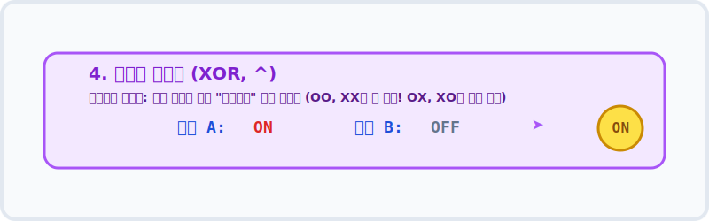

# 5.5 논리 연산자 (Logical Operators)

"국어 점수도 90점 넘고, **그리고(AND)** 수학 점수도 90점이 넘어야 스마트폰을 사줄게!" 
"엄마 카드가 있거나, **또는(OR)** 아빠 카드가 있으면 결제할 수 있어."

우리가 일상생활에서 조건문 뒤에 붙이는 접속사들과 완전히 똑같은 역할을 하는 것이 바로 **논리 연산자**입니다.
여러 개의 조건(`true`/`false`)을 조합해서 복잡한 판단을 내릴 때 사용합니다.


위 웹툰에서 선생님이 보여주는 마법의 문 3개처럼, 컴퓨터 세상의 **모든 프로그램은 이 3가지 뼈대(AND, OR, NOT) 논리 회로(게이트)로 만들어집니다.** 

### 🖥️ 진짜 컴퓨터 속의 논리 게이트 기호 구경하기

실제로 컴퓨터 공학과 학생이나 전기/전자공학도들이 설계도를 그릴 때는, 소형 반도체 칩 안에 들어가는 이 논리 연산자들을 아래와 같은 **'디지털 논리 게이트'** 기호로 약속해서 그립니다. 자바의 `&&`, `||`, `!` 기호가 실제 컴퓨터 하드웨어에서는 아래 그림과 완벽하게 1:1로 매칭된답니다!


---

## 💡 전기 스위치(논리 회로)로 이해해 봅시다!

논리 연산자를 가장 쉽고 완벽하게 이해하는 방법은 **'전구와 스위치가 연결된 전기 회로'** 로 상상하는 것입니다!


### 1. AND 연산자 (`&&`) : "깐깐한 문지기 (둘 다 내놔!)" 🤝

*   **기호**: `&`를 두 번 씁니다. (Amper-sand 라고 읽어요)
*   **회로 비유**: **직렬 회로**입니다. 두 개의 스위치가 일렬로 연결되어 있어서, **모두 다(true) 켜져야만** 전구에 불이 들어옵니다. 하나라도 끊어지면 얄짤없이 켜지지 않습니다.

|   스위치 A   |   스위치 B   | 전구 반응 (`A && B`) | 설명 |
| :---: | :---: | :---: | :--- |
| **`true` (켜짐)**  | **`true` (켜짐)**  |   **`true` (불 켜짐!)**    | 조건을 둘 다 만족했으니 통과! |
| `true`  | `false` |   `false`   | B가 꺼져있어서 전기가 안 통함 |
| `false` | `true`  |   `false`   | A가 꺼져있어서 전기가 안 통함 |
| `false` | `false` |   `false`   | 당연히 안 켜짐 |

### 2. OR 연산자 (`||`) : "너그러운 문지기 (하나만 줘도 돼~)" 👐

*   **기호**: `|`를 두 번 씁니다. (엔터키 ↵ 위에 있는 `\` 키를 Shift 누르고 입력!)
*   **회로 비유**: **병렬 회로**입니다. 전류가 흐를 수 있는 길이 두 갈래로 나뉘어 있어서, **둘 중 딱 하나만(true) 켜져도** 전구에 불이 들어옵니다.

|   스위치 A   |   스위치 B   | 전구 반응 (`A \|\| B`) | 설명 |
| :---: | :---: | :---: | :--- |
| **`true`**  | **`true`**  |    **`true`**     | 둘 다 켜졌으니 통과! |
| **`true`**  | `false` |    **`true`**     | A쪽 길로 전기가 흘러 통과! |
| `false` | **`true`**  |    **`true`**     | B쪽 길로 전기가 흘러 통과! |
| `false` | `false` |    `false`    | 둘 다 끊어져야 비로소 전기가 안 통함 |

### 3. NOT 연산자 (`!`) : "청개구리 인버터 🐸"

*   **기호**: 느낌표 `!`를 조건문 맨 앞에 씁니다.
*   **회로 비유**: 입력을 완전 반대로 뒤집는 **인버터 회로**입니다. 스위치가 켜지면 불을 끄고, 스위치가 꺼지면 오히려 불을 켭니다!

```java
boolean isRaining = true; // 지금 비가 오고 있음 (true)

if (!isRaining) { 
    // "비가 오지 않는다면? (NOT true = false 가 되어버림)"
    System.out.println("자전거 타러 가자!"); // 이 코드는 실행 안 됨
}
```

---

## 4. 추가 번외: XOR 연산자 (`^`) "심술쟁이 스위치" 😈

이 녀석은 조금 특이합니다. 모양은 수학의 제곱 기호(캐럿) `^` 를 씁니다.
"배타적 논리합(Exclusive OR)" 이라는 어려운 이름을 가졌지만 일명 **"심술쟁이 스위치"** 라고 부릅니다. 

이 녀석은 A와 B가 서로 똑같은 꼴을 보는 것을 제일 싫어합니다. **서로 상태가 완전 달라야만 전구를 켜줍니다 (true).**



*   `true` ^ `true` = `false` (둘이 같으니까 싫어! 끄기)
*   `false` ^ `false` = `false` (둘이 같으니까 싫어! 끄기)
*   **`true` ^ `false` = `true`** (둘이 다르네? 좋아! 켜기)
*   **`false` ^ `true` = `true`** (둘이 다르네? 좋아! 켜기)

---

## 5. ⚡️ 최고급 꿀팁: 효율적인 계산 (Short Circuit)

컴퓨터 세상의 자바는 엄청난 '귀차니스트' 라서, **이미 결과가 뻔뻔하게 확정 났으면 뒤의 조건은 아예 보지도 않습니다.** 이걸 전문 용어로 '단축 평가(Short Circuit)'라고 합니다.

### 1) AND 연산 (`&&`)의 꼼수
*   만약 처음 검사한 조건이 `false`라면?
*   어차피 "전구 불은 절대 안 켜짐" 확정! 뒤에 붙은 조건은 거들떠보지도 않고 (오류가 있어도) 그냥 쭉 무시해버립니다.

### 2) OR 연산 (`||`)의 꼼수
*   만약 처음 검사한 조건이 `true`라면?
*   어차피 "전구 불은 100% 켜짐" 확정! 뒤에 다른 어떤 조건이 오든 무시하고 바로 `true`로 넘겨버립니다.

> **💡 개발자 취업 면접 단골 질문!**
> 👉 **정답:** 당연히 제일 빠르고 가벼운 연산을 맨 왼쪽에 배치해야, Short-Circuit 덕분에 무거운 조건문을 실행조차 하지 않고 스킵할 확률이 높아져서 프로그램 속도가 엄청 빨라집니다!!

---

## 코딩 영단어 학습 📝

코딩에서 영어 단어의 의미만 정확히 이해해도 절반은 성공입니다! 오늘 배운 핵심 영단어들을 다시 한번 짚고 넘어가 볼까요?

*   **`Logical`**: 로지컬, 논리적인. (참과 거짓, 상태를 따지는 것)
*   **`AND`**: 앤드, 그리고. (양쪽 모두 참이어야만 통과)
*   **`OR`**: 오어, 또는. (둘 중 하나만 참이어도 통과)
*   **`NOT`**: 낫, 아니다. (참과 거짓을 반대로 뒤집는 청개구리 역할)
*   **`Short Circuit`**: 쇼트 서킷, 단축 평가. (결과가 확실해지면 뒤의 무의미한 연산을 즉시 생략하여 실행 속도를 높이는 최적화 기법)
