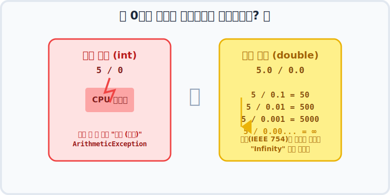
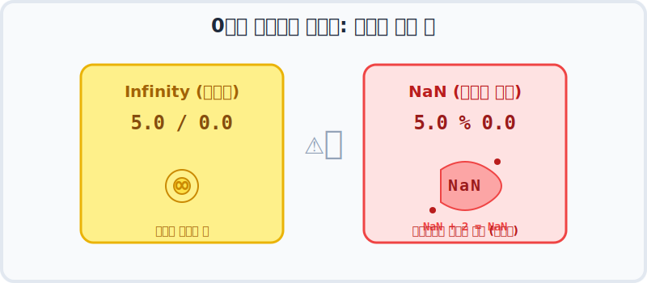

# 3.5 나눗셈 연산 후 NaN과 Infinity 처리

자바 프로그래밍에서 숫자를 계산하다 보면 `Infinity` 혹은 `NaN` 이라는 독특한 단어를 마주칠 때가 있습니다. 이 챕터에서는 왜 이런 결과가 나오는지, 그리고 어떻게 안전하게 처리해야 하는지 구체적인 원리와 함께 학습합니다.


---

## 1. Infinity (무한대) 란? 🚀

**Infinity**는 "끝을 알 수 없을 정도로 한없이 큰 수"를 수학적으로 표현한 것입니다. 컴퓨터의 한정된 메모리 상자(예: 64bit)가 더 이상 감당할 수 없을 정도로 결괏값이 폭발적으로 커질 때, "이 값은 우리 그릇을 초과한 무한대입니다!" 라고 선언해 버리는 특별한 표시라고 생각하면 됩니다. 주로 **실수(double)를 0으로 나눌 때(`/`) 발생**합니다.



---

## 2. NaN (Not a Number) 이란? 🤷‍♂️

**NaN**은 영어 그대로 "이건 숫자가 아니다"라는 뜻입니다. 수학적으로 전혀 성립할 수 없거나, 컴퓨터가 도저히 해석 결과를 도출할 수 없는 의미 없는 계산을 강제로 시켰을 때 반환하는 **치명적 수학 오류** 표시입니다. 주로 **실수(double)를 0으로 나눈 후 나머지(`%`)를 구할 때 발생**합니다. 0으로 나눈 것의 나머지가 존재할 리 없기 때문입니다.



---

## 3. 정수와 실수의 근본적인 차이 🧐

나눗셈 연산에 있어 아주 중요한 규칙이 있습니다. 바로 **"정수는 에러를 내고, 실수는 버틴다"** 입니다.

```java
5 / 0 -> 예외 발생 (ArithmeticException)
5 % 0 -> 예외 발생 (ArithmeticException)
```

**정수 연산의 경우:**
정수는 딱 떨어지는 정확한 숫자를 다루는 계산기(ALU)에 가깝습니다. "5개의 사과를 0명에게 나누어라"라는 명령을 받으면, 컴퓨터 논리 장치는 계산을 완료할 수 없다고 판단하고 즉시 **오류(ArithmeticException)** 를 뿜어내며 프로그램을 강제 종료시켜 버립니다.

**실수 연산의 경우:**
반면 소수점을 포함하는 실수는 애초에 "근삿값"을 다루도록 설계(IEEE 754 표준)되었습니다. 분모가 0에 한없이 가까워질수록 (예: `5 / 0.1 = 50`, `5 / 0.001 = 5000` ...) 그 결과값은 수학적으로 한없이 무한대에 수렴하게 됩니다. 
따라서 컴퓨터는 에러를 내어 프로그램을 죽이는 대신 **`Infinity` 거나 `NaN`** 이라는 특별한 값을 결괏값으로 남겨두고 계속 실행을 진행합니다.



```java
5.0 / 0.0 -> Infinity (몫은 무한대로 커진다)
5.0 % 0.0 -> NaN (무한대 몫의 나머지는 정의 불가)
```

---

## 4. 데이터 훼손의 전염성 주의! 🦠

`Infinity` 또는 `NaN` 상태에서 계속해서 다른 숫자를 연산하면 절대로 안 됩니다. 
무한대에 무슨 숫자를 더하든 무한대이고, 숫자가 아닌 쓰레기값(NaN)에 숫자를 더해봤자 여전히 쓰레기값입니다. 어떤 연산을 하더라도 계속해서 이 형태가 유지되므로 **데이터 결괏값이 완전히 오염**됩니다.



```java
Infinity + 2 -> Infinity
NaN + 2 -> NaN
```

### 어떻게 방어하나요? (해결책)

그렇기 때문에 `/`와 `%` 연산의 결과가 `Infinity` 또는 `NaN`으로 변질되지 않았는지 먼저 확인하고 다음 연산을 수행해야 데이터를 안전하게 보존할 수 있습니다. 
이를 위해 자바에서는 **`Double.isInfinite()`** 와 **`Double.isNaN()`** 메서드를 제공합니다.

```java
boolean result1 = Double.isInfinite(변수); // Infinity면 true 반환
boolean result2 = Double.isNaN(변수);      // NaN이면 true 반환
```

다음 예제에서 알맞은 코드 방어 로직을 살펴보며 배운 내용을 마무리해 봅시다.

**[예제: InfinityAndNaNCheckExample.java]**
```java
package ch03.sec05;

public class InfinityAndNaNCheckExample {
    public static void main(String[] args) {
        int x = 5;
        double y = 0.0;
        double z = x / y; // Infinity 발생
        //double z = x % y; // 주석 해제 시 NaN 발생
        
        // 잘못된 코드: 오염된 데이터가 계속 계산됨
        // System.out.println(z + 2); 
        
        // 알맞은 코드: isInfinite / isNaN 함수로 데이터 오염 여부 선제적 방어!
        if(Double.isInfinite(z) || Double.isNaN(z)) {
            System.out.println("⚠️ 치명적 오류: 0으로 나눌 수 없어 값 산출이 불가합니다.");
        } else {
            System.out.println("정상 산출 값: " + (z + 2));
        }
    }
}
```

**실행 결과**
```
⚠️ 치명적 오류: 0으로 나눌 수 없어 값 산출이 불가합니다.
```

---

## 코딩 영단어 학습 📝

코딩에서 영어 단어의 의미만 정확히 이해해도 절반은 성공입니다! 오늘 배운 핵심 영단어들을 다시 한번 짚고 넘어가 볼까요?

*   **`Infinity`**: 인피니티, 무한대. (컴퓨터 메모리가 표현할 수 있는 한계를 넘어설 정도로 폭발적으로 큰 수)
*   **`NaN (Not a Number)`**: 낫 어 넘버, 숫자가 아님. (수학적으로 정의할 수 없는 연산(예: 0으로 나눈 나머지)의 결과값)
*   **`Exception`**: 익셉션, 예외(에러). (정수를 0으로 나누려 할 때 프로그램이 강제 종료되는 치명적 오류 현상)
