# 5.3 오버플로우와 언더플로우 (Overflow & Underflow)

수학 시간의 숫자에는 한계가 없지만, 프로그램 속 숫자는 **메모리(Memory)라는 물리적이고 제한된 상자** 안에 담겨야 합니다. 
마치 종이 상자에 물건을 한없이 집어넣으면 상자가 터지듯이, 컴퓨터의 상자(변수 타입)도 수용할 수 있는 한계를 넘어가면 독특한 현상이 발생하는데, 이를 **오버플로우(Overflow)** 와 **언더플로우(Underflow)** 라고 부릅니다.

---

## 1. 자료형과 상자의 한계 (비트와 바이트) 📦

오버플로우를 이해하려면 먼저 자바가 숫자를 담기 위해 제공하는 '상자(자료형)'의 크기를 알아야 합니다. 
컴퓨터는 데이터를 0과 1의 조합인 **비트(bit)** 로 저장하며, 8개의 비트가 모여 1 **바이트(byte)** 가 됩니다. 상자의 크기가 클수록 더 광범위한 숫자를 온전히 담아낼 수 있습니다.

| 자료형 (타입) | 메모리 크기 | 비트(bit) 수 | 표현 가능한 숫자의 범위 |
| :---: | :---: | :---: | :--- |
| **`byte`** | 1 byte | 8 bit | `-128` ~ `127` |
| **`short`** | 2 byte | 16 bit | `-32,768` ~ `32,767` |
| **`int`** | 4 byte | 32 bit | `-2,147,483,648` ~ `2,147,483,647` (약 21억) |
| **`long`** | 8 byte | 64 bit | `-922경` ~ `922경` (천문학적 숫자) |

위 표에서 알 수 있듯, 가장 작은 상자인 `byte`는 최대 `127`까지만 숫자를 담을 수 있습니다. 만약 이 상자에 `128`을 억지로 쑤셔 넣으려고 하면 어떻게 될까요? 바로 여기서 문제가 발생합니다!

---

## 2. 오버플로우 (Overflow): 상단 한계 돌파 🚗

자동차가 오래 달리면 주행 거리계가 `999,999` 에서 다시 `000,000` 으로 초기화되듯, 컴퓨터 메모리의 그릇도 **최대값을 넘어가면 최소값으로 뚝 떨어져서 처음부터 다시 시작**합니다. 물이 너무 많아서 그릇 밖으로 넘쳐 흐르는 현상에서 유래했습니다.



`byte` 타입은 8비트(bit) 크기만 제공하므로 오로지 `-128` 부터 `127` 까지만 담을 수 있습니다.
최대값인 `127`에서 `1`을 억지로 더하면, 상자가 견디지 못하고(비트가 초과되어) 최소값인 `-128`로 빙글 돌아버립니다. 수학적으로는 절대 일어날 수 없는 에러 상황이지만 초보 프로그래머들이 정말 자주 당하는 함정 중 하나입니다!

```java
byte b = 127;          // byte의 최대값
b++;                   // 1을 증가시켜 봅니다.
System.out.println(b); // 128이 아니라, -128 (최소값)이 출력됩니다!
```

### 왜 하필 `-128` 로 돌아갈까요? (비트의 비밀 🤫)

컴퓨터가 숫자를 저장하는 방식을 **비트 단위**로 들여다보면 그 이유를 확실히 알 수 있습니다.
자바의 `byte`는 맨 앞의 첫 번째 비트(MSB, Most Significant Bit)를 **부호(+, -)** 를 결정하는 용도로 사용합니다. `0`이면 양수, `1`이면 음수입니다.



1. `127`은 이진수로 `01111111` 입니다. (맨 앞 `0`은 양수를 의미)
2. 여기에 `+ 1` 을 하면 이진수 덧셈 법칙에 의해 모두 받아올림이 발생하여 `10000000` 이 됩니다.
3. 맨 앞자리가 `1`로 바뀌었기 때문에, 컴퓨터는 이것을 더 이상 128이 아니라 **음수 중 가장 작은 값인 `-128`** 로 정해진 규칙(2의 보수법)에 따라 읽어버리게 됩니다!

---

## 3. 언더플로우 (Underflow): 하향 한계 돌파 🕳️

반대로, 변수의 값이 **최소값보다 더 작아지려고 하면 그릇의 뒷면을 뚫고 지나가 최대값으로 껑충 뛰어오르는(Wrap-around) 현상**을 의미합니다. 



아무것도 들어있지 않은 상자에서 굳이 하나를 더 꺼내려고 하면, 시스템은 최소값의 경계를 허물고 반대편의 가장 큰 숫자인 `127`로 돌아가버립니다.

```java
byte b = -128;         // byte의 최소값
b--;                   // 1을 오히려 감소시켜 봅니다.
System.out.println(b); // -129가 아니라, 127 (최대값)이 출력됩니다!
```

---

## 4. 어떻게 예방할 수 있나요? 🛡️

숫자를 계산할 때 이처럼 상자가 터져버리는 것을 막기 위해서는 **"애초에 더 큰 튼튼한 상자"** 를 써야 합니다.
자바에서는 대용량 데이터를 다루거나 계산 중 숫자가 커질 것으로 예상된다면, `int` 나 `long` 처럼 충분히 넉넉한 바구니에 숫자를 분배하여 에러의 소지를 차단하는 것이 기본이자 핵심 프로그래밍 습관입니다.

> **💡 핵심 요약**: 
> 계산될 값의 **최대치**가 해당 타입이 감당할 범위를 넘어설 우려가 티끌만큼이라도 있다면, 과감하게 한 단계 위 타입(예: `long`)으로 선언하여 코딩하세요!
