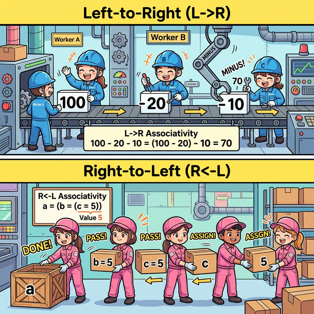

# 3.12 연산의 방향과 우선순위 (Precedence & Associativity)

우리가 수학 시간에 "더하기보다 곱하기를 먼저 계산해야 해!"라고 배운 것처럼, 컴퓨터 내부에 있는 계산기(ALU)도 수많은 기호들이 한 줄에 섞여 있을 때 **어떤 것부터 먼저 처리할지**, 그리고 **어느 방향으로 읽어나갈지** 철저한 규칙을 지킵니다.

이 두 가지 핵심 규칙 **우선순위(Precedence)** 와 **연산 방향(Associativity)** 을 알면 헷갈리는 코드도 컴퓨터의 시선으로 완벽하게 풀어낼 수 있습니다.

---

## 1. 어떤 기호를 먼저 요리할까? (우선순위 - Precedence) 🍔

컴퓨터의 두뇌인 CPU 안에는 **ALU(산술논리연산장치)** 라는 거대한 주방이 있습니다. 이 주방에는 매일 수천만 개의 연산 주문서가 날아옵니다.


주방장(ALU)은 아무렇게나 요리하지 않습니다. 메뉴(연산자 종류)마다 **VIP 서열(우선순위)** 이 적혀 있기 때문에, 등급이 가장 높은 VIP 주문부터 무조건 앞당겨서 처리합니다.

### 🏆 전체 연산자 VIP 피라미드 서열
피라미드 꼭대기에 가까울수록 **먼저 요리(계산)** 됩니다!


*(💡 팁: 이 표를 억지로 암기할 필요는 없지만, 대략적인 덩어리 서열은 알아두면 좋습니다.)*
1. **단항** (`++`, `--` 등 혼자 있는 놈)
2. **산술** (`*`, `/` ➔ `+`, `-`)
3. **비교** (`>`, `==`)
4. **논리** (`&&`, `||`)
5. **대입** (`=`, `+=`) ➔ 가장 만만하고 꼴찌인 녀석입니다.

#### [실습 예제: 서열 정리]
```java
boolean result = x > 0 && y < 0;
```
위 코드가 어떻게 실행될까요? 주방장에게 `>`(비교), `<`(비교), `&&`(논리) 3가지 주문이 한 줄로 들어왔습니다.
1. `>` 와 `<` 비교 연산이 논리(`&&`)보다 서열이 높으므로 먼저 요리합니다!
2. `x > 0` 결과가 나오고, `y < 0` 결과가 나옵니다.
3. 두 개의 결과물을 들고, 가장 서열이 낮은 `&&` 연산을 바탕으로 최종 `true/false`를 결정합니다.

---

## 2. 등급이 똑같은 놈들끼리 만났다면? (연산의 방향 - Associativity) 🤜🤛

자바를 하다 보면 이런 난감한 상황이 옵니다. *"주방장님! VIP 등급이 똑같은 주문만 3개가 동시에 들어왔는데요?!"*
이때 주방장은 **'연산의 방향성'** 이라는 공장 컨베이어 벨트 규칙을 따릅니다.



### 1) 대부분은 정상 방향: 왼쪽 ➔ 오른쪽 (L ➔ R)
우리나라 글씨를 읽는 방향과 똑같습니다. 덧셈, 뺄셈, 곱셈, 나누기 등 우리가 아는 대부분의 연산은 동급일 경우 무조건 **먼저 눈에 띄는 왼쪽부터 차례대로** 요리합니다.


*위 애니메이션의 상단(1번) 블록을 보세요.*
`100 - 20 - 10` 이라는 코드는 빼기(`-`) 등급이 모두 똑같기 때문에, 무조건 왼쪽 덩어리인 `100 - 20` 부터 묶여서 1단계로 `80`을 만듭니다. 그 다음 `80 - 10`을 요리해서 `70`이 됩니다.

### 2) 특이한 청개구리 방향: 오른쪽 ➔ 왼쪽 (R ➔ L)
자바 연산자 중에는 특이하게 꼬리부터 머리 방향으로 거꾸로 처리하는 녀석들이 있습니다. 바로 **단항 연산자 (`++`, `!`)** 와 **대입 연산자 (`=`, `+=`)** 입니다.

*위 애니메이션의 하단(2번) 블록을 보세요.*
```java
a = b = c = 5;
```
대입 연산자(=)들은 동급이지만, 컨베이어 벨트가 **오른쪽에서 왼쪽으로** 역주행합니다!
1. 가장 오른쪽의 값 `5`를 상자 `c`에 담습니다. (`c = 5`)
2. `c`의 내용물인 5를 상자 `b`에 담습니다. (`b = 5`)
3. `b`의 내용물인 5를 상자 `a`에 담습니다. (`a = 5`)
그래서 3개의 변수에 모두 5가 안전하게 들어갈 수 있는 것입니다.

---

## 3. 🛡️ 식의 우선순위가 불명확할 때는? 무적의 방패 "소괄호 ()" 🛡️

막상 실무 프로젝트를 하다 보면 연산자가 4~5개씩 섞이게 되고, *"비교가 먼저인가 논리가 먼저인가.. 방향은 뭐였지?"* 하고 연산 순서가 불명확해지는 순간이 옵니다. (전문가들도 맨날 헷갈립니다!)

**이럴 때 가장 좋은 해결책은 바로 소괄호 `( )` 를 이용하여 계산 순서를 명확하게 묶어주는 것입니다!**

자바 주방장은 다른 모든 VIP 등급이나 방향 규칙을 올스톱시키고, **소괄호 쳐진 주문서를 우주 최우선으로 가장 먼저 처리**합니다. 괄호를 치면, 코드를 작성한 사람의 '의도'가 컴퓨터와 다른 동료 개발자에게 100% 명확하게 전달됩니다.

```java
int var1 = 1;
int var2 = 3;
int var3 = 2;

// 괄호가 없을 때: 규칙에 따라 곱하기(*)가 먼저 요리됨 (불명확할 수 있음)
int result1 = var1 + var2 * var3; // 1 + (3 * 2) = 7

// 괄호를 쳤을 때: 곱셈이고 나발이고 괄호 쳐진 쪽부터 무조건 명확하게 먼저 계산!
int result2 = (var1 + var2) * var3; // (1 + 3) * 2 = 8
```

> **👨‍💻 선배 개발자의 핵심 조언:**
> "저는 연산자 우선순위를 완벽하게 외우고 있어요!" 라고 자랑하며 괄호를 안 쓰는 것보다, **우선순위가 헷갈리거나 불명확할 때는 적극적으로 소괄호 `( )`를 사용하여 코드를 더 명확하고 직관적으로 만드는 개발자**가 훨씬 대우받습니다. 가독성은 곧 실력입니다!
