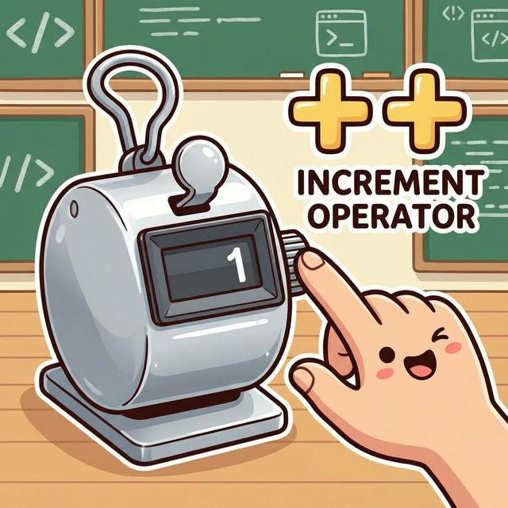

# 5.1 부호/증감 연산자

## 1. 부호 연산자 (`+`, `-`) ➕➖

수학에서 쓰는 것과 똑같습니다.
*   `+`: 부호 유지 (잘 안 씀)
*   `-`: 부호 변경 (양수 -> 음수, 음수 -> 양수)

```java
int x = -100;
int result = -x; // 100
```

## 2. 증감 연산자 (`++`, `--`) 🔢

변수의 값을 **1 증가**시키거나 **1 감소**시킵니다.
**카운터(계수기)**를 누르는 것과 같습니다.



*   `++`: 1 증가 (`x = x + 1`)
*   `--`: 1 감소 (`x = x - 1`)

### 전위(Prefix)와 후위(Postfix)의 차이

위치는 중요합니다!
*   **앞에 붙으면 (`++x`)**: **먼저** 증가시키고 다른 일을 합니다.
*   **뒤에 붙으면 (`x++`)**: 다른 일을 **먼저** 하고 나중에 증가시킵니다.

```java
int x = 1;
int y = 1;

int result1 = ++x + 10; // x가 2가 된 후 + 10 -> 12
int result2 = y++ + 10; // 1 + 10을 먼저 하고 -> y가 2가 됨 -> 11
```
