# 5.1 부호/증감 연산자

## 1. 부호 연산자 (`+`, `-`) ➕➖

수학에서 쓰는 것과 똑같습니다.
*   `+`: 부호 유지 (잘 안 씀)
*   `-`: 부호 변경 (양수 -> 음수, 음수 -> 양수)

```java
int x = -100;
int result = -x; // 100
```

> **💡 노트: `int result = -x;` 와 같은 식을 계산할 수 있나요?**  
> 네, 정상적으로 계산됩니다! 자바에서 부호 연산자 `-`를 변수 앞에 붙이면, 내부적으로 해당 변수의 값에 **`-1`을 곱한 것과 동일한 원리**로 부호가 반전되어 연산 결과를 산출합니다.

## 2. 증감 연산자 (`++`, `--`) 🔢

변수의 값을 **1 증가**시키거나 **1 감소**시킵니다.
**카운터(계수기)**를 누르는 것과 같습니다.



> **💡 노트: `int result = -x;` 와 같은 식을 계산할 수 있나요?**  
> 네, 정상적으로 계산됩니다! 자바에서 부호 연산자 `-`를 변수 앞에 붙이면, 내부적으로 해당 변수의 값에 **`-1`을 곱한 것과 동일한 원리**로 부호가 반전되어 연산 결과를 산출합니다. 위 애니메이션을 통해 값의 부호가 변환되는 마법을 확인해 보세요.

## 2. 증감 연산자 (`++`, `--`) 🔢

변수의 값을 **1 증가**시키거나 **1 감소**시킵니다.
**카운터(계수기)**를 누르는 것과 같습니다.



*   `++`: 1 증가 (`x = x + 1`)
*   `--`: 1 감소 (`x = x - 1`)

### 전위(Prefix)와 후위(Postfix)의 차이

위치는 중요합니다!
*   **앞에 붙으면 (`++x`)**: **먼저** 증가시키고 다른 일을 합니다.
*   **뒤에 붙으면 (`x++`)**: 다른 일을 **먼저** 하고 나중에 증가시킵니다.

```java
int x = 1;
int y = 1;

int result1 = ++x + 10; // x가 2가 된 후 + 10 -> 12
int result2 = y++ + 10; // 1 + 10을 먼저 하고 -> y가 2가 됨 -> 11
```

---

## 3. 증감 연산자의 진짜 무대: 반복문 (미리보기) 🔁

증감 연산자(`++`, `--`)는 단독으로 쓰일 때보다 **반복문(for, while)** 과 결합될 때 진정한 위력을 발휘합니다.
(반복문에 대한 자세한 내용은 [Chapter 07. 반복문](/basic/loop)에서 확실하게 배우게 됩니다!)



*   위 애니메이션처럼 `int i = 0`부터 시작해서, 코드가 한 번 실행될 때마다 **`i++` 가 호출되며 변수 `i`를 1씩 증가** 시킵니다.
*   이렇게 `i` 가 0, 1, 2 로 꾸준히 증가하다가 지정된 조건(예: `i < 3`)을 벗어나면 루프가 안전하게 종료됩니다.
*   증감 연산자가 없다면 컴퓨터는 언제 멈춰야 할지 모르고 영원히 트랙을 달리는 **무한 루프**에 빠지게 됩니다!
