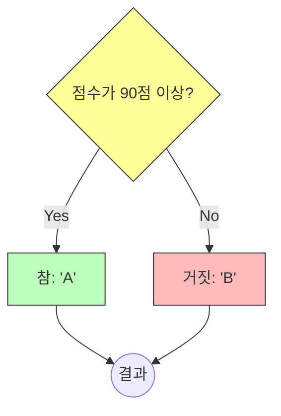

# 5.7 삼항 연산자 (Ternary Operator)

`if-else` 문을 단 한 줄로 줄여 쓸 수 있는 마법 같은 연산자입니다. 🪄
항(피연산자)이 3개라서 **삼항 연산자**라고 부릅니다.

---

## 1. 구조 및 문법 📐

### 1) 공식
> **(조건) ? 참일_때_값 : 거짓일_때_값**

*   **물음표(`?`)**: "이 조건이 참이니?" 라고 물어보는 것과 같습니다.
*   **콜론(`:`)**: "아니면 이거!" 라고 대안을 제시하는 것과 같습니다.

### 2) 비유: "양자택일 표지판"
*   갈림길에서 표지판을 만났습니다.
*   "오른쪽으로 가면(참) 보물, 왼쪽으로 가면(거짓) 꽝"

### 3) 흐름 시각화



---

## 2. 코드 비교: if문 vs 삼항 연산자 ⚖️

점수에 따라 학점을 주는 코드를 비교해 봅시다.

### 1) if-else 문 (5줄)
```java
int score = 85;
char grade;

if (score >= 90) {
    grade = 'A';
} else {
    grade = 'B';
}
```

### 2) 삼항 연산자 (1줄)
```java
int score = 85;
char grade = (score >= 90) ? 'A' : 'B';
```

---

## 3. 주의사항 ⚠️

코드가 짧아진다고 무조건 좋은 것은 아닙니다.
삼항 연산자를 너무 많이 중첩해서 쓰면 가독성이 떨어져서 **스파게티 코드**가 될 수 있습니다.

```java
// (X) 나쁜 예: 중첩 사용 (읽기 힘듦)
String result = (score > 90) ? "A" : ((score > 80) ? "B" : "C");

// (O) 좋은 예: 이럴 땐 그냥 if-else if 문을 쓰세요.
```
