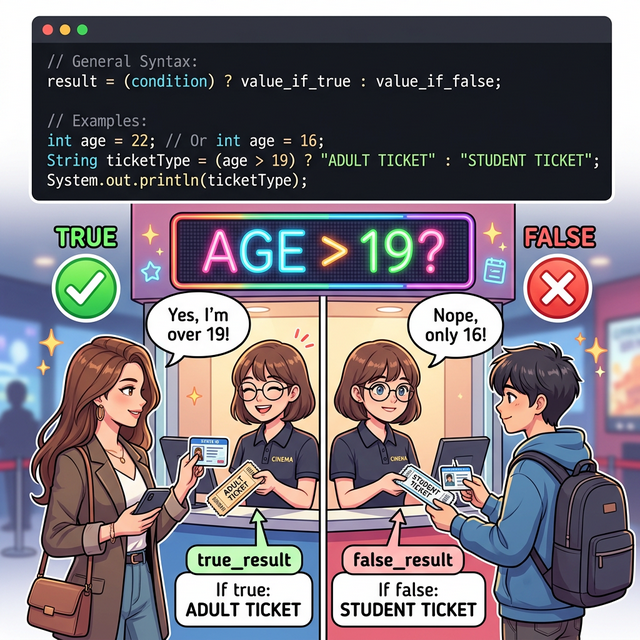
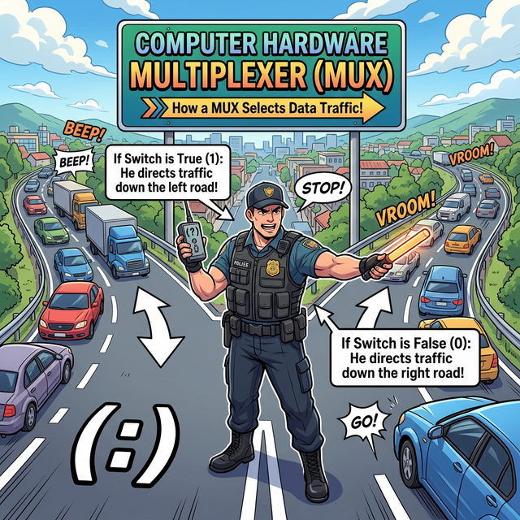

# 5.7 삼항 연산자 (Ternary Operator)

`if-else` 문을 여러 줄에 걸쳐 길게 써야 하는 코드를 단 한 줄로 깔끔하게 압축할 수 있는 마법 같은 연산자입니다. 🪄
이 연산자는 필수 구성 요소(항)가 3개나 필요하기 때문에 유일하게 **'삼항' 연산자**라고 부릅니다.

---

## 1. 일상생활의 삼항 연산자: 영화관 매표소 🎫

삼항 연산자의 핵심은 **"질문에 대한 대답(True/False)에 따라 내어주는 결과물이 완전히 달라진다"** 는 것입니다.

영화관 매표소를 상상해 보세요. 



매표소 직원은 손님에게 딱 한 가지 질문조건을 던집니다. *"나이가 19세 이상인가요?"*
1. **네 (True) 🟢**: 직원은 왼쪽 서랍에서 **'성인 티켓'** 을 꺼내 줍니다.
2. **아니오 (False) 🔴**: 직원은 오른쪽 서랍에서 **'학생 티켓'** 을 꺼내 줍니다.

이처럼 조건에 따라 두 개의 값 중 딱 하나만 선택해서 반환하는 얄짤없는 논리 교차로가 바로 삼항 연산자입니다.

---

## 2. 하드웨어의 삼항 연산자: 멀티플렉서 (MUX) 🚦

이 논리는 컴퓨터 CPU 내부의 하드웨어 부품인 **멀티플렉서(Multiplexer, 줄여서 MUX)** 와 완벽하게 동일하게 생겼습니다. 



수많은 데이터(차량)가 지나가는 속에서, 경찰 아저씨(제어 장치)가 쥐고 있는 **판단 스위치(0인지 1인지)** 에 따라 A도로의 차만 지나가게 할지, B도로의 차만 지나가게 할지 순식간에 결정해버리는 물리적인 스위치 부품입니다.

이를 소프트웨어 프로그래밍 언어로 옮겨 놓은 것이 우리의 주인공입니다.

---

## 3. 구조 및 문법 📐

### 1) 공식 파헤치기
코드로 작성해보면 앞서 배운 매표소와 경찰 아저씨의 논리가 그대로 보입니다.

> **(조건식) ? 참일_때_값 : 거짓일_때_값 ;**

*   **물음표(`?`) 스위치 확인**: "앞의 조건식이 뭐야? 19세 이상(True)이야 아니야(False)?" 하고 컴퓨터에게 강하게 묻는 기호입니다.
*   **콜론(`:`) 갈림길 분리대**: 참일 때 가져갈 값과 거짓일 때 가져갈 값을 양옆으로 분리해 주는 중앙선 역할을 합니다.

### 2) 파이프라인 시각화 (데이터 흐름)
단 1줄짜리 코드 안에서, 데이터가 어떻게 물음표를 통과해 콜론을 거쳐 최종 변수에 담기는지 아래 파이프라인 애니메이션으로 살펴봅시다.



위 애니메이션에서 보듯 `age = 15` 일 때는 수십 개의 파이프를 통과할 필요 없이, 즉각적으로 `age >= 19` 검문소에서 튕겨 나와 거짓(False) 경로인 **"학생"** 값을 들고 최종 조립되어 반환됩니다. `age = 25` 일 때는 당연히 윗길인 **"성인"** 을 들고 오겠죠.

---

## 4. 코드 비교: if문 vs 삼항 연산자 ⚖️

같은 논리를 두 가지 방식으로 코딩해 봅시다.

### 1) 일반적인 if-else 문 (5줄 이상)
초보자가 가장 생각하기 편한 구조이지만, 단순한 선택을 하기 위해 코드가 너무 세로로 길어집니다.
```java
int age = 15;
String ticket; // 티켓을 담을 빈 변수

if (age >= 19) {             // 조건
    ticket = "성인 티켓";    // True일 때
} else {
    ticket = "학생 티켓";    // False일 때
}
```

### 2) 삼항 연산자 (단 1줄!)
위의 6줄짜리 뚱뚱한 코드가, 깔끔하고 우아한 1줄짜리 코드로 환골탈태합니다.
```java
int age = 15;
                                  // 물음표(?)     (참)       (거짓)
String ticket = (age >= 19) ? "성인 티켓" : "학생 티켓";
```

---

## 5. ⚠️ 치명적인 주의사항 (가독성은 생명)

코드가 1줄로 짧아진다고 해서 삼항 연산자를 무지막지하게 남발하면 절대 안 됩니다.
**삼항 연산자 안에 또 다른 삼항 연산자를 중첩해서 쓰면 안 됩니다.**

```java
// ❌ 최악의 스파게티 코드 (읽는 사람 눈물 남)
// "90점 넘으면 A, 아니면 80점 넘으면 B를 주고, 그것도 아니면 C를 줘라!"
String grade = (score >= 90) ? "A" : ((score >= 80) ? "B" : "C");

// 🟢 좋은 예시 (이럴 땐 깔끔하게 if - else if 문을 쓰세요!)
String grade;
if (score >= 90) {
    grade = "A";
} else if (score >= 80) {
    grade = "B";
} else {
    grade = "C";
}
```

**👨‍💻 현업 개발자의 꿀팁!**
*"삼항 연산자는 갈림길이 딱 2개(예/아니오)로 심플하고 직관적으로 떨어지는 일에만 쓰고, 조건이 3개 이상으로 늘어나 빙빙 꼬일 것 같으면 미련 없이 `if`문으로 돌아가세요!"*

---

## 코딩 영단어 학습 📝

코딩에서 영어 단어의 의미만 정확히 이해해도 절반은 성공입니다! 오늘 배운 핵심 영단어들을 다시 한번 짚고 넘어가 볼까요?

*   **`Ternary`**: 터너리, 3개의, 3항의. (피연산자(항)가 3개 필요한 유일한 연산자라는 뜻)
*   **`Condition`**: 컨디션, 조건. (참인지 거짓인지 판별할 기준이 되는 질문식)
*   **`Question Mark`**: 퀘스천 마크, 물음표 `?`. (조건을 묻고 답변을 기다리는 첫 번째 관문 기호)
*   **`Colon`**: 콜론, 쌍점 `:`. (참일 때의 결과와 거짓일 때의 결과를 양옆으로 나누는 두 번째 분리대 기호)
