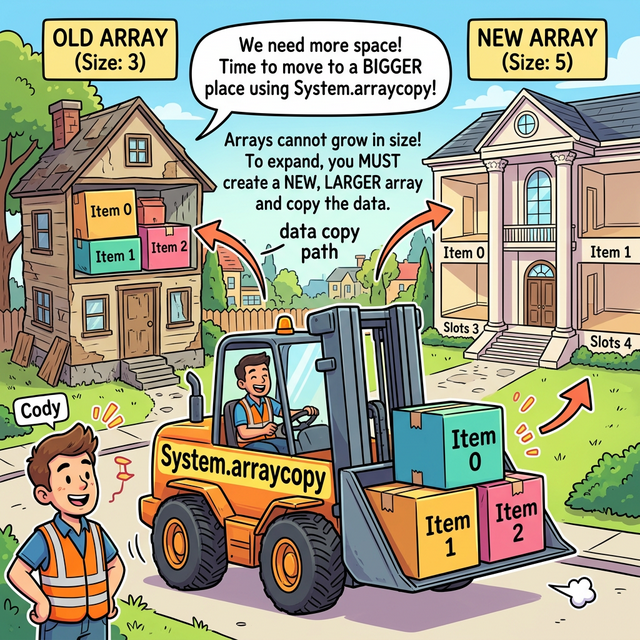
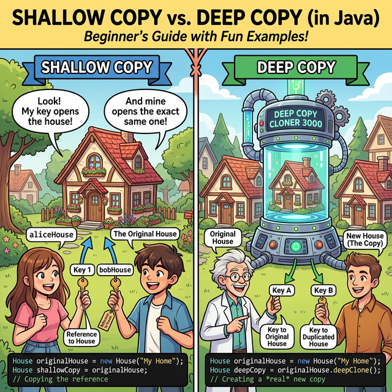
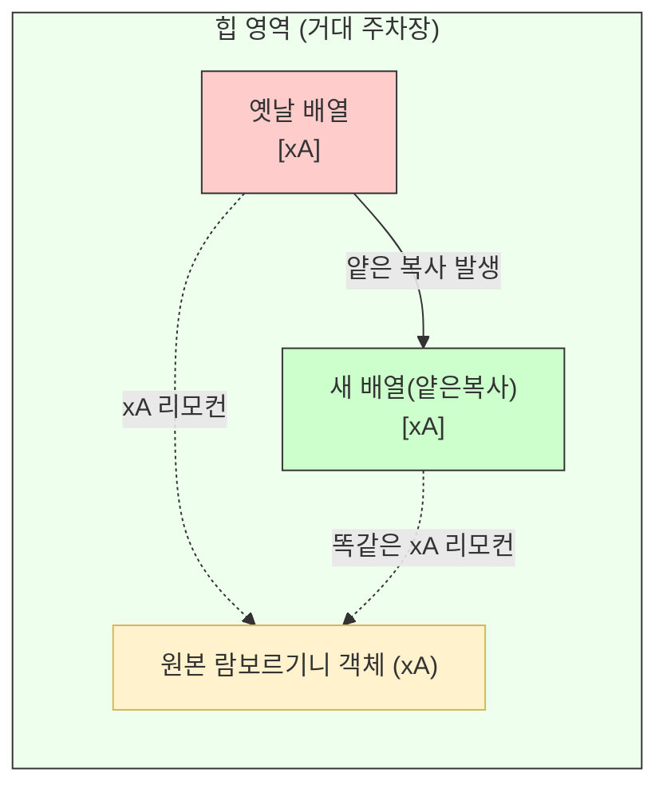

# 8.9 배열 복사 (Array Copy)

## 1. 뼈아픈 진실: 배열은 한 번 지으면 증축 불가능 🚧

자바에서 배열(Array)은 생성될 때 가장 첫 번째로 지켜야 할 철칙이 있습니다.
바로 **"한 번 생성된 배열은 프로그램이 죽었다 깨어나도 그 크기를 절대 늘리거나 줄일 수 없다"**는 점입니다. 메모리상에 '연속된 빈 공간'을 점유해야 하는데 뒤에 다른 데이터가 살고 있을 수 있기 때문입니다. 

그래서 만약 방 3개짜리 아파트(배열)를 지었는데 식구가 5명으로 늘어난다면 어떻게 해야 할까요?
기존 아파트를 증축할 수는 없으니, **방 5개짜리 더 큰 새 아파트를 짓고, 기존 식구들을 그곳으로 이사(복사)를 시켜야 합니다.** 이것이 배열 복사의 근본 원리입니다.



위 그림처럼 낡고 비좁은 옛날 배열의 짐(데이터)들을 크고 넓은 새 배열로 옮기고, 옛날 집은 가비지 컬렉터(GC)에게 헐어버리라고 넘기는 것입니다.

---

## 2. 수작업 이사(for문) vs 지게차 이사(System.arraycopy) 🚚

이사 짐을 옮기는 데는 크게 두 가지 방법이 있습니다.
하나는 `for` 반복문을 이용해 개발자가 직접 "물건 하나 집어서, 새 배열에 하나 넣고"를 반복하는 **수작업 방식**입니다.
다른 하나는 자바 운영체제를 호출하여 "여기서부터 저기까지 한 방에 그냥 다 옮겨줘!" 라고 통째로 블록 복사를 요청하는 **`System.arraycopy()` 방식**입니다.



두 방식을 코드로 비교해 볼까요?

### 📦 1. for 문을 이용한 복사 (수작업)
```java
int[] oldIntArray = { 1, 2, 3 };
int[] newIntArray = new int[5]; // 더 넓은 5칸짜리 새 집! (나머지 2칸은 기본값 0으로 초기화됨)

// 하나씩 낑낑대며 옮기기
for(int i = 0; i < oldIntArray.length; i++) {
    newIntArray[i] = oldIntArray[i]; 
}
```

### 🚚 2. System.arraycopy()를 이용한 복사 (지게차)
C언어의 `memmove` 와 같이 메모리 블록을 통째로 복사하기 때문에 속도가 훨씬, 압도적으로 빠릅니다.

```java
String[] oldStrArray = { "java", "array", "copy" };
String[] newStrArray = new String[5];

// 이삿짐센터 출동! (원본, 원본시작, 새배열, 새배열시작, 복사할개수)
System.arraycopy(oldStrArray, 0, newStrArray, 0, oldStrArray.length);
```

> **📌 메소드 해석**
> `System.arraycopy(원본 배열, 원본 시작 인덱스, 새 배열, 새 배열 방 시작 인덱스, 복사할 길이);`
> - 위 코드는 "oldStrArray의 0번 칸부터 oldStrArray 길이만큼을, newStrArray의 0번 칸부터 쭉 붙여 넣어라!" 라는 뜻입니다.

---

## 3. 얕은 복사(Shallow Copy) vs 깊은 복사(Deep Copy) 🪞

`String[]` 같은 **객체 참조 배열**을 복사할 때는 어마어마한 주의가 필요합니다!

- **얕은 복사(Shallow Copy)**: `System.arraycopy()` 등의 방식으로 배열을 복사하면, 힙 영역에 거대하게 존재하는 "진짜 객체들(TV나 집)"을 2배로 복제해 주지 않습니다. 오직 배열 칸 안에 들어있는 **"리모컨(스마트 키)"만 그대로 새 배열에 복사**해 줍니다. 결국 옛날 배열과 새 배열이 **똑같은 하나의 객체를 공유**하게 됩니다!
- **깊은 복사(Deep Copy)**: "열쇠만 주지 말고, 집 자체를 똑같이 한 채 더 지어줘!" 라는 뜻입니다. 안의 알맹이 내용물들까지 일일이 `new` 키워드로 새롭게 생성하여 완전히 독립적인 복제본을 만드는 것입니다.






### 🎧 Vibe 코딩 : 얕은 복사의 배신 (값 하나 바꿨는데 왜 다 바뀌지?)

얕은 복사는 결국 '같은 집'을 가리키기 때문에, 복사본에서 값을 수정하면 원본 배열의 데이터까지 훼손되는 현상을 관찰해 봅니다.

> **🗣️ 학생 프롬프트 (AI에게 이렇게 명령해 보세요):**
> "자바에서 객체 배열(예: Player 객체 배열)을 System.arraycopy로 얕은 복사(Shallow Copy)한 다음, 복사본 배열의 요소 하나를 수정했을 때 원본 배열 요소까지 같이 등골 서늘하게 변해버리는 현상을 증명하는 코드를 짜 줘. 깊은 복사(Deep Copy)를 하려면 for문을 돌려서 직접 `new` 해야 한다는 설명도 주석으로 달아줘."

```java
class Player {
    String name;
    Player(String name) { this.name = name; }
}

public class VibeArrayDeepCopy {
    public static void main(String[] args) {
        
        System.out.println("🤖 얕은 복사의 배신 시뮬레이션 시작!");
        
        Player[] originalTeam = new Player[1];
        originalTeam[0] = new Player("Faker"); // 원본 집 짓기 완료
        
        // 1. 얕은 복사 (리모컨 주파수만 복사해 옴)
        Player[] copiedTeam_Shallow = new Player[1];
        System.arraycopy(originalTeam, 0, copiedTeam_Shallow, 0, 1);
        
        System.out.println("\n🔥 [충격 주의] 복사본 팀의 선수 이름을 BDD로 바꿉니다!");
        copiedTeam_Shallow[0].name = "Bdd"; // 복사본의 이름을 수정했는데!
        
        // 2. 결과 확인
        System.out.println("원본 팀 0번 선수: " + originalTeam[0].name); 
        // 띠용? 원본도 Bdd로 바뀌어 있음! (같은 객체 공간을 공유하기 때문)
        
        System.out.println("\n✨ [올바른 깊은 복사 방법]");
        Player[] copiedTeam_Deep = new Player[1];
        // 3. 깊은 복사는 for문을 돌리면서 일일이 new 로 새 객체를 '창조'해 주어야 함!
        for(int i = 0; i < originalTeam.length; i++){
            copiedTeam_Deep[i] = new Player(originalTeam[i].name);
        }
        
    }
}
```

**[실행 결과 해석]**
분명 `copiedTeam_Shallow` 배열안의 이름을 바꿨는데, 어이없게도 원본인 `originalTeam`의 선수 이름까지 `Bdd`로 바뀌어 버립니다. 이것이 바로 서로 리모컨 주파수를 공유하고 있는 '얕은 복사'의 함정입니다! 서로 완전히 독립적인 데이터를 가지려면 반드시 `new` 키워드를 사용해 새로운 공간을 뚫어주는 **깊은 복사(Deep Copy)**를 수행해야 합니다.

---

## 4. 🎧 Vibe 코딩 : 진짜 이삿짐센터 불러보기

`System.arraycopy()` 를 사용하여 직접 배열 공간을 늘려보는 실전 체험 코드입니다.
출력된 결과를 확인하면서 0번 인덱스부터 복사되지 않은 뒷방들 (`null`)이 어떻게 남아있는지 확인해 보세요.

> **🗣️ 학생 프롬프트 (AI에게 이렇게 명령해 보세요):**
> "자바에서 배열은 크기를 바꿀 수 없다는 걸 보여주기 위해, `System.arraycopy()`를 사용해서 작은 배열의 데이터를 더 큰 새 배열로 통째로 복사하는 예제 코드를 작성해 줘. 그리고 주석으로 얕은 복사(Shallow Copy)가 무엇인지도 간단히 설명해 줘."

```java
public class VibeArrayCopy {
    public static void main(String[] args) {
        
        System.out.println("🚚 배열 이삿짐센터 시작!");
        
        // 1. 방 3개짜리 낡고 꽉 찬 아파트
        String[] oldHouse = { "철수", "영희", "바둑이" };
        
        // 2. 식구가 더 늘어날 것을 대비해 방 5개짜리 최고급 펜션 구매!
        // (현재 새 펜션의 모든 방은 null 로 텅텅 비어있음)
        String[] newMansion = new String[5]; 
        
        // 3. 이삿짐센터 호출!
        // "oldHouse[0]부터 시작해서 식구 3명을, newMansion[0]부터 차례대로 모셔주세요!"
        System.arraycopy(oldHouse, 0, newMansion, 0, oldHouse.length);
        
        // 4. 이사 끝난 후 새 아파트 상태 확인
        System.out.println("\n--- [새 펜션 거주자 명단] ---");
        for(int i = 0; i < newMansion.length; i++) {
            System.out.println(i + "번 방: " + newMansion[i]);
        }
        
        System.out.println("\n🎉 성공! 나머지 3, 4번 방은 미래의 식구를 위해 비워져(null) 있습니다.");
    }
}
```

**[실행 결과 해석]**
위 코드를 실행하면 0번, 1번, 2번 방에는 "철수", "영희", "바둑이"가 완벽하게 복사되어 들어가고, 우리가 값을 밀어 넣지 않은 3번, 4번 방은 참조 타입의 기본 초기값인 `null`이 예쁘게 남아있는 것을 볼 수 있습니다. 이것이 자바에서 배열을 '증축'하는 정석적인 방법입니다.

---

## 코딩 영단어 학습 📝

코딩에서 영어 단어의 의미만 정확히 이해해도 절반은 성공입니다! 오늘 배운 핵심 영단어들을 다시 한번 짚고 넘어가 볼까요?

*   **`Copy`**: 복사하다.
*   **`System.arraycopy`**: 시스템 어레이카피(합성어). 자바 운영체제(System)에게 배열(array)을 복사(copy)해달라고 요청.
*   **`Shallow Copy`**: 얕은 복사. (진짜 알맹이가 아니라 껍데기/리모컨 주소만 복사하여 데이터를 공유하는 현상)
*   **`Deep Copy`**: 깊은 복사. (주소뿐만 아니라 실제 객체 알맹이까지 복제하여 독립적인 복사본 창조)
*   **`Garbage Collector (GC)`**: 가비지 컬렉터. (더는 사용되지 않는 쓰레기(Garbage) 메모리를 자동으로 주워(Collect) 청소해주는 자바의 청소부)
*   **`Source (src)`**: 소스, 출발지, 원본.
*   **`Destination (dest)`**: 데스티네이션, 목적지. (주로 어디로 복사할 것인지 타겟을 의미)
