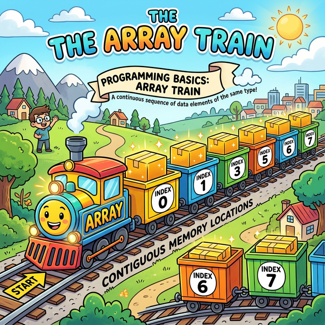
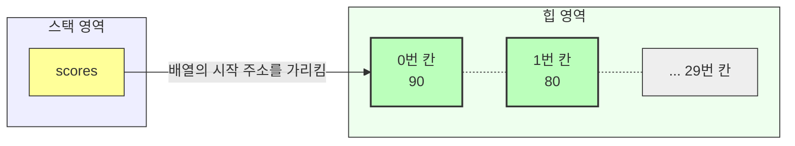

# 8.6 배열(Array) 타입

## 1. 기차 만들기 🚂

변수는 하나에 값 하나만 담을 수 있습니다.
값이 30개라면 변수 30개를 만들어야 할까요? (너무 힘듭니다!)

**배열(Array)**은 같은 타입의 변수를 여러 개 묶어서 **기차처럼 길게 연결한 것**입니다.



## 2. 선언과 생성

```java
// 1. 선언 (기차표 끊기)
int[] scores;

// 2. 생성 (좌석 30개짜리 기차 만들기)
scores = new int[30];

// 3. 값 넣기 (승객 태우기)
scores[0] = 90; // 첫 번째 칸 (0번부터 시작!)
scores[1] = 80;
```



## 3. 한 방에 만들기

```java
int[] scores = { 90, 80, 70, 60 };
```

> **주의**: 배열의 순서(인덱스)는 **0부터 시작**합니다. (0, 1, 2, ...)
