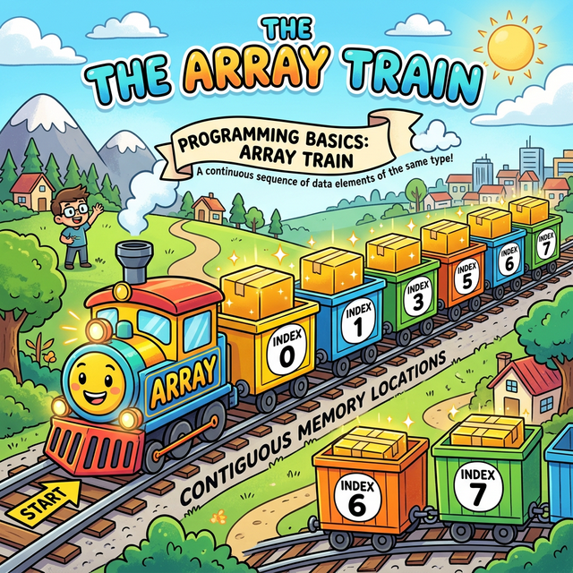
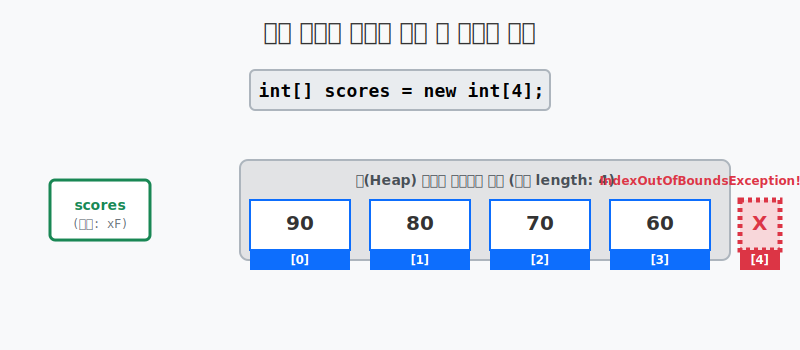
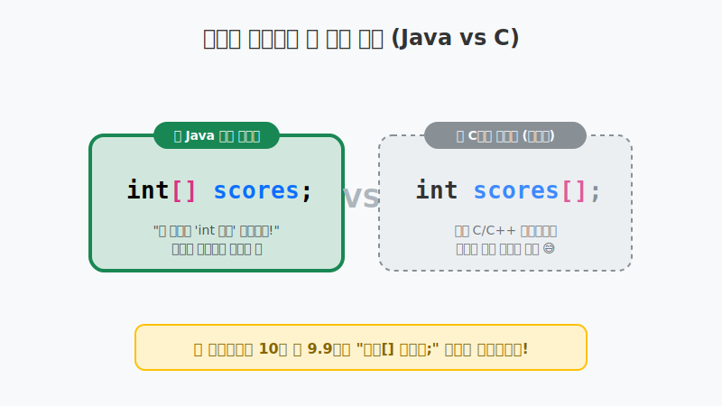
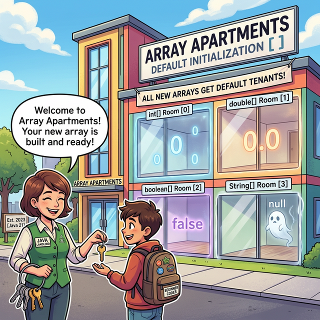
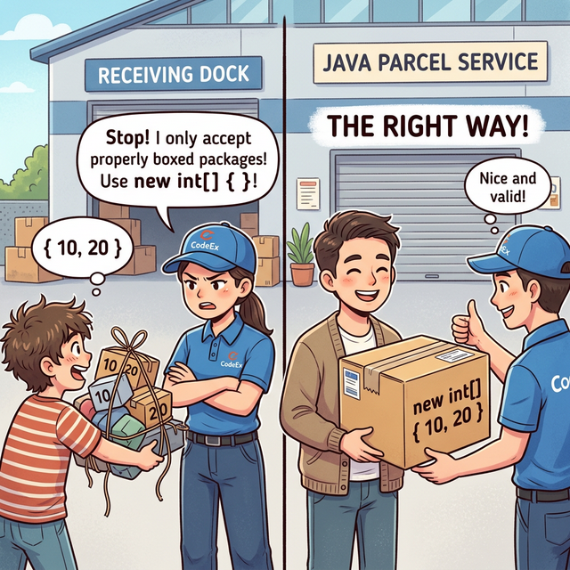
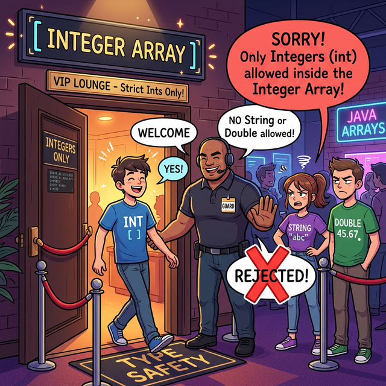
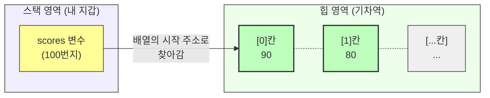
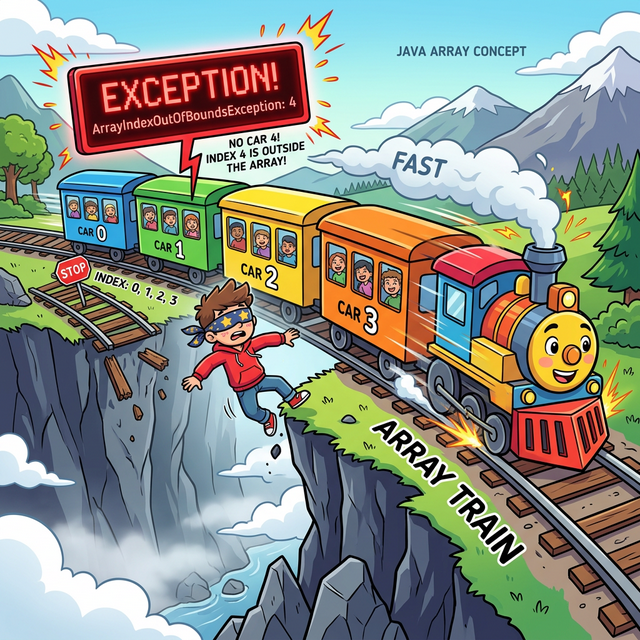

# 8.6 배열(Array) 타입

## 1. 수십 개의 변수를 한 줄로 묶는 마법: 기차 만들기 🚂

지금까지 우리가 배운 변수는 '하나의 주머니에 단 한 개의 물건만' 담을 수 있었습니다.
그런데 만약 학생 30명의 수학 점수를 저장해야 한다면 어떨까요?
`int score_01, score_02, ... score_30;` 처럼 변수를 30개나 연달아 선언하는 것은 매우 고통스러운 일입니다.

이런 상황을 위해 **같은 속성의 데이터 여러 개를 기차의 객실들처럼 한 줄로 쭉 연결해 놓은 것**이 바로 **배열(Array)** 입니다.



위 그림처럼 기차가 통째로 하나의 이름을 지니고 있고, 그 객실마다 번호판(인덱스)이 차례대로 붙어있는 구조입니다.

---

## 2. 좌석 번호(Index)는 1번이 아닌 0번부터! 💺

배열의 각 칸에 접근할 때 사용하는 숫자를 **인덱스(Index)**라고 부릅니다.
컴퓨터 과학의 오랜 관습에 따라, 배열의 인덱스는 **우리 일상처럼 1번째부터 세지 않고 `0`번째부터 세기 시작**합니다.



길이가 4칸인 배열을 만들었다면, 사용할 수 있는 칸의 번호는 `[0], [1], [2], [3]` 이 됩니다.
만약 존재하지 않는 `[4]` 번째 칸을 열려고 하면 컴퓨터는 몹시 불같이 화를 내며 치명적인 에러를 발생시킵니다.

---

## 3. 배열을 선언하는 두 가지 얼굴 (Java 스타일 vs C 스타일) 🎭

자바에서 배열 변수를 선언할 때, 대괄호(`[]`)를 붙이는 위치는 두 군데 중 하나를 선택할 수 있습니다. 

1. **`타입[] 변수;` (Java 권장 스타일)**
2. **`타입 변수[];` (C언어 스타일)**

결론부터 말씀드리면, **실무에서는 무조건 1번(Java 스타일)을 사용하시는 것을 강력하게 권장합니다!**




`int[] scores;` 라고 쓰면, 사람의 눈으로 읽을 때 **"아, 이 변수는 `int 배열` 타입 전체를 가리키는 `scores` 구나!"** 라고 매우 직관적으로 해석됩니다. 대괄호(`[]`)가 타입(int)에 찰싹 달라붙어 있기 때문입니다.

반면 `int scores[];` 방식은 과거 C나 C++ 언어에 익숙했던 개발자들이 자바로 쉽게 넘어올 수 있도록 자바 설계자들이 배려 차원에서 남겨둔 '레거시(Legacy)' 문법입니다. 틀린 문법은 아니지만, 최근 자바 생태계에서는 거의 사용하지 않는 구시대의 유물처럼 취급됩니다.

### 🎧 Vibe 코딩 : 배열 선언 스타일 비교기

> **🗣️ 학생 프롬프트 (AI에게 이렇게 명령해 보세요):**
> "자바에서 배열 변수를 선언할 때 사용할 수 있는 두 가지 방식(`타입[] 변수` 와 `타입 변수[]`)을 모두 보여주고, 똑같은 길이를 가진 배열을 각각 할당해 보는 짧은 코드를 짜 줘. 그리고 자바에서는 왜 앞의 방식을 훨씬 더 선호하는지 주석으로 쉽게 설명해 줘."

```java
public class VibeArrayDeclaration {
    public static void main(String[] args) {
        
        // ✨ 스타일 1: Java 권장 스타일 (타입[] 변수)
        // 해석: "int 배열 타입"으로 만들어진 변수 "scores1" 이다! (직관적)
        int[] scores1 = new int[3];
        scores1[0] = 100;
        System.out.println("Java 스타일 배열 정상 작동: " + scores1[0]);

        // 👴 스타일 2: C언어 레거시 스타일 (타입 변수[])
        // 해석: 옛날 C언어 개발자들을 위해 남겨둔 문법. 동작은 완벽하게 똑같습니다.
        int scores2[] = new int[3];
        scores2[0] = 90;
        System.out.println("C언어 스타일 배열 정상 작동: " + scores2[0]);
        
        // 결론: 어떻게 쓰든 결과는 같지만, 앞으로 우리는 무조건 "타입[] 변수명;" 형태만 쓰기로 약속합시다!
    }
}
```

---

## 4. 배열 생성하기 ({} vs new []{}) 📦

배열을 만들고 데이터를 채워 넣는 방법은 크게 3가지가 있습니다. 제일 자주 쓰이는 방식 두 가지를 집중적으로 비교해 봅시다.

### ⚡ 방법 1: 탄생과 동시에 데이터 나열하기 (초스피드 방식)
처음부터 기차에 태울 승객 명단이 확정되어 있을 때 가장 편리한 방법입니다. 변수를 선언하는 **"바로 그 첫 단 한 줄"**에서만 쓸 수 있는 마법의 중괄호(`{ }`) 단축키입니다.

```java
// 선언과 동시에 중괄호 {} 로 값을 나열하면 끝!
int[] scores = { 90, 80, 70, 60 };
String[] names = { "Jiny", "Java", "Spring" };
```

### 🧐 방법 2: 나중에 데이터 통째로 넣기 (반드시 `new 타입[]` 명시!)
가장 많이 하는 실수 중 하나가 바로 변수 선언만 먼저 해놓고, 나중에 중괄호(`{ }`)만 써서 값을 밀어 넣으려는 시도입니다. 자바 컴파일러는 중괄호 뭉치만 덜렁 주어지면 이것이 문자 배열용인지 숫자 배열용인지 확신하지 못해 에러를 뿜어냅니다.




따라서 **변수 선언과 값의 할당이 서로 다른 줄(Line)에서 일어날 때**는, 덜렁 `{ }` 만 쓰면 안 되고 **"이것은 새로운 int 배열 객체입니다!" 라고 `new int[]`를 반드시 친절하게 명시**해 주어야 기차가 정상적으로 생성됩니다.

```java
int[] scores; // 일단 선언 (빈 리모컨)

// scores = { 90, 80, 70, 60 };  // 🚨 (X) 무지막지한 컴파일 에러 발생!
scores = new int[] { 90, 80, 70, 60 }; // ✅ (O) "새로 객체를 만들어서 통째로 넣겠다"고 명시
```

### 🚀 방법 3: 빈 수레 먼저 만들기 (크기만 지정하기)
승객 데이터는 나중에 천천히 들어올 예정이고, "우선 빈 객실 4개짜리 기차만 세팅"해두고 싶을 때 사용하는 가장 클래식한 정석 방법입니다.

```java
int[] scores = new int[4]; // 4칸짜리 기차 생성
```

#### 👻 빈 방은 없다! 자동으로 채워지는 '기본값(Default Value)'
위처럼 `new int[4]` 라고 크기만 지정해서 배열을 생성하면, 그 안은 정말 텅텅 비어있을까요? 아닙니다! **자바는 `new` 키워드로 힙(Heap) 영역에 공간을 만들 때, 절대로 공간을 쓰레기 값으로 방치하지 않고 기본값(Default)으로 깔끔하게 초기화해 줍니다.**




방의 타입(Type)에 따라 자바가 알아서 채워주는 유령(기본값)들은 다음과 같습니다:

1. **정수형 배열** (`byte[]`, `short[]`, `int[]`, `long[]`): 모두 **`0`** 으로 초기화됩니다.
2. **실수형 배열** (`float[]`, `double[]`): 모두 **`0.0`** 으로 초기화됩니다.
3. **논리형 배열** (`boolean[]`): 모두 **`false`** 로 초기화됩니다.
4. **참조형 배열** (`String[]`, `Object[]` 등): 모두 **`null`** (가리키는 객체가 없음) 로 초기화됩니다.

#### 🏗️ 나중에 원하는 값으로 인테리어(할당) 하기
이렇게 0이나 null로 채워진 방에 진짜 주인공(데이터)을 넣으려면, 인덱스 번호를 지정하여 직접 대입 연산자(`=`)로 값을 덮어씌워 주면 됩니다.

```java
int[] scores = new int[4]; // 현재 상태: { 0, 0, 0, 0 }

scores[0] = 90; // 0번 방에 90 대입
scores[1] = 80; // 1번 방에 80 대입
// 결과: { 90, 80, 0, 0 } (나머지 방은 여전히 0 유지)
```

#### 🎧 Vibe 코딩 : 빈 배열의 으스스한 유령(기본값) 확인하기

> **🗣️ 학생 프롬프트 (AI에게 이렇게 명령해 보세요):**
> "자바에서 `new`를 써서 크기만 지정해 배열을 만들었을 때, 데이터 타입별로 어떤 기본값이 자동으로 들어가는지 확인하고 싶어. `int[]`, `double[]`, `boolean[]`, `String[]` 배열을 각각 1칸짜리로 만들고, 그 0번째 인덱스를 력해서 기본값이 무엇인지 보여주는 코드를 작성해 줘. 그리고 그 값에 새로운 값을 덮어씌우는 예제도 하나 추가해 줘."

```java
public class VibeArrayDefault {
    public static void main(String[] args) {
        
        System.out.println("👻 빈 방에 숨어있는 기본값(Default) 녀석들 확인!");
        
        int[] intArr = new int[1];
        System.out.println("1. int 배열의 빈 방: " + intArr[0]); // 0
        
        double[] doubleArr = new double[1];
        System.out.println("2. double 배열의 빈 방: " + doubleArr[0]); // 0.0
        
        boolean[] boolArr = new boolean[1];
        System.out.println("3. boolean 배열의 빈 방: " + boolArr[0]); // false
        
        String[] stringArr = new String[1];
        System.out.println("4. String(참조) 배열의 빈 방: " + stringArr[0]); // null
        
        System.out.println("\n✨ 유령을 쫓아내고 진짜 데이터 할당하기!");
        
        // 0.0 이 들어있던 방에 99.9 할당 (기본값 덮어쓰기)
        doubleArr[0] = 99.9; 
        System.out.println("업데이트된 double 배열 방: " + doubleArr[0]);
    }
}
```

> **🗣️ 학생 프롬프트 (AI에게 이렇게 명령해 보세요):**
> "자바 배열을 생성할 때 가장 많이 헷갈려하는 `{ }` 단축 초기화 방식과, 변수를 먼저 만들고 나중에 배열을 통째로 덮어씌울 때 쓰는 `new int[]{ }` 방식의 차이를 비교해 줘. 만약 나중에 할당할 때 `new int[]`를 빼먹으면 어떤 에러가 나는지 주석으로 눈에 띄게 경고해 주고, 올바른 코드도 함께 보여줘."

```java
public class VibeArrayCreation {
    public static void main(String[] args) {
        
        // 1. 선언과 동시에 할당 (퍼펙트 매치)
        String[] season1 = { "봄", "여름", "가을", "겨울" };
        System.out.println("선언과 동시 할당된 첫 계절: " + season1[0]);

        // 2. 선언을 먼저 하고, 나중에 데이터를 한꺼번에 쏟아붓고 싶을 때
        String[] season2;
        
        // season2 = { "봄", "여름", "가을", "겨울" }; 
        // 🔥 초보자 단골 에러! (Array constants can only be used in initializers)
        
        // 3. ✨ 반드시 new 타입[] 을 앞에 붙여서 새 객체임을 명시해야 통과!
        season2 = new String[] { "봄", "여름", "가을", "겨울" };
        System.out.println("나중에 분리 할당된 마지막 계절: " + season2[3]);
        
        System.out.println("👉 결론: 변수 선언 줄이 끝나버렸다면, 덜렁 { } 만 쓸 수 없습니다!");
    }
}
```

### 🎯 주의사항: 메소드에 직접 배열을 던져줄 때 (매개변수 전달)

위에서 배운 "결국 분리 할당은 `new 타입[]`이 필수다"라는 규칙이 가장 헷갈리게 적용되는 곳이 바로 **메소드를 호출하며 인자(Argument)로 배열을 넘겨줄 때**입니다.

메소드의 소괄호 `()` 안에 곧바로 데이터 리스트를 밀어 넣고 싶을 때, 초보자들은 흔히 `{ 1, 2, 3 }` 이라고 적습니다. 하지만 이는 컴파일 에러를 뿜어냅니다!




메소드를 호출하는 순간은 1번 방식("탄생과 동시에 선언형태로 할당")이 아닙니다. 왜냐하면 메소드 내부 어딘가에 이미 `int[] arr` 라는 변수가 먼저 선언되어 있고, 우리가 던지는 값을 **나중에 받아서 대입(분리 할당)**하는 구조이기 때문입니다.
따라서 이곳에서도 반드시 **`new 타입[]`**을 명시하여 완벽한 객체 박스로 포장한 상태로 던져주어야 합니다.

#### 🎧 Vibe 코딩 : 메소드로 배열 택배 보내기

> **🗣️ 학생 프롬프트 (AI에게 이렇게 명령해 보세요):**
> "자바에서 배열 데이터를 넘겨받아 총합을 구해주는 `add(int[] scores)` 라는 메소드를 하나 만들어 줘. 그리고 `main` 메소드 안에서 이 `add` 메소드를 호출할 때, `add({10, 20})` 처럼 `{ }`만 썼을 때 왜 에러가 나는지 주석으로 설명하고, 올바르게 `new int[]{ 10, 20 }` 형태로 인자를 던져서 정상 작동하는 코드를 완성해 줘."

```java
public class VibeArrayMethodArg {
    
    // 배열을 통째로 넘겨받아 총합을 구해주는 메소드
    public static int add(int[] scores) {
        int sum = 0;
        for (int i = 0; i < scores.length; i++) {
            sum += scores[i];
        }
        return sum;
    }

    public static void main(String[] args) {
        
        // 1. 컴파일 에러 (메소드 인자로 던질 때 덜렁 { } 만 쓰면 안 됨)
        // int result1 = add( { 95, 85, 90 } ); // 🚨 컴파일러: "이게 무슨 타입 덩어리야?!"
        
        // 2. 정상 작동 (반드시 new int[] 로 포장해서 보내야 함!)
        int result2 = add( new int[] { 95, 85, 90 } ); 
        
        System.out.println("총합 계산 완료: " + result2);
    }
}
```

---

## 4. 배열의 철칙: "같은 타입(Type)만 탑승 가능합니다!" 🚫

자바 배열이 가진 가장 중요하고도 엄격한 규칙은 **"처음 기차를 만들 때 정해둔 타입(Type)의 승객만 탈 수 있다"**는 점입니다. 
파이썬이나 자바스크립트의 리스트처럼 숫자와 문자를 한 바구니에 마구잡이로 섞어 담을 수 없습니다.




`int[]` 로 선언된 배열에는 오직 정수형(`int`) 데이터만 들어갈 수 있습니다. 만약 실수(`double`)나 문자열(`String`)을 강제로 쑤셔 넣으려고 하면, 자바 컴파일러라는 무서운 기도가 문을 쾅 닫고 **Type mismatch (타입 불일치)** 에러를 내뿜습니다.

### 🎧 Vibe 코딩 : 철저한 VIP 타입 검사기 체험

> **🗣️ 학생 프롬프트 (AI에게 이렇게 명령해 보세요):**
> "자바 배열은 '동일한 데이터 타입'만 들어갈 수 있다는 강력한 규칙을 보여주기 위해, `double[]` 배열에 실수, 정수, 그리고 문자열을 각각 넣어보는 코드를 작성해 줘. 어느 부분에서 컴파일 에러가 나는지 주석으로 이유를 명확하게 설명해 줘."

```java
public class VibeArrayTypeStrict {
    public static void main(String[] args) {
        
        System.out.println("🌟 소수점(double) VIP 전용 객실 오픈!");
        
        // 1. 소수점(실수)만 타기로 약속한 기차 생성
        double[] weights = new double[3];
        
        // 2. 정상 탑승 (실수)
        weights[0] = 75.5; 
        
        // 3. 이건 탑승 가능할까? (정수)
        // -> 가능합니다! 자바에서 int는 double로 알아서 변신(자동 타입 변환)할 수 있기 때문입니다. (62 -> 62.0)
        weights[1] = 62;   
        
        // 4. 이건 탑승 가능할까? (문자열)
        // weights[2] = "무거움"; // 🔥 삐빅! 컴파일 에러 (Type mismatch: cannot convert from String to double)
        
        System.out.println("0번칸: " + weights[0]);
        System.out.println("1번칸: " + weights[1]); // 62.0 으로 출력됨
        System.out.println("단일 타입 원칙을 철저히 검사 완료!");
    }
}
```

---

## 5. 배열의 크기 확인하기 (.length)와 불변성(Immutability) 📏

배열을 사용할 때 가장 많이 쓰는 또 다른 기능은 바로 배열의 전체 길이를 알려주는 **`.length`** 속성입니다. 배열 뒤에 괄호 없이 `.length`만 붙여주면 현재 기차가 몇 칸짜리인지 `int` 정수형으로 즉시 반환해 줍니다. 

**["배열은 한 번 태어나면 절대 크기를 바꿀 수 없다!"]**
자바의 배열 객체는 생성되는 즉시 그 길이가 영구적으로 고정(불변성) 됩니다. 3칸짜리 기차를 만들었다면, 도중에 4칸으로 늘이거나 2칸으로 줄일 수 있는 마법은 존재하지 않습니다.




만약 공간이 더 필요하다면 어떻게 해야 할까요? **아예 처음부터 더 큰 기차(배열)를 새로 하나 사고, 기존 승객들을 몽땅 새 기차로 옮겨 태워야만 합니다.** (이를 배열 복사라고 부르며, 다음 챕터에서 아주 자세히 배울 예정입니다!)

### 🎧 Vibe 코딩 : 배열의 길이 체크와 크기 늘리기 체력전

> **🗣️ 학생 프롬프트 (AI에게 이렇게 명령해 보세요):**
> "자바 배열의 `.length` 속성을 사용해서 배열의 크기를 출력해 보고, 만약 배열의 크기를 변경하고 싶을 때(예: 3칸에서 5칸으로) 기존 배열에 단순히 방을 추가할 수 없다는 걸 주석으로 명시한 뒤, 아예 크기가 5인 새로운 배열을 만들어서 데이터를 직접 옮겨 담는 예제를 만들어 줘."

```java
public class VibeArrayLength {
    public static void main(String[] args) {
        
        // 1. 초기 3칸짜리 배열 생성
        int[] oldTrain = { 10, 20, 30 };
        System.out.println("기존 기차의 총 길이: " + oldTrain.length + "칸");
        
        // 2. 승객 폭주! 5칸이 필요해짐. 하지만 oldTrain.length = 5; (절대 불가!!! 컴파일 에러)
        // System.out.println("🚨 알림: 기존 기차를 잡아늘리는 것은 불가능합니다!");
        
        // 3. 어쩔 수 없이 5칸짜리 새 기차를 아예 새로 구매함
        int[] newTrain = new int[5];
        System.out.println("\n✨ 5칸짜리 새 기차 대령이오! (길이: " + newTrain.length + "칸)");
        
        // 4. 노가다로 기존 승객들을 한 명씩 옮겨 태움 (이사 작업)
        for (int i = 0; i < oldTrain.length; i++) {
            newTrain[i] = oldTrain[i];
        }
        
        // 5. 남은 빈 방(3번칸, 4번칸)에 새 승객 탑승
        newTrain[3] = 40;
        newTrain[4] = 50;
        
        System.out.println("이사 완료! 새 기차의 마지막 객실 번호: " + (newTrain.length - 1)); // 4 반환
    }
}
```

---

## 6. 메모리 내부 모습 (스택과 힙)

배열 역시 **참조 타입(Reference Type)**입니다. `scores`라는 변수 안에는 90, 80이라는 값이 통째로 들어있는 것이 아니라, 힙 영역에 거대하게 만들어진 **기차의 첫 번째 칸 앞부분(시작 주소)**만 메모해두고 있습니다.


```mermaid
flowchart LR
    subgraph Stack ["스택 영역 (내 지갑)"]
        Ref["scores 변수<br/>(100번지)"]
    end
    
    subgraph Heap ["힙 영역 (기차역)"]
        direction LR
        Arr0["[0]칸<br/>90"] -.- Arr1["[1]칸<br/>80"] -.- Arr2["[...칸]<br/>..."]
    end
    
    Ref -->|"배열의 시작 주소로<br/>찾아감"| Arr0
    
    style Stack fill:#eef,stroke:#333
    style Heap fill:#efe,stroke:#333
    style Ref fill:#ff9,stroke:#333
    style Arr0 fill:#bfb,stroke:#333,stroke-width:2px
    style Arr1 fill:#bfb,stroke:#333,stroke-width:2px
    style Arr2 fill:#eee,stroke:#333
```

---

## 7. 가장 흔하고 무서운 실수: `ArrayIndexOutOfBoundsException` 🚨

배열을 배운 초보자들이 (심지어 숙련된 개발자들까지도) 가장 자주 겪는 사고 중 하나가 바로 **"존재하지 않는 좌석표(Index) 문을 강제로 열려고 하는 시도"**입니다! 

배열의 가장 마지막 객실 번호는 언제나 **`(배열의 길이 - 1)`** 입니다. 길이가 4인 기차가 있다면 유효한 좌석 번호는 오직 `0, 1, 2, 3` 뿐입니다.




위 그림처럼, 만약 실수로 `[4]` 번째 손님칸을 찾아 문을 열려고 하면 어떻게 될까요? 기차 뒤에는 더 이상 이어지는 아무런 칸도 없기 때문에, 프로그램은 그대로 절벽으로 추락하며 즉시 실행을 중단해 버립니다. 
이때 자바 콘솔 창에 무섭게 뿜어져 나오는 붉은 글씨가 바로 그 유명한 **`java.lang.ArrayIndexOutOfBoundsException` (배열 인덱스가 경계를 벗어남)** 에러입니다.

### 🎧 Vibe 코딩 : 배열의 절벽 밑으로 직접 떨어져 보기

> **🗣️ 학생 프롬프트 (AI에게 이렇게 명령해 보세요):**
> "자바 배열에서 제일 흔하게 발생하는 에러인 ArrayIndexOutOfBoundsException을 일부러 발생시키는 간단한 코드를 보여줘. 왜 이 에러가 발생했는지, 배열의 인덱스는 몇부터 시작하고 끝나는지 주석으로 쉽게 설명해 줘."

```java
public class VibeArrayBreak {
    public static void main(String[] args) {
        
        System.out.println("🚂 기차 출발합니다! 빵빠앙!");
        
        // 4칸짜리 기차 생성 (인덱스는 0, 1, 2, 3 까지만 존재!)
        int[] vipSeats = { 100, 200, 300, 400 }; 
        
        System.out.println("0번칸 승객: " + vipSeats[0]); // 100
        System.out.println("3번칸 승객: " + vipSeats[3]); // 400
        
        System.out.println("\n🚨 위험! 존재하지 않는 [4]번째 객실 문을 열려고 시도합니다!");
        
        try {
            // vipSeats[4]는 5번째 사람을 의미함. 칸이 없는데 부수고 들어가려 함
            // 배열의 최대 인덱스는 (vipSeats.length - 1)인 3입니다.
            System.out.println("4번칸 승객: " + vipSeats[4]); 
            
        } catch (ArrayIndexOutOfBoundsException e) {
            System.out.println("🔥🔥🔥🔥🔥🔥🔥🔥🔥🔥🔥🔥🔥🔥🔥🔥🔥");
            System.out.println("에러 발생: " + e.toString());
            System.out.println("해석: 배열(Array)의 선로 끝자락(Bounds)을 넘어서 허공으로 떨어졌습니다!");
            System.out.println("기차의 길이는 " + vipSeats.length + "칸인데, [" + 4 + "]번 문을 열 수 없습니다.");
        }
        
    }
}
```

이 코드를 실행하시면 콘솔에 배열 경계를 벗어남을 알리는 붉은 경고가 등장하는 것을 볼 수 있습니다. 항상 **배열의 마지막 칸은 `배열이름.length - 1`** 이라는 공식을 절대 잊지 마세요!
