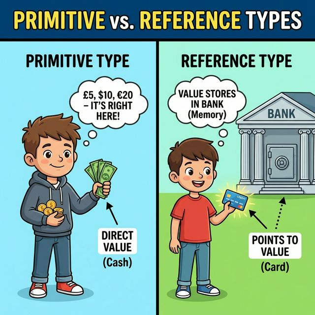

# 8.1 데이터 타입 분류

## 1. 기본 타입 vs 참조 타입

자바의 데이터 타입은 크게 두 가지로 나뉩니다.

| 종류          | 영어           | 비유       | 설명                                                                      |
| :------------ | :------------- | :--------- | :------------------------------------------------------------------------ |
| **기본 타입** | Primitive Type | **현금** 💵 | 변수 안에 **실제 값**이 들어있습니다. (`int`, `double` 등)                |
| **참조 타입** | Reference Type | **통장** 💳 | 변수 안에 **주소(번지)**가 들어있습니다. (배열, 열거, 클래스, 인터페이스) |



## 2. 참조(Reference)란?

참조 타입 변수는 객체가 힙(Heap) 메모리 어딘가에 있고, 그 **위치(주소)**를 가지고 있습니다.
마치 "서울시 강남구..."라는 주소가 적힌 명함과 같습니다.
우리가 그 명함(변수)을 보고 찾아가야 실제 집(객체)을 만날 수 있습니다.

```mermaid
flowchart LR
    subgraph Stack [스택(Stack) 영역 - 변수 상자]
        direction TB
        Prim[기본 타입 변수\nint age = 25]
        Ref[참조 타입 변수\nString name = '100번지']
    end
    
    subgraph Heap [힙(Heap) 영역 - 실제 객체]
        Obj[실제 데이터\n'100번지: 홍길동']
    end
    
    Ref -->|주소를 참조| Obj
    
    style Stack fill:#eef,stroke:#333
    style Heap fill:#efe,stroke:#333
    style Prim fill:#fff,stroke:#333
    style Ref fill:#ff9,stroke:#333
    style Obj fill:#bfb,stroke:#333,stroke-width:2px
```
