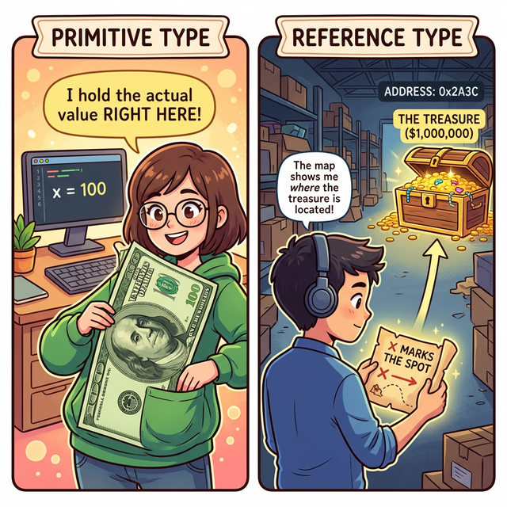
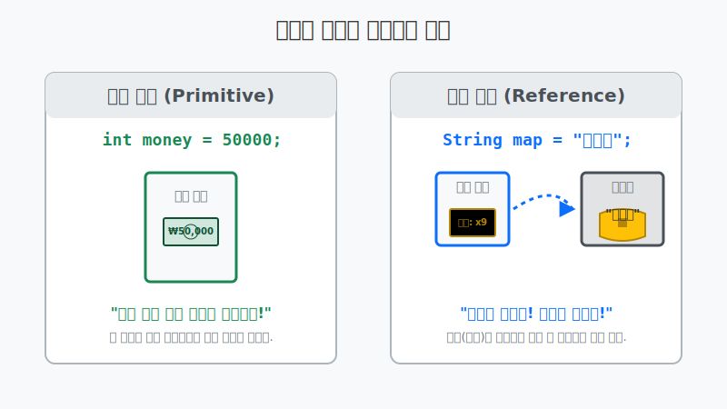
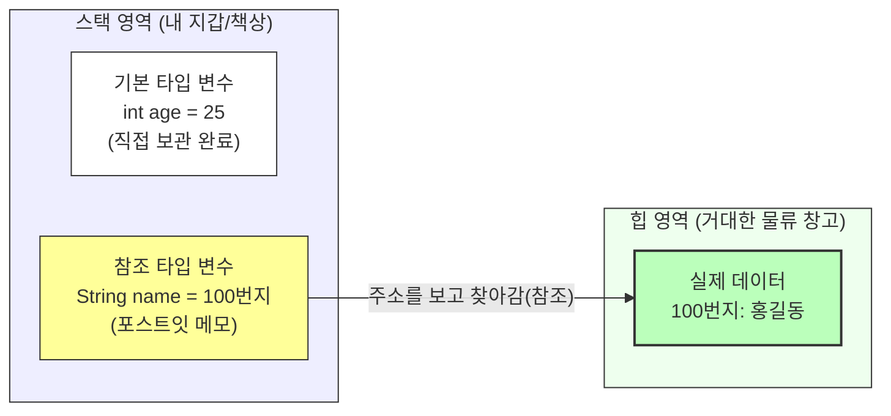

# 8.1 데이터 타입 분류

## 1. 기본 타입 vs 참조 타입 (현금 💵 vs 보물지도 🗺️)

자바 세상의 모든 데이터는 보관하는 방식에 따라 크게 두 가지 파벌로 나뉩니다.

| 종류          | 영어           | 비유       | 특징                                                                      |
| :------------ | :------------- | :--------- | :------------------------------------------------------------------------ |
| **기본 타입** | Primitive Type | **현금** 💵 | 지갑(변수) 안에 **실제 돈(값)**이 직접 들어있습니다. (`int`, `double`, `boolean` 등) |
| **참조 타입** | Reference Type | **지도** 🗺️ | 지갑(변수) 안에 진짜 보물이 아니라, 보물이 숨겨진 **주소(좌표)**만 들어있습니다. (배열, 열거, 클래스 등) |

### 🎨 비유: 내 주머니 속 현금 vs 창고 키

직접 5만 원짜리 지폐(가벼운 데이터)를 주머니에 넣고 다니는 것과, 어마어마한 보물 상자(무겁고 거대한 데이터)의 위치가 적힌 지도를 들고 다니는 것의 차이입니다.



위 그림처럼, 참조 타입 변수는 아무리 거대한 객체라도 변수 상자 자체는 무거워지지 않습니다. 그저 "100번지에 가면 있어~"라는 작은 메모표만 가지고 있을 뿐이죠.

---

## 2. 메모리 구조와 참조(Reference)의 비밀 🧠

우리가 참조 타입 변수(`String`, 배열 등)를 부르면, 컴퓨터 내부에서는 엄청나게 빠른 속도로 **'지도에 적힌 주소를 보고 창고(Heap)로 달려가는'** 택배 기사들의 움직임이 일어납니다.




```mermaid
flowchart LR
    subgraph Stack["스택 영역 (내 지갑/책상)"]
        direction TB
        Prim["기본 타입 변수<br/>int age = 25<br/>(직접 보관 완료)"]
        Ref["참조 타입 변수<br/>String name = 100번지<br/>(포스트잇 메모)"]
    end
    
    subgraph Heap["힙 영역 (거대한 물류 창고)"]
        Obj["실제 데이터<br/>100번지: 홍길동"]
    end
    
    Ref -->|"주소를 보고 찾아감(참조)"| Obj
    
    style Stack fill:#eef,stroke:#333
    style Heap fill:#efe,stroke:#333
    style Prim fill:#fff,stroke:#333
    style Ref fill:#ff9,stroke:#333
    style Obj fill:#bfb,stroke:#333,stroke-width:2px
```

---

## 3. 🎧 Vibe 코딩: 복사할 때 일어나는 소름 돋는 차이

이 "현금 vs 지도"의 차이는 다른 사람에게 빌려줄 때(변수 복사) 가장 극명하게 나타납니다.

> **🗣️ 학생 프롬프트 (AI에게 이렇게 명령해 보세요):**
> "자바에서 기본 타입(int) 변수를 복사할 때와 참조 타입(배열이나 객체) 변수를 복사할 때, 값을 수정하면 원본에 어떤 영향을 미치는지 보여주는 코드를 짜 줘. 주석으로 '값 복사'와 '주소 복사'의 차이점도 명확하게 설명해 줘."

```java
public class VibeClassification {
    public static void main(String[] args) {
        System.out.println("--- 💵 기본 타입(현금) 복사 ---");
        int myMoney = 50000;
        int friendMoney = myMoney; // 돈(값)을 똑같이 복사해서 줌
        
        friendMoney = 10000; // 친구가 자기 돈을 써버림
        
        System.out.println("내 돈: " + myMoney); // 50000 (안전함! 내 지갑은 영향 없음)
        System.out.println("친구 돈: " + friendMoney); // 10000
        
        
        System.out.println("\n--- 🗺️ 참조 타입(현관 비번) 복사 ---");
        int[] myHousePass = {1, 2, 3, 4}; // 비밀번호 목록이 든 집(객체)
        int[] friendHousePass = myHousePass;  // 집을 통째로 준 게 아니라, '현관 주소'만 알려줌!
        
        friendHousePass[0] = 9; // 친구가 알려준 주소로 찾아가 비번의 앞자리를 9로 바꿔버림!
        
        System.out.println("내 집 1번 비번: " + myHousePass[0]); // 9 (헉! 내 집 비번도 털림!)
        System.out.println("친구 집 1번 비번: " + friendHousePass[0]); // 9
    }
}
```

> **🔥 꿀팁**: 참조 타입을 남에게 넘겨줄 때(복사할 때)는 "진짜 내용물을 복제해 준 건지, 아니면 하나뿐인 우리 집 현관문 주소를 공유한 건지"를 반드시 명심해야 합니다!
