# 8.10 배열 항목 반복을 위한 향상된 for 문 (Enhanced For Loop)

## 1. 회전 초밥집 컨베이어 벨트 🍣 (다른 언어의 `foreach`와 동일!)

C#, Python, JavaScript 등 다른 프로그래밍 언어를 먼저 접해보신 분들이라면 **`foreach`** 혹은 **`for in`** 이라는 문법이 매우 익숙하실 것입니다. 
결론부터 말씀드리면, 자바의 **'향상된 for 문(Enhanced For Loop)'은 이름만 다를 뿐 다른 언어들의 `foreach` 문법과 작동 원리가 100% 똑같습니다.**

우리가 배열의 모든 데이터를 처음부터 끝까지 읽어올 때, 기존의 `for` 문에서는 인덱스(방 번호, `i=0, 1, 2...`)를 직접 세어가면서 데이터를 하나씩 꺼내야 했습니다. 마치 전통적인 초밥집 주방장이 **"내가 지금 몇 번째 접시를 집었지? 접시가 총 몇 개 남았지?"** 를 장부에 계속 기록(`i++`)하면서 확인(`i < length`)하는 것과 같았죠. 

하지만 향상된 for 문(for-each)은 회전 초밥집의 최신식 컨베이어 벨트와 같습니다. 장부에 적을 필요 없이, 그저 벨트(배열)에서 나오는 초밥(데이터)을 **"다 떨어질 때까지 그냥 순서대로 내 앞접시에 놔줘!"** 라고 명령하는 마법 같은 문법입니다.




위 그림처럼 인덱스 번호를 아예 신경 쓸 필요 없이, 오직 들어있는 "데이터(초밥)" 자체에만 집중할 수 있게 해줍니다.

---

## 2. 향상된 for 문의 구조와 마법 ✨

향상된 for 문은 반복 횟수를 지정하기 위한 초기화식, 조건식, 증감식이 모두 사라졌습니다. 변수 세 개만 기억하면 됩니다!

```java
// 1. 데이터가 담긴 원본 (컨베이어 벨트)
int[] scores = { 95, 71, 84 };

// 2. 향상된 for 문! (초밥 그릇 : 원본 벨트)
for (int score : scores) {
    // 3. 요리 즐기기
    System.out.println(score);
}
```


**구조 해석:** `for ( 타입 변수 : 배열 )`
1. 콜론(`:`) 뒤에 있는 `scores` 는 데이터를 여러 개 가진 **원본 배열**입니다.
2. 콜론(`:`) 앞에 있는 `int score` 는 배열에서 꺼낸 값 하나를 잠시 담아둘 **임시 그릇(변수)**입니다.
3. 실행 흐름:
   - 배열에서 첫 번째 값을 꺼내서 변수 `score`에 저장하고, 블록(`{}`) 안의 코드를 실행합니다.
   - 코드가 끝나면 다시 올라가 배열에서 **그 다음 값**을 꺼내어 `score`에 새로 덮어쓰고, 코드를 실행합니다.
   - 배열에 더 이상 꺼낼 데이터가 없으면, 똑똑하게 알아서 반복문을 완전히 종료해 버립니다! (`ArrayIndexOutOfBoundsException`이 발생할 확률이 0% 입니다.)

> **💡 중요:** 향상된 for 문은 값을 '읽어올 때'만 사용하기 좋습니다. 배열에 들어있는 값을 중간에 '수정'해야 하거나, 인덱스 번호(`i`)가 계산식에 꼭 필요할 때는 기존의 전통적인 `for` 문을 사용해야 합니다.

---

## 3. 🎧 Vibe 코딩 : 향상된 for 문으로 전체 점수 합산하기

인덱스를 세는 귀찮은 작업에서 해방되어, 오로지 배열의 총합(Sum)과 평균(Average)을 구하는 데에만 집중하는 아름다운 코드입니다.

> **🗣️ 학생 프롬프트 (AI에게 이렇게 명령해 보세요):**
> "기존의 기본 `for` 문과 자바 5부터 나온 '향상된 for 문(for-each)'을 비교할 수 있게, int 배열의 데이터를 읽어오는 코드를 두 가지 방식으로 모두 작성해 줘. 그리고 향상된 for 문의 장점이 뭔지 주석으로 설명해 줘."

```java
public class VibeEnhancedFor {
    public static void main(String[] args) {
        
        System.out.println("🍣 회전초밥 (향상된 for문) 식사 시작!");
        
        // 1. 학생들의 시험 점수가 들어있는 배열 선언
        int[] scores = { 95, 71, 84, 93, 87 };
        
        int sum = 0; // 초밥을 쌓아둘 총합 그릇
        
        // 2. 향상된 for 문 사용: "scores 배열 안의 점수(score)를 처음부터 끝까지 하나씩 줘!"
        for (int score : scores) {
            sum = sum + score; // 혹은 sum += score;
            System.out.println("벨트에서 내린 점수: " + score + " (현재 총합: " + sum + ")");
        }
        
        System.out.println("\n🔥 식사 종료!");
        System.out.println("📊 점수 총합: " + sum);
        
        // 학생 수는 배열의 길이를 이용해서 바로 구하기!
        double avg = (double) sum / scores.length;
        System.out.println("📈 점수 평균: " + avg);
    }
}
```

**[실행 결과 해석]**
코드 어디에도 `i=0` 이나 `i++` 같은 지저분한 인덱스 제어 코드가 존재하지 않습니다. 코드가 훨씬 짧아지고 "배열 안의 점수(score)들을 합산(sum)한다"는 영단어 읽듯 자연스러운 흐름이 만들어졌습니다. 실무 개발자들이 배열 요소를 단순 탐색할 때 90% 이상 사용하는 문법입니다!

---

## 코딩 영단어 학습 📝

코딩에서 영어 단어의 의미만 정확히 이해해도 절반은 성공입니다! 오늘 배운 핵심 영단어들을 다시 한번 짚고 넘어가 볼까요?

*   **`Enhanced`**: 향상된, 강화된. (`기존 for문` 기능을 더욱 편리하게 업그레이드했다는 의미)
*   **`Loop`**: 루프, 반복문. (코드가 동그랗게 맴돌며 반복 실행됨)
*   **`For-each`**: 포이치. (배열 안의 각각(each) 요소에 대하여(for) 반복 실행하라는 의미의 합성어)
*   **`Sum`**: 썸, 합계.
*   **`Average (Avg)`**: 애버리지, 평균. (코딩 시 주로 `Avg` 로 줄여 씀)
