# 8.12 열거(Enum) 타입 (Enumeration Type)

## 1. 깐깐한 클럽의 VIP 리스트 📋

자바 프로그래밍을 하다 보면 데이터가 **몇 가지 종류로 딱 한정되어 있는 경우**가 많습니다.
- 요일: `월, 화, 수, 목, 금, 토, 일`
- 계절: `봄, 여름, 가을, 겨울`
- 회원등급: `일반, VIP, VVIP`

이런 데이터들을 다룰 때 일반 `String` (문자열) 변수를 사용하면 오타가 나거나 예상치 못한 엉뚱한 값(예: "먼데이", "monday", "FUNDAY" 등)이 들어와 프로그램이 고장 날 위험이 있습니다.

이때 **"내가 허락한 단어 말고는 절대 들어올 수 없어!"** 라고 강력하게 접근을 막아주는 안전장치가 바로 **열거(Enum) 타입**입니다. 자바 컴파일러가 강력한 클럽의 기도(Bouncer) 역할을 하여, 미리 명부에 작성해 둔 VIP 호칭이 아니면 에러를 뿜어내며 쫓아냅니다.




위 그림처럼 오직 대문자로 정확히 선언된 `Week.MONDAY`만 통과가 가능하며, 문자열을 흉내 낸 일반 `String` 타입의 `"Monday"`나 듣도 보도 못한 `"FUNDAY"` 같은 값들은 컴퓨터(기도)가 쳐다보지도 않고 자비 없이 컴파일 에러를 발생시킵니다.

---

## 2. Enum 타입 선언과 사용법 🛠️

`enum` 파일은 클래스(Class)와 마찬가지로 영문 대문자로 시작하는 파일(예: `Week.java`)로 작성합니다. 열거하는 메뉴의 이름들은 상수의 성격을 띠기 때문에 **모두 대문자**로 작성하는 것이 프로그래머들 사이의 관례(관행)입니다.

### Enum 파일 선언 (`Week.java`)
```java
public enum Week {
    MONDAY,
    TUESDAY,
    WEDNESDAY,
    THURSDAY,
    FRIDAY,
    SATURDAY,
    SUNDAY
}
```

### Enum 변수 사용
이제 `Week` 라는 새로운 '자료형(타입)'이 하나 탄생한 것입니다! `int`나 `String`을 쓰듯이 사용하면 됩니다. 값을 넣을 때는 무조건 **`열거타입이름.메뉴이름`** 형식으로 넣어야 합니다.

```java
// 올바른 사용법
Week today = Week.SUNDAY;
Week reservationDay = Week.FRIDAY;

// 에러 발생! (String을 넣을 수 없음)
// Week badDay1 = "MONDAY"; 

// 에러 발생! (명단에 없는 단어는 넣을 수 없음)
// Week badDay2 = Week.FUNDAY; 
```

---

## 3. 열거 객체의 메모리 비밀 (1개만 존재한다!) 🤯

열거 타입도 엄연한 **참조 타입(Reference Type)** 입니다. 
"그렇다면 메모리의 힙(Heap) 영역에 객체가 마구 만들어지는 건가요?"

아닙니다! 열거 타입 상수들은 프로그램이 시작될 때 자바의 **메소드 영역(Method Area, 메타데이터 보관소)**에 단 1개씩만(싱글톤처럼) 영구적으로 만들어집니다.



1. `Week.MONDAY` 라고 치면 매번 새로운 객체를 하나씩 찍어내는 것이 절대로 아닙니다.
2. 자바 프로그램이 켜질 때, **메소드 영역(Method Area)** 이라는 본사 금고 바닥에 딱 하나씩 만들어 앙카를 박아둔 `MONDAY` 객체의 리모컨 번지수 하나(예: `xM`)를 전국 모든 변수들이 똑같이 돌려쓰게 됩니다.
2. 따라서 아래의 비교식은 반드시 **`true`**가 됩니다! 리모컨 안의 16진수 번지수가 글자 하나도 안 틀리고 완벽히 똑같기 때문입니다.

```java
Week day1 = Week.MONDAY;
Week day2 = Week.MONDAY;

// 참조 타입이지만 메모리 번지(리모컨)가 완전히 동일하기 때문에 true가 나옵니다!
System.out.println(day1 == day2); // 출력 결과: true
```

---

## 4. 🎧 Vibe 코딩 : switch문과 찰떡궁합인 Enum

Enum 타입은 `switch` 문과 만났을 때 그 진가를 200% 발휘합니다! `switch` 문 안쪽 괄호에는 `Week` 타입의 변수가 들어가면 되고, `case` 옆에는 `Week.` 을 생략하고 메뉴 이름(`MONDAY`, `SUNDAY` 등)만 적으면 됩니다. 코드가 엄청나게 직관적이고 깔끔해집니다.

> **🗣️ 학생 프롬프트 (AI에게 이렇게 명령해 보세요):**
> "자바에서 요일을 나타내는 Enum(열거 타입)을 하나 만들고, 그 Enum을 `switch` 문과 함께 사용해서 평일과 주말에 따라 다른 메시지를 출력하는 깔끔한 코드를 작성해 줘."

> 실습을 위해 프로젝트 폴더 쪽에 `Week.java` (Enum)와 `VibeEnumSwitch.java` 두 개를 생성해야 합니다.

```java
// 1. Week.java 파일 내용
public enum Week {
    MONDAY, TUESDAY, WEDNESDAY, THURSDAY, FRIDAY, SATURDAY, SUNDAY
}
```

```java
// 2. VibeEnumSwitch.java 파일 내용
import java.util.Calendar;

public class VibeEnumSwitch {
    public static void main(String[] args) {
        System.out.println("🤖 오늘의 요일 확인 로봇 가동!");
        
        Week today = null; // 먼저 Enum 변수를 비워둔다.
        
        // (참고) 자바의 캘린더를 이용해 컴퓨터의 오늘 '요일' 숫자를 가져오는 마법 코드
        Calendar cal = Calendar.getInstance();
        int weekNum = cal.get(Calendar.DAY_OF_WEEK); // 일(1), 월(2)... 토(7) 반환
        
        // 1~7 숫자를 우리가 방금 만든 Week Enum 명단으로 변환!
        switch(weekNum) {
            case 1: today = Week.SUNDAY; break;
            case 2: today = Week.MONDAY; break;
            case 3: today = Week.TUESDAY; break;
            case 4: today = Week.WEDNESDAY; break;
            case 5: today = Week.THURSDAY; break;
            case 6: today = Week.FRIDAY; break;
            case 7: today = Week.SATURDAY; break;
        }
        
        System.out.println("판별된 오늘 요일: " + today);
        
        // Enum과 Switch문의 환상적인 결합!
        switch(today) {
            case MONDAY:
            case TUESDAY:
            case WEDNESDAY:
            case THURSDAY:
                System.out.println("💻 자바 코딩 공부를 열심히 하는 평일입니다.");
                break;
            case FRIDAY:
                System.out.println("🍻 불금입니다! 신나게 프로젝트를 리팩토링 합니다.");
                break;
            case SATURDAY:
            case SUNDAY:
                System.out.println("⛺ 주말입니다! 밀린 웹툰을 보고 푹 쉽니다.");
                break;
        }
    }
}
```

**[실행 결과 해석]**
위 코드를 실행하면 여러분 컴퓨터의 시간 요일에 맞춰 아름다운 메시지가 뜹니다. 만약 `String` 이었다면 `case "monday":` `case "Monday":` 처럼 대소문자 문제로 끔찍하게 코드가 길어졌겠지만, `Enum`을 사용하니 오직 한정된 7개의 선택지만이 존재하게 되어 조건문이 에러 가능성 0%의 무결점 코드가 되었습니다.

---

## 코딩 영단어 학습 📝

코딩에서 영어 단어의 의미만 정확히 이해해도 절반은 성공입니다! 오늘 배운 핵심 영단어들을 다시 한번 짚고 넘어가 볼까요?

*   **`Enum (Enumeration)`**: 열거, 나열. (데이터가 한정된 값의 집합임을 나타내는 약자)
*   **`Type`**: 타입, 자료형.
*   **`Reference`**: 참조. (메모리 주소를 가리킴)
*   **`Constant`**: 상수. (항상 유지되는 변하지 않는 값)
*   **`Singleton`**: 싱글톤. (단 하나만 만들어져 메모리에 올려두고 공유한다는 의미의 합성어)
*   **`Instance`**: 인스턴스, 객체. (메모리에 실제로 생성된 산출물)
