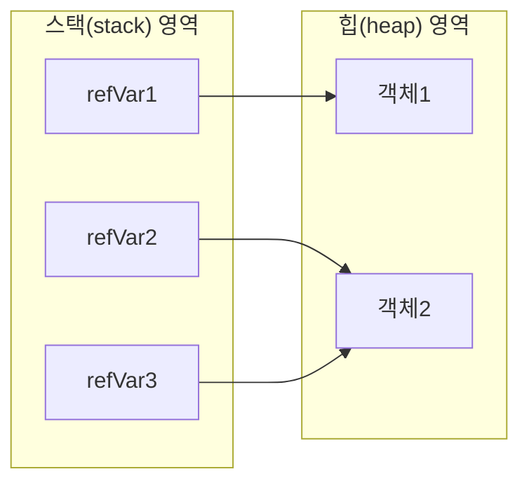
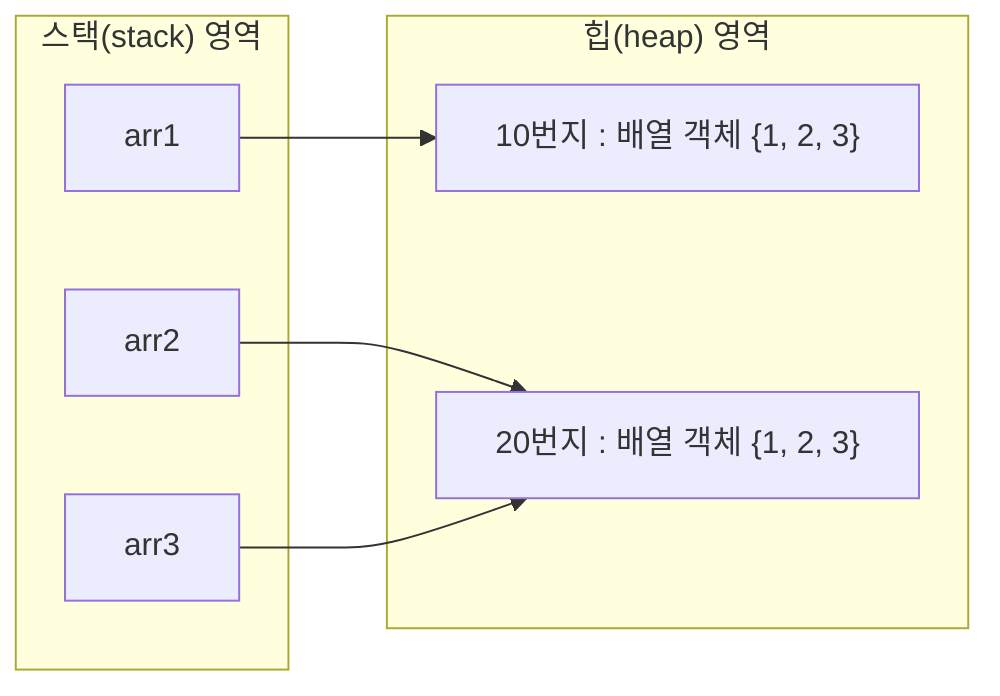

# 5.3 참조 타입 변수의 ==, != 연산

`==`, `!=` 연산자는 변수의 값이 같은지, 아닌지를 조사한다. 참조 타입 변수의 값은 객체의 번지이므로 참조 타입 변수의 `==`, `!=` 연산자는 번지를 비교하는 것이 된다. 번지가 같다면 동일한 객체를 참조하는 것이고, 다르다면 다른 객체를 참조하는 것이다. 




위 그림에서 `refVar1`과 `refVar2`는 서로 다른 객체를 참조하고 있으므로 `==` 및 `!=` 연산의 결과는 다음과 같다. 

```java
refVar1 == refVar2 //결과: false
refVar1 != refVar2 //결과: true

```


`refVar2`와 `refVar3`은 동일한 객체2를 참조하고 있으므로 `==` 및 `!=` 연산의 결과는 다음과 같다. 

```java
refVar2 == refVar3 //결과: true
refVar2 != refVar3 //결과: false

```


`==`, `!=` 연산자로 객체를 비교하는 코드는 `if` 문에서 많이 사용한다. 다음은 `refVar2`와 `refVar3` 변수가 같은 객체를 참조할 경우 `if` 블록을 실행하는 코드이다. 

```java
if(refVar2 == refVar3) { ... }

```


5.6절에서 학습하게 될 배열은 여러 개의 값을 저장하는 객체이다. 따라서 배열 변수는 참조 타입 변수가 된다. 다음 예제는 두 배열 변수를 `==`, `!=` 연산으로 같은 배열을 참조하는지 검사한다. 

**[예제: ReferenceVariableCompareExample.java]**

```java
package ch05.sec03;

public class ReferenceVariableCompareExample {
    public static void main(String[] args) {
        int[] arr1; //배열 변수 arr1 선언
        int[] arr2; //배열 변수 arr2 선언
        int[] arr3; //배열 변수 arr3 선언

        arr1 = new int[] { 1, 2, 3 }; //배열 {1, 2, 3}을 생성하고 arr1 변수에 대입
        arr2 = new int[] { 1, 2, 3 }; //배열 {1, 2, 3}을 생성하고 arr2 변수에 대입
        arr3 = arr2;                  //배열 변수 arr2의 값을 배열 변수 arr3에 대입

        System.out.println(arr1 == arr2); //arr1과 arr2 변수가 같은 배열을 참조하는지 검사
        System.out.println(arr2 == arr3); //arr2와 arr3 변수가 같은 배열을 참조하는지 검사
    }
}

```


**실행 결과**

```
false
true

```





9라인에서 생성한 배열과 10라인에서 생성한 배열은 저장 항목은 같지만 서로 다른 배열 객체로 생성되므로 `arr1`과 `arr2` 변수에 대입되는 번지는 다르다. 
따라서 13라인의 결과는 `false`, 14라인의 결과는 `true`가 출력된다. `arr3`은 11라인에서 `arr2` 변수의 번지가 대입되었기 때문에 두 변수는 동일한 번지를 가지며 같은 배열을 참조한다.
