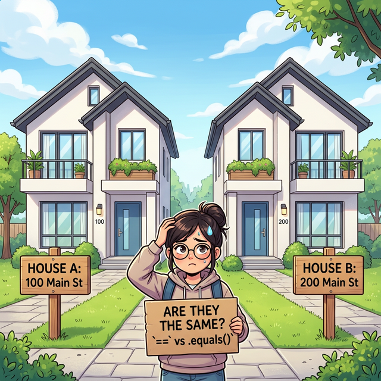
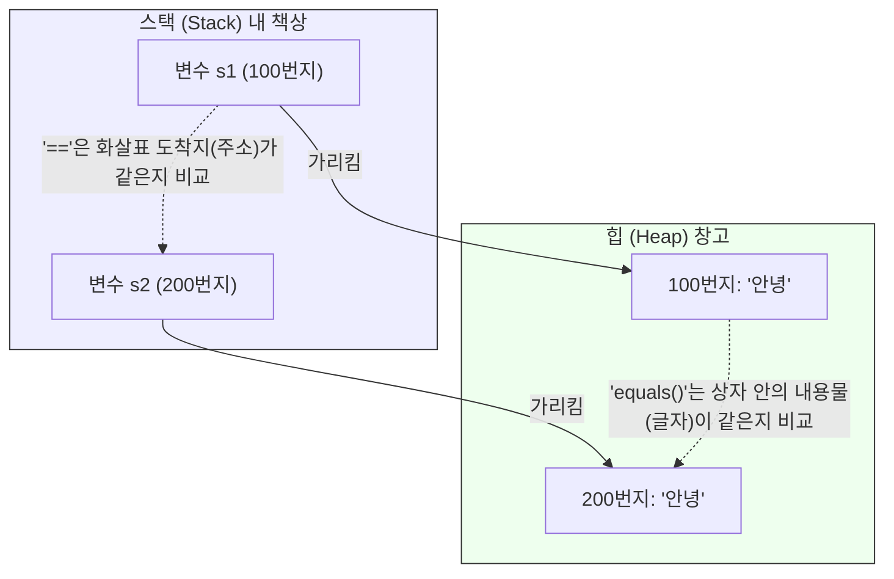

# 8.3 참조 변수의 비교

## 1. `==` 연산자의 배신 (주소 비교) 💔

우리가 지금까지 즐겨 쓰던 `==` 연산자는 `int`나 `double` 같은 기본 타입에서는 수학의 "같다"처럼 값(내용)이 똑같은지 비교해 주었습니다.
하지만 **참조 타입(String, 배열, 클래스 등)을 만나는 순간, `==` 연산자의 성격이 완전히 달라집니다.**

참조 타입에서 `==` 연산자는 상자 안의 내용물이 아니라, 오직 **"두 변수가 가리키는 메모리 주소(번지수)가 완벽히 똑같은가?"** 만 검사합니다.



위 그림처럼 완전히 똑같이 생긴 쌍둥이 집(객체)을 두 채 지었더라도, 내비게이션에 찍히는 **주소(100번지 vs 200번지)가 다르면 `==` 연산자는 매정하게 `false`**를 던집니다.

```java
String s1 = new String("안녕"); // 100번지에 새 집(객체) 건축
String s2 = new String("안녕"); // 200번지에 새 집(객체) 건축

System.out.println(s1 == s2); // ❌ false! (글자는 같지만, 집 주소가 다름)
```



---

## 2. `.equals()` 를 써야 하는 진짜 이유 🛡️

따라서 자바 아키텍트들은 내용물(실제 데이터 값)이 같은지 꼼꼼하게 비교하고 싶을 때 쓰라고 **`.equals()`** 라는 전용 메소드를 만들어 두었습니다.



```java
String s1 = new String("안녕");
String s2 = new String("안녕");

System.out.println(s1.equals(s2)); // ✅ true! (주소는 달라도 내용물이 같음)
```

> **🔥 생존 요약 노트 (이것만은 꼭!)**
> *   `==` 연산자: "너네 둘이 **주민등록번호(메모리 주소)**가 완전히 동일한 한 사람이야?" 
> *   `.equals()` 메소드: "너네 둘이 **생김새(실제 내용물)**가 똑같은 쌍둥이야?" 
>   
> 문자열(String)의 글자가 같은지 확인할 때는 **무조건 `.equals()`**를 사용하세요!
