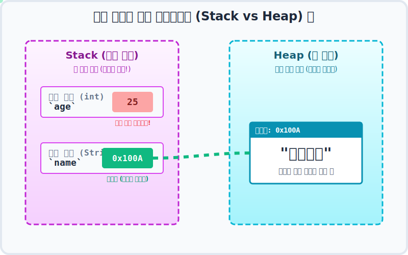

# Chapter 05. 참조 타입 (Reference Types) - 리모컨과 거대한 TV

## 1. 값(기본) 타입 vs 참조 타입 🧐

지금까지 배운 `int`, `double`, `boolean` 같은 기본 타입(Primitive Type) 변수들은 내 주머니 속의 **'작은 동전 지갑'** 과 같습니다. 숫자 `10`을 넣으면 그 지갑 안에 `10`이라는 진짜 데이터가 그대로 쏙 들어갑니다.

하지만 우리가 앞으로 다룰 **문자열(String)**, **배열(Array)**, **클래스(Class)** 같은 데이터는 그 크기가 어마어마하게 큽니다. 학생 10,000명의 이름표 데이터를 내 작은 동전 지갑 하나에 우겨넣을 수는 없겠죠?

그래서 자바는 **'참조 타입 (Reference Type)'** 이라는 아주 똑똑한 보관 방식을 사용합니다!

---

## 2. 스택(Stack)과 힙(Heap): 코앞의 좁은 책상 vs 거대한 물류 창고 📺

이 참조 타입을 이해하려면 컴퓨터 메모리의 두 가지 핵심 구역(Stack, Heap)을 알아야 합니다.
아주 쉬운 비유를 위해 **내 앞의 작은 사무실 책상(Stack)** 과 **저 멀리 있는 초대형 물류 창고(Heap)** 를 상상해 봅시다.


*   **스택 (Stack) 영역**: 내 코앞에 있는 작은 책상입니다. 서랍이 좁아서 진짜 데이터(`10`, `3.14` 같은 기본 타입)나 작고 가벼운 **리모컨(참조 주소값)** 만 올려둘 수 있습니다. 대신 나랑 제일 가까워서 손을 뻗으면 0.001초 만에 바로 꺼낼 수 있어 속도가 엄청 빠릅니다!
*   **힙 (Heap) 영역**: 산골짜기에 있는 초대형 물류 창고입니다. 공간이 무한대에 가까워서 엄청나게 거대한 스마트 TV나 수만 개의 상자(객체 데이터, 배열)를 마음껏 던져둘 수 있습니다. 

### 💡 그럼 무거운 TV를 어떻게 보나요? (참조의 원리)

우리는 무거운 85인치 TV(객체 데이터)를 끙끙대며 내 좁은 책상(스택) 위로 가져오지 않습니다. TV 본체는 그저 넓은 창고(힙)에 놔둔 채, 내 책상에는 **그 TV와 주파수가 연결된 작은 만능 리모컨(참조 변수)** 만 가볍게 올려둡니다.

여러분이 자바에서 `내티비.전원켜기()` 라고 코드를 치면, 스택에 있는 리모컨이 레이저 빔을 쏴서 힙 창고의 100A 번지 구역에 있는 진짜 거대 TV를 원격으로 조종하는 것입니다! 



위 애니메이션처럼 참조 타입 변수(`name`)의 지갑을 열어보면 안에는 진짜 "지니개발" 이라는 글자 데이터가 들어있는 것이 아닙니다. 대신 그 글자 덩어리가 숨어있는 **창고의 비밀 지도 좌표(메모리 번지수, 예: 0x100A)** 가 적힌 쪽지가 들어있을 뿐입니다.

> **💡 핵심 요약! 자다가도 벌떡 일어나 외워야 할 문장:**
> 1. 기본 타입 변수는 메모리(스택)에 **"진짜 데이터 값"** 을 저장한다.
> 2. 참조 타입 변수는 메모리(스택)에 진짜 데이터가 있는 힙 창고의 **"위치(주소, 번지수)"** 를 저장한다!

---

## 3. 참조 타입의 무서운 점: 널 포인터 에러 (NullPointerException) 💣

위의 리모컨 비유를 완벽히 이해하셨다면, 초중급 자바 개발자들이 자다가도 식은땀을 흘리며 벌떡 깬다는 그 유명한 지옥의 에러, **`NullPointerException`** 도 단 1초 만에 이해할 수 있습니다.

`null` 이란 "리모컨은 손에 쥐고 있는데, 아직 이 리모컨이랑 주파수를 맞춘 TV(본체)가 창고에 하나도 없음!" 이라는 뜻입니다. (주소가 비어있음)

그런데 연결된 TV 본체도 없는 '빈 껍데기 리모컨'을 들고 허공에 대고 `전원켜기()` 버튼을 꾹꾹 누르면 어떻게 될까요? 
컴퓨터는 허공에 쏜 레이저를 보고 당황하며 "어? 창고에 TV가 없는데 누굴 조종하라는 거야?!" 라며 그 자리에서 펑! 하고 프로그램을 강제로 터뜨려버립니다.

### 🎯 실습 1. 가장 흔한 에러, NullPointerException 의도적으로 유발하기

가장 좋은 공부는 에러를 겪어보는 것입니다. AI 가이드의 도움을 받아 일부러 자바 프로그램을 폭파시켜 봅시다!

> **🗣️ 학생 프롬프트 (AI에게 이렇게 명령해 보세요):**
> "자바 언어로 NullPointerException이 터지는 코드를 의도적으로 하나 보여줘.
> String 타입의 변수 str을 만들고 처음에 null 이라고 초기화해 줘. (= TV 없는 빈 리모컨)
> 그 다음 줄에서 str.length() 명령어를 써서 글자 수를 세라고 시켜 줘. (= 허공에 대고 버튼 누르기)
> 그리고 실행하면 어떤 에러 메시지가 콘솔에 뜨는지 주석으로 설명해 줘."

**[AI가 생성할 자바 코드 예측]**
```java
public class NullErrorDemo {
    public static void main(String[] args) {
        
        // 1. String 타입 리모컨을 만들긴 했지만, 아직 아무 글자 TV와 연결하지 않았습니다!
        String str = null; 
        
        System.out.println("프로그램을 시작합니다.");
        
        // 2. 💣 펑! (연결된 객체가 없는데 리모컨의 length() 버튼을 눌렀습니다!)
        int length = str.length(); 
        
        // 3. 위에서 에러가 터지면서 프로그램이 강제 종료되므로, 이 줄은 영원히 출력되지 않습니다.
        System.out.println("글자 수는 " + length + "개 입니다."); 
    }
}
```

**[실행 결과 (에러 발생)]**
```text
프로그램을 시작합니다.
Exception in thread "main" java.lang.NullPointerException
    at NullErrorDemo.main(NullErrorDemo.java:10)
```
이 에러가 뜨면 당황하지 마시고, **"아뿔싸! 내가 리모컨만 쥐고 창고에 진짜 객체 덩어리를 만들어주지(new) 않았구나!"** 라고 깨달으시면 여러분은 이미 중급 개발자의 시야를 갖춘 것입니다!

---

## 4. 이번 챕터에서 배울 내용

이제 본격적으로 자바의 가장 거대한 세계, '참조 타입'의 숲으로 들어가 보겠습니다.

*   [5.1 데이터 타입 분류](./01/)
*   [5.2 메모리 사용 영역](./02/)
*   [5.3 참조 타입 변수의 ==, != 연산](./03/)
*   [5.4 null과 NullPointerException](./04/)
*   [5.5 문자열(String) 타입](./05/)
*   [5.6 배열(Array) 타입](./06/)
*   [5.7 다차원 배열](./07/)
*   [5.8 객체를 참조하는 배열](./08/)
*   [5.9 배열 복사](./09/)
*   [5.10 향상된 for 문](./10/)
*   [5.11 main() 메소드의 String[] 매개변수](./11/)
*   [5.12 열거(Enum) 타입](./12/)
*   [확인문제](./quiz)
