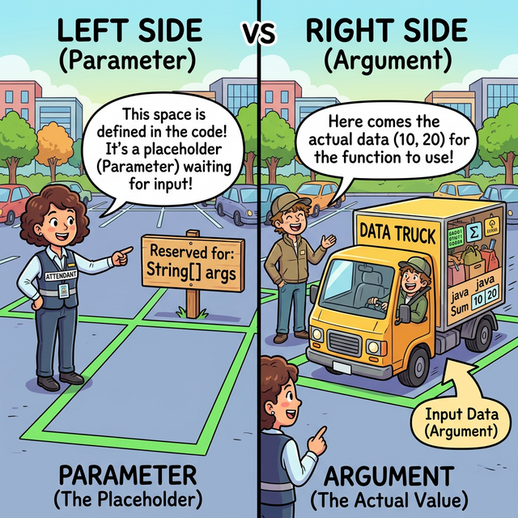

# 8.11 main() 메소드의 String[] 매개변수 용도

## 1. 프로그램의 첫 번째 입구 🚪

우리가 처음 자바를 배울 때부터 묻지도 따지지도 않고 항상 적어왔던 신비의 코드가 있습니다.
```java
public static void main(String[] args) { ... }
```
여기서 괄호 안의 **`String[] args`** 는 도대체 왜 붙어있는 걸까요? 이름부터 생소한 이 매개변수는 사실 **"프로그램이 시작될 때 터미널 우체통으로 배달되는 외부 메시지 묶음(배열) 상자"**를 뜻합니다!


위 그림처럼 윈도우의 '명령 프롬프트(cmd)'나 맥OS의 '터미널'에서 자바 프로그램을 마법 포털에 밀어넣고 실행할 때, 우리는 프로그램 뒤에 공백으로 구분해서 여러 가지 문자나 숫자를 같이 우겨넣을 수 있습니다.

### 1.1 가장 헷갈리는 기초 용어: 매개변수 vs 인자(인수) 🥊

여기서 초보자들이 자바를 배우며 99% 헷갈려 하는 용어가 있습니다. 바로 **매개변수(Parameter)**와 **인자/인수(Argument)**의 차이입니다.

- **매개변수 (Parameter)**: `main(String[] args)` 처럼 괄호 안에 적혀 있는 빈 껍데기 변수입니다. 아직 데이터가 들어오지 않은 상태의 **"데이터 수신용 우편함"** 혹은 **"빈 주차 공간"**을 의미합니다.
- **인자/인수 (Argument)**: `java Sum 10 20` 을 칠 때 던진 `10`, `20` 처럼 우편함에 실제로 쑤셔 넣는 **"진짜 택배 화물"** 혹은 빈 주차 공간에 척 하고 주차되는 **"실제 자동차 데이터"**를 의미합니다.




방금 `main` 옆에 달린 `String[] args` 에서 `args`가 arguments의 약자라고 했죠? 
"네가 터미널에서 진짜 데이터(인자)들을 던지면, 내가 만든 이 빈 우편함(매개변수)으로 쏙 받아주겠다!" 라는 깊은 뜻이 담겨 있었던 것입니다!

```bash
# Sum 프로그램을 실행하면서 10과 20이라는 두 개의 문자열을 툭 던져 밀어넣음!
java Sum 10 20
```

---

## 2. 힙(Heap) 영역에서 벌어지는 일 🧠

명령어에서 입력한 `10` 과 `20` 은 자바 가상 머신(JVM)에 의해 **자동으로 문자열 배열(`String[]`) 객체**로 만들어져 힙(Heap) 포장 센터에 저장됩니다. (숫자 10이 아니라 문자열 "10" 이라는 점을 명심하세요!) 

그리고 이 배열 묶음의 **리모컨 주소**가 `main` 문이 시작되자마자 제일 처음으로 `args` 라는 이름을 가진 변수 주머니에 쏙 담기게 됩니다. (`args`는 arguments, 즉 '매개로 전달되는 인수'의 약자입니다)



1. `args.length` 를 찍어보면 사용자가 던져넣은 단어의 개수를 알 수 있습니다. 이 예시에서는 2개입니다.
2. `args[0]` 을 열어보면 자바 환경이 포장해둔 `"10"` 문자열이 튀어나옵니다.

만약 아무것도 안 던지고 그냥 `java Sum` 이렇게만 실행시켰다면? 
배열의 크기(length)가 `0`인 텅텅 빈 배열의 리모컨이 담기게 됩니다.

---

## 3. String(문자)를 int(숫자)로 강제 변환하기 🔄

터미널에서 친 10, 20 은 겉보기엔 숫자여도 컴퓨터 눈에는 "일, 영", "이, 영" 처럼 글자(String)일 뿐입니다.
글자 2개를 덧셈 연산해봤자 "10" + "20" = `"1020"` 이라는 이상한 글자가 탄생하게 됩니다. 

진짜 수학적인 덧셈을 하려면 `Integer.parseInt()` 라는 아주 강력한 내장 도구를 사용하여 이 문자열들을 억지로 숫자(정수형 타입)로 파괴 및 재조립해야 합니다.

```java
// "10" 이라는 글자 옷을 벗기고 진짜 숫자 10으로 변신시킵니다!
int x = Integer.parseInt(args[0]);
int y = Integer.parseInt(args[1]);
```

> **📌 주의!** 사용자가 `java Sum 안녕 20` 이렇게 문자를 던져버리면, `"안녕"`을 숫자로 변신시키지 못해 **`NumberFormatException`** 이라는 긴급 에러가 발생하며 프로그램이 폭파됩니다.

---

## 4. 🎧 Vibe 코딩 : 터미널 인사봇 & 덧셈 계산기 만들기

매개변수를 활용하여 터미널에서 실행될 때마다 다른 메시지를 만들어내는 코드입니다. 사용자가 매개변수를 올바르게 안 던지고 누락시켰을 때의 예외 처리(방어막)까지 추가되어 있습니다.

> **🗣️ 학생 프롬프트 (AI에게 이렇게 명령해 보세요):**
> "자바 main 메소드의 `String[] args` 매개변수가 무엇인지 확인할 수 있도록, 터미널에서 입력받은 두 개의 문자열을 덧셈 연산하는 가벼운 예제를 작성해 줘. 값을 제대로 입력하지 않았을 때 에러가 나지 않도록 코드로 방어하는 방법도 주석으로 보여줘."

```java
public class VibeMainArgs {
    public static void main(String[] args) {
        
        System.out.println("🤖 터미널 로봇 대기 반입 필터 가동 중...");
        
        // 1. 매개변수가 딱 2개 들어왔는지 "방어(검문)" 철저히 하기!
        if (args.length != 2) {
            System.out.println("❌ 잘못된 실행입니다!");
            System.out.println("💡 사용법: java VibeMainArgs [이름] [나이]");
            
            // System.exit(0) 은 더 이상 코드를 실행하지 않고 프로그램을 강제로 즉시 종료시킵니다.
            System.exit(0); 
        }
        
        // 2. 만약 무사히 2개가 들어왔다면 검문 통과!
        String name = args[0]; // 첫 번째 상자는 이름 (String)
        String strAge = args[1]; // 두 번째 상자는 나이 (String 상태)
        
        System.out.println("\n✅ 검문 완료! 환영합니다, " + name + "님.");
        
        // 3. String으로 들어온 나이를 수학 연산을 위해 int로 강력하게 변신!
        int age = Integer.parseInt(strAge);
        int nextYearAge = age + 1; // 덧셈 테스트!
        
        System.out.println("🎉 내년에는 " + nextYearAge + "살이 되시는군요!");
    }
}
```

### 터미널(Terminal)에서 직접 실행해 보기

VS Code나 명령 프롬프트(cmd) 터미널을 열고 위 자바 프로그램을 컴파일한 뒤 아래 두 가지 방식으로 실행해 보세요!

**실행 1 (실패하는 경우 - 매개변수를 누락함)**
```bash
$ java VibeMainArgs
🤖 터미널 로봇 대기 반입 필터 가동 중...
❌ 잘못된 실행입니다!
💡 사용법: java VibeMainArgs [이름] [나이]
```

**실행 2 (성공하는 경우 - 매개변수 2개 전달)**
```bash
$ java VibeMainArgs Jiny 20
🤖 터미널 로봇 대기 반입 필터 가동 중...

✅ 검문 완료! 환영합니다, Jiny님.
🎉 내년에는 21살이 되시는군요!
```
