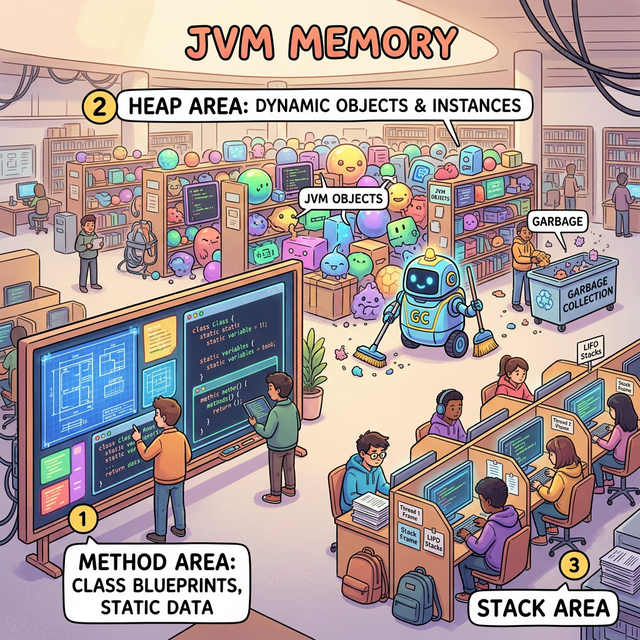
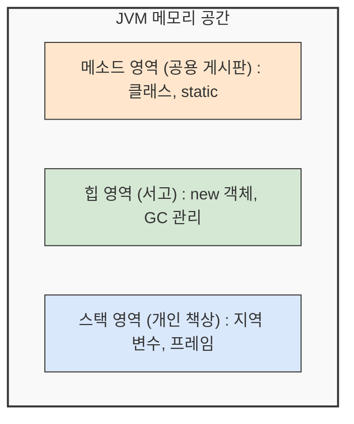

# 8.2 메모리 사용 영역

우리가 자바 프로그램을 마우스로 더블 클릭해서 실행하면, JVM(자바 가상 머신)이 운영체제로부터 커다란 메모리 공간을 빌려옵니다. 효율적인 관리를 위해 이 공간을 마치 세 구역으로 분리된 도서관처럼 나누어서 사용합니다.



## 1. 메소드 영역 (Method Area) 📜 : 공용 정보 게시판 
*   **비유**: **도서관 로비의 공용 게시판**
*   가장 먼저 데이터가 세팅되는 곳입니다. 
*   우리가 만든 수많은 클래스들의 **설계도 정보, 정적(static) 변수, 상수** 등이 저장됩니다. 프로그램이 시작될 때부터 끝날 때까지 모두가 공유하며 볼 수 있는 전역 공간입니다.

## 2. 힙 영역 (Heap Area) 📚 : 거대 물류 창고
*   **비유**: **대형 서고 (물류 창고)**
*   우리가 `new` 키워드를 사용해 생성하는 **객체(Object)와 배열(Array)** 같은 무거운 데이터들이 만들어지는 곳입니다.
*   **참조 변수(주소)**를 가지고 있어야만 이 창고에 있는 물건을 찾을 수 있습니다.
*   아무도 주소를 기억하지 않는 물건(고아 객체)이 생기면, 자바 전담 청소부인 **가비지 컬렉터(Garbage Collector, GC)**가 와서 주기적으로 빈 공간으로 치워줍니다. (개발자가 일일이 메모리를 치워줄 필요가 없는 가장 큰 이유입니다!)

## 3. 스택 영역 (Stack Area) 🖥️ : 개인용 임시 책상
*   **비유**: **개인용 열람실 책상**
*   가장 활발하게 생겼다가 사라지는 바쁜 구역입니다.
*   **메소드를 실행(`{ }` 블록 시작)**할 때마다 새로운 책상(프레임)이 맨 위에 하나씩 얹혀집니다(LIFO 구조).
*   그 책상 위에서 **기본 타입 변수(현금)**를 올려두고 사용하거나, 힙 창고의 **참조 주소(메모지)**를 적어두고 사용합니다.
*   메소드가 끝나면(`}` 블록 종료), 그 책상은 책상 위에 올려진 모든 변수 쪽지들과 함께 영원히 허공 속으로 파기(자동 제거)됩니다.

---

### 메모리 영역 시각화 (도서관 비유)



---

## 4. 힙(Heap)이란 무엇인가?

힙(Heap)은 자바에서 **가장 넓은 메모리 공간**으로, 비유하자면 **거대한 물류 창고나 도서관의 대형 서고**와 같습니다.

우리가 프로그램에서 `new` 키워드를 사용하여 무언가(객체나 배열)를 새로 만들면, 무조건 이 힙 영역에 공간을 할당받아 데이터가 저장됩니다. 

*   **무작위 저장:** 책상(스택)처럼 순차적으로 쌓이는 것이 아니라, 빈 공간이 있는 곳 아무 데나 데이터를 생성합니다.
*   **주소 발급:** 힙 영역에 데이터가 생성되면 JVM은 그 데이터가 위치한 **메모리 번지(주소)**를 발급해 줍니다.
*   **쓰레기 수집가(GC):** 이 거대한 창고는 주기적으로 전담 청소부인 **Garbage Collector(가비지 컬렉터)**가 순찰합니다. 아무도 주소를 기억하지 않아(참조하지 않아) 쓸모가 없어진 데이터는 자동으로 폐기하여 공간을 되찾아줍니다.

<!-- 힙 영역 비유 이미지는 이전에 다른 페이지용으로 준비된 것을 사용하거나 텍스트로 대체 -->

## 5. 스택(Stack)이란 무엇인가?

스택(Stack)은 메소드를 실행할 때 지역 변수들을 임시로 올려두는 **작은 개인 책상**이나, 짐을 쌓아두는 **바구니**와 같습니다. 

컴퓨터 과학에서 스택은 **LIFO (Last In, First Out)**, 즉 **나중에 들어온 것이 먼저 나가는 구조**를 뜻합니다. 택배 상자를 바닥부터 위로 차곡차곡 쌓은 뒤, 꺼낼 때는 맨 위에 올린 제일 마지막 상자부터 꺼내야만 하는 것과 똑같은 원리입니다.

*   **메소드 호출:** 메소드가 실행될 때마다 변수를 담을 새로운 공간(프레임)이 책상 위에 추가됩니다.
*   **변수 보관:** 우리가 선언하는 `int age = 20;` 같은 기본 타입 변수들과 힙 영역의 주소만 적혀있는 참조 타입 변수(쪽지)가 모두 여기에 쌓입니다.
*   **자동 소멸:** 메소드나 `if`, `for` 문 등의 `{ }` (중괄호 블록) 실행이 끝나면, 그 안에서 임시로 쌓였던 변수 상자들은 맨 위에서부터 순서대로 한 번에 싹 치워집니다(메모리 해제).

---

## 6. 스택과 힙의 상호작용 🧠

스택 책상이 쌓이고 닫히는 원리, 그리고 그 안에서 리모컨(참조 변수)이 힙 창고를 쏘아보는 과정을 한눈에 보겠습니다.



---

## 7. 🎧 Vibe 코딩 : 메모리가 터지는 StackOverflow 체험

스택(책상) 영역은 물리적으로 크기가 한정되어 있습니다. 책상을 밑에서부터 무한정 쌓아 올리면 천장에 닿아 무너져 내리겠죠? 이것이 그 유명한 **`StackOverflowError`** 입니다. (유명한 웹사이트 StackOverflow의 유래이기도 합니다.)

> **🗣️ 학생 프롬프트 (AI에게 이렇게 명령해 보세요):**
> "자바에서 무한 재귀 호출로 인해 StackOverflowError가 발생하는 간단한 코드를 작성해 줘. 그리고 이 에러가 왜 스택 영역과 관련이 있는지 초보자도 이해하기 쉽게 비유를 들어서 주석으로 설명해 줘."

```java
public class VibeMemoryBreak {
    
    // 이 메소드는 자기 자신을 끝없이 호출하는 짓궂은 메소드입니다 (무한 재귀)
    public static void endlessCall(int limit) {
        System.out.println("스택 책상 쌓기 시도: " + limit + "층");
        // 책상을 닫지 못하고 또 다른 자기 자신 책상을 그 위에 부름
        endlessCall(limit + 1); 
    }

    public static void main(String[] args) {
        System.out.println("🚨 삐뽀삐뽀: 스택 메모리 폭파 실험 시작");
        
        try {
            // JVM이 허용하는 한계치까지 스택 책상을 쌓아보자!
            endlessCall(1);
        } catch (StackOverflowError e) {
            System.out.println("🔥🔥🔥🔥🔥🔥🔥🔥🔥🔥🔥🔥🔥🔥🔥🔥🔥🔥🔥🔥🔥🔥");
            System.out.println("앗! 더 이상 스택 책상을 쌓을 천장이 부족합니다!");
            System.out.println("이것이 진짜 StackOverflow Error 입니다: " + e.toString());
        }
    }
}
```

이 코드를 복사해서 실행시키면 콘솔 창에 1만 층 언저리까지 책상이 쌓이다가 프로그램이 강제로 `🔥 폭파(StackOverflow)`되는 것을 볼 수 있습니다. **메소드가 끝나기 전(블록이 닫히기 전)에는 스택 메모리가 비워지지 않는다**는 사실을 꼭 명심하세요.
