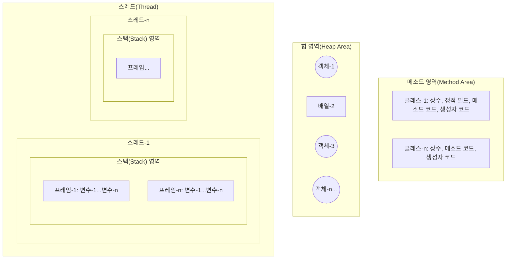

# 5.2 메모리 사용 영역

자바에서 사용하는 메모리 영역에 대해 간단히 알아보자. `java` 명령어로 JVM이 구동되면 JVM은 운영체제에서 할당받은 메모리 영역(Runtime Data Area)을 다음과 같이 구분해서 사용한다. 

**[메모리 영역(Runtime Data Area) 구조]**

**메소드 영역**
메소드(Method) 영역은 바이트코드 파일을 읽은 내용이 저장되는 영역으로 클래스별로 상수, 정적 필드, 메소드 코드, 생성자 코드 등이 저장된다. 
아직 이 용어들을 몰라도 상관없다. 단순히 바이트코드 파일의 내용이 저장되는 영역이라고만 알고 있자. 

**힙 영역**
힙(Heap) 영역은 객체가 생성되는 영역이다. 객체의 번지는 메소드 영역과 스택 영역의 상수와 변수에서 참조할 수 있다. 

**스택 영역**
스택(Stack) 영역은 메소드를 호출할 때마다 생성되는 프레임(Frame)이 저장되는 영역이다. 메소드 호출이 끝나면 프레임은 자동 제거된다. 
프레임 내부에는 로컬 변수 스택이 있다. 여기에서 기본 타입 변수와 참조 타입 변수가 생성되고 제거된다. 

---
