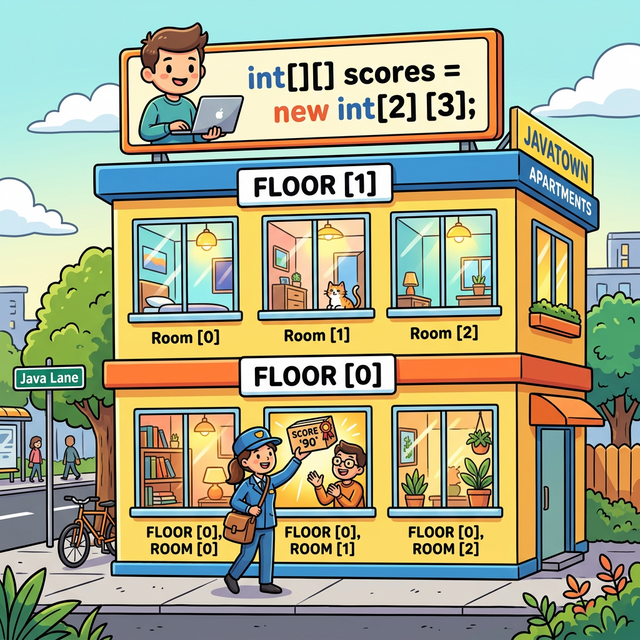
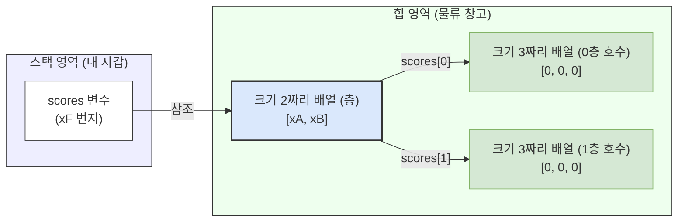
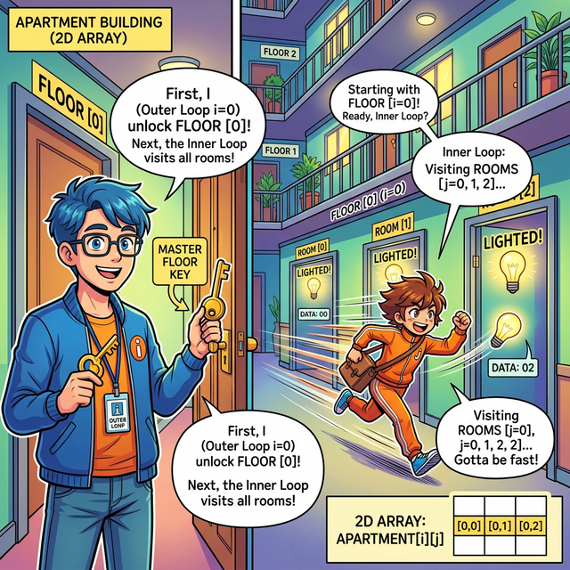

# 8.7 다차원 배열 (Multidimensional Array)

## 1. 행과 열로 된 아파트 짓기 🏢

우리가 앞서 배운 1차원 배열이 단층짜리 **기차(한 줄)**였다면, 2차원 이상의 다차원 배열은 여러 층으로 이루어진 **아파트(행렬)**와 같습니다. 

행(층수)과 열(호수)을 가지는 2차원 배열은 수학의 행렬, 혹은 엑셀(Excel)의 표와 똑같은 형태입니다.



위 아파트 그림처럼, 아파트 주소록(배열)에서 값을 꺼내려면 **`[층수][호수]`** 순서로 길을 찾아가야 합니다.
자바 코드에서는 다음과 같이 선언합니다.

```java
// 2층짜리 아파트, 각 층에 방이 3개씩 있는 형태로 생성
int[][] scores = new int[2][3];

// 0층 1호 방에 90점을 저장! (인덱스는 무조건 0부터 시작)
scores[0][1] = 90;
```

---

## 2. 자바 배열의 충격적인 진실: "배열의 배열" 🤯

자바(Java)는 C언어나 C++ 같은 언어들과 다르게, 진짜 의미의 '2차원 블록'을 한 번에 메모리에 파내지 않습니다. 
대신 훨씬 유연한 방식인 **'배열에 또 다른 배열들의 리모컨 주소를 담는 방식(Array of Arrays)'**을 사용합니다.

아래 애니메이션을 보면 진짜 작동 방식을 이해할 수 있습니다.



1. `new int[2][3]` 을 실행하면 먼저 힙(Heap) 영역에 크기가 2인 1차원 배열(층수 관리소)이 만들어집니다.
2. 하지만 이 배열의 각 방에는 아직 최종 정수값이 없습니다! 이곳에는 **'진짜 방 3개짜리 1차원 배열(호수)'을 가리키는 리모컨(주소)**이 들어갑니다.
3. 결국 `[0][1]` 명령은 "0번 층 리모컨을 타고 넘어가서, 거기서 다시 1번 호수를 열어라!" 라는 두 단계를 거치는 탐색입니다.



> **💡 중요:** 따라서 `scores.length` 는 전체 칸의 개수인 6이 아닙니다! **층수 배열의 길이인 2**가 나옵니다.
> 만약 0층의 방문 개수를 알고 싶다면 `scores[0].length` 라고 적어야 3이 나옵니다.

---

## 3. 2차원 배열 순회하기 (중첩 for문) 🔄

2차원 배열 아파트에 있는 모든 빈 방을 청소하거나 모든 승객의 표를 검사하려면 어떻게 해야 할까요? 1차원 배열이 단일 `for` 문 1개로 해결되었다면, 2차원 배열은 필연적으로 **중첩 for문 (for문 안의 for문)** 을 필요로 합니다.

바깥쪽 `for` 문은 **층수(행)**를 하나씩 내려가며 순회하고, 안쪽 `for` 문은 해당 층에 도착했을 때 **포함된 호수(열)**들을 쭉 훑고 지나가는 역할을 합니다.




### 🎧 Vibe 코딩 : 아파트 전 객실 순회하며 불 켜기

> **🗣️ 학생 프롬프트 (AI에게 이렇게 명령해 보세요):**
> "자바에서 2행 3열짜리 2차원 정수 배열을 만들고, 중첩 for문을 사용해서 1부터 6까지의 숫자를 순서대로 채워 넣는 코드를 작성해 줘. 그리고 다시 한 번 중첩 for문을 사용해서 채워진 숫자들을 콘솔에 표(엑셀 형태)처럼 깔끔하게 출력해 줘."

```java
public class VibeMultiArrayLoop {
    public static void main(String[] args) {
        
        System.out.println("🏢 2층짜리 아파트(2행 3열) 건축 및 전력 공급 시작!");
        
        int[][] apartments = new int[2][3];
        int powerLevel = 1;
        
        // 1. 데이터 채워넣기 (바깥 for문: 층수 이동 / 안쪽 for문: 각 층의 호수 이동)
        for (int row = 0; row < apartments.length; row++) { // apartments.length 는 2 (층수)
            for (int col = 0; col < apartments[row].length; col++) { // 방 개수(3) 만큼 반복
                apartments[row][col] = powerLevel; // 1, 2, 3, 4, 5, 6 순서대로 들어감
                powerLevel++;
            }
        }
        
        System.out.println("\n💡 아파트 전체 전력 공급 현황 출력:");
        
        // 2. 데이터 예쁘게 출력하기 (엑셀 표 형식)
        for (int row = 0; row < apartments.length; row++) {
            System.out.print("[" + row + "층] ");
            
            for (int col = 0; col < apartments[row].length; col++) {
                System.out.print(apartments[row][col] + "V\t"); // \t 를 쳐서 칸을 예쁘게 띄움
            }
            System.out.println(); // 한 층 순회가 끝나면 다음 줄(다음 층)로 줄바꿈!
        }
    }
}
```

---

## 4. 🎧 Vibe 코딩 : 층마다 방의 개수가 다른 삐뚤빼뚤 아파트 (계단식 배열)

자바가 굳이 이렇게 복잡하게 "배열의 배열" 방식을 채택한 거대한 장점이 하나 있습니다! 바로 **계단식 배열(Jagged Array)**을 아주 쉽게 만들 수 있다는 점입니다. 1층은 방이 2개인데, 2층은 방이 5개인 이상한 피라미드 아파트도 지을 수 있는 것이죠. 이렇게 하면 필요 없는 방수(메모리)를 획기적으로 절약할 수 있습니다.

> **🗣️ 학생 프롬프트 (AI에게 이렇게 명령해 보세요):**
> "자바에서 2차원 배열을 만들 때, 1행의 열 개수와 2행의 열 개수가 서로 다른 '계단식 배열(Jagged Array)'을 만드는 코드를 보여줘. 그리고 이 구조가 왜 '배열의 배열'로 불리는지 주석으로 쉽게 설명해 줘."

```java
public class VibeMultiArrayJagged {
    public static void main(String[] args) {
        
        System.out.println("🏗️ 특수 계단식 아파트 건축 시작!");
        
        // 1. 일단 층(행)수만 2개로 결정하고, 호수(열)는 과감히 비워둔다! 탑승금지!
        int[][] jaggedScores = new int[2][];
        
        // 2. 이제 각 층마다 다르게 방을 배정한다!
        jaggedScores[0] = new int[2]; // 0층에는 2칸짜리 방을 만듦
        jaggedScores[1] = new int[5]; // 1층에는 5칸짜리 길다란 방을 만듦
        
        System.out.println("0층의 방문 개수는? " + jaggedScores[0].length + "개"); // 2출력
        System.out.println("1층의 방문 개수는? " + jaggedScores[1].length + "개"); // 5출력
        
        System.out.println("\n🔥 1층(1번 인덱스) 방 끝자락에 값 넣기!");
        jaggedScores[1][4] = 100; // 1층의 5번째 방에 입주 완료! 정상 실행!
        System.out.println("jaggedScores[1][4] = " + jaggedScores[1][4]);
        
        // 아래 코드는 막혀있는 벽을 뚫으려 하기 때문에 💣 ArrayIndexOutOfBoundsException 발생!
        // System.out.println(jaggedScores[0][4]); // 0층에는 4번방이 없다!
    }
}
```

**[실행 결과 해석]**
`new int[2][]` 처럼 뒷부분을 비워두는 것은 자바만이 가진 고유한 유연함입니다. 처음에는 뼈대만 잡아두고, 나중에 각 뼈대 끝에 원하는 크기의 밧줄(배열)을 마음대로 묶어서 달아버릴 수 있습니다. 메모리도 절약하지만, 데이터 모양 자체를 자유자재로 구성할 수 있는 강력한 기능입니다!
