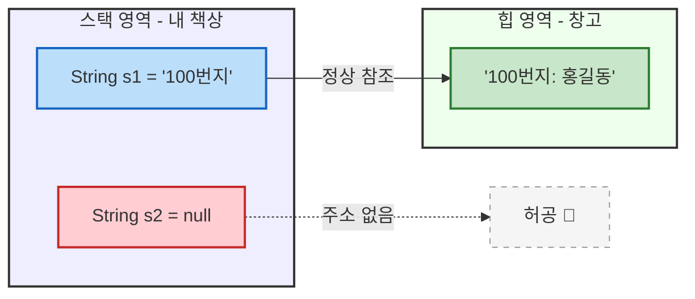

# 8.4 null과 NullPointerException

## 1. `null` (텅 빈 리모컨) 🈳

자바의 참조 변수는 '메모리 힙 영역의 주소'를 저장하는 일종의 리모컨입니다. 
하지만 만약 이 리모컨을 처음 샀는데, **아직 연결할 TV(객체)가 없다면** 어떻게 될까요? 

이럴 때 리모컨 안에는 **`null`**(널) 이라는 특수한 값을 넣어둡니다.

*   "이 리모컨은 아직 아무 TV와도 주파수가 맞지 않아."
*   "명함 지갑을 열었지만, 들어있는 명함이 0장이야."




## 2. `NullPointerException` (가장 무서운 에러 😱)

`null` 인 상태, 즉 **TV와 연결되지 않은 빈 리모컨**을 들고 허공에 대고 `전원켜기()` 버튼을 꾹 누르면 어떻게 될까요? 
바로 그때 터지는 에러가 그 유명한 **`NullPointerException` (NPE)** 입니다.

**"주소가 비어있는데, 대체 어느 창고에 가서 가져오라는 거야!"** 라며 자바(JVM)가 화를 내며 프로그램을 강제로 종료시켜 버립니다. 도트 연산자(`.`)를 허공에 찍을 때 발생합니다.



```java
public class NullExample {
    public static void main(String[] args) {
        // 1. 텅 빈 리모컨 만들기
        String str = null;
        
        // 2. 💣 버튼 누르기! (NPE 에러 발생)
        // 콘솔: Exception in thread "main" java.lang.NullPointerException
        System.out.println(str.length()); 
    }
}
```

> **🔥 생존 팁 (해결책)**
> 언제나 참조 변수 뒤에 마침표(`.`)를 찍어 객체를 사용하기 전에는, 그 리모컨 안에 진짜 주소가 들어있는지 (`!= null`) 확인하는 습관을 들여야 합니다!

---

## 코딩 영단어 학습 📝

코딩에서 영어 단어의 의미만 정확히 이해해도 절반은 성공입니다! 오늘 배운 핵심 영단어들을 다시 한번 짚고 넘어가 볼까요?

*   **`Null`**: 널. (비어있음. 참조용 리모컨 변수가 창고의 어떤 객체 주소도 가리키지 않고 텅 빈 기본 상태)
*   **`Pointer`**: 포인터. (메모리의 특정 위치(주소)를 가리키는 손가락 같은 변수 기능)
*   **`Exception`**: 익셉션, 예외. (프로그램 실행 중 예기치 않게 발생하는 비정상적인 종료 에러 상황)
*   **`NullPointerException`**: 널 포인터 익셉션. (연결된 객체가 없는 빈 리모컨(null) 버튼(`.`)을 억지로 꾹 누르려고 할 때 JVM이 화내며 뿜는 가장 흔하고 치명적인 자바 에러)
