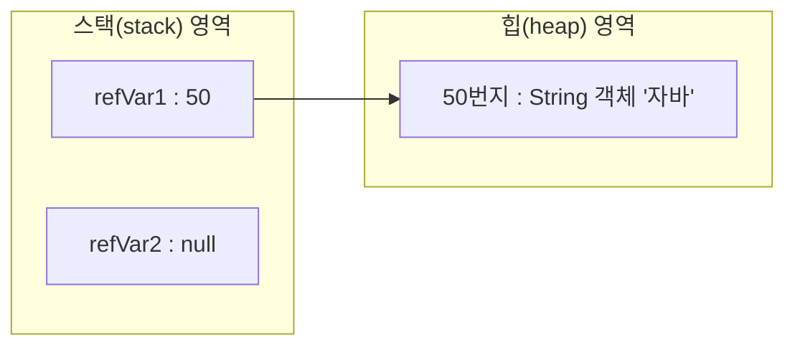
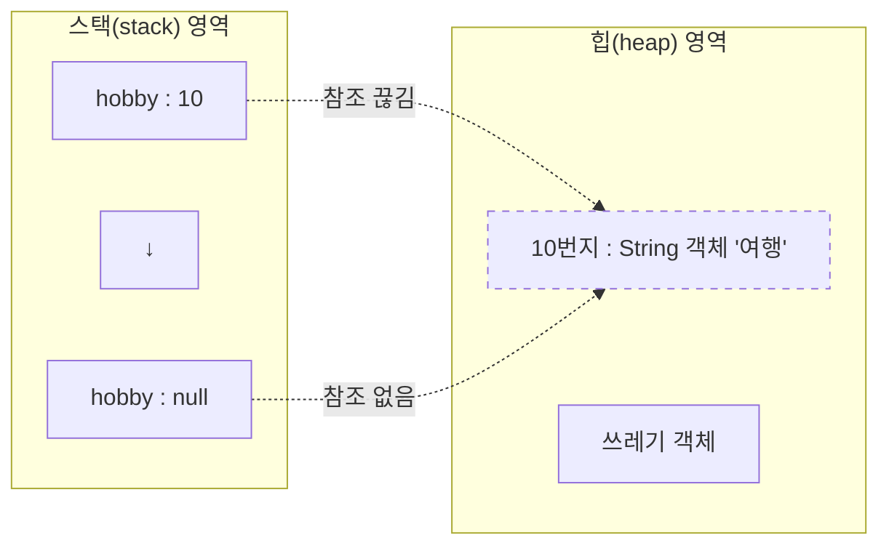
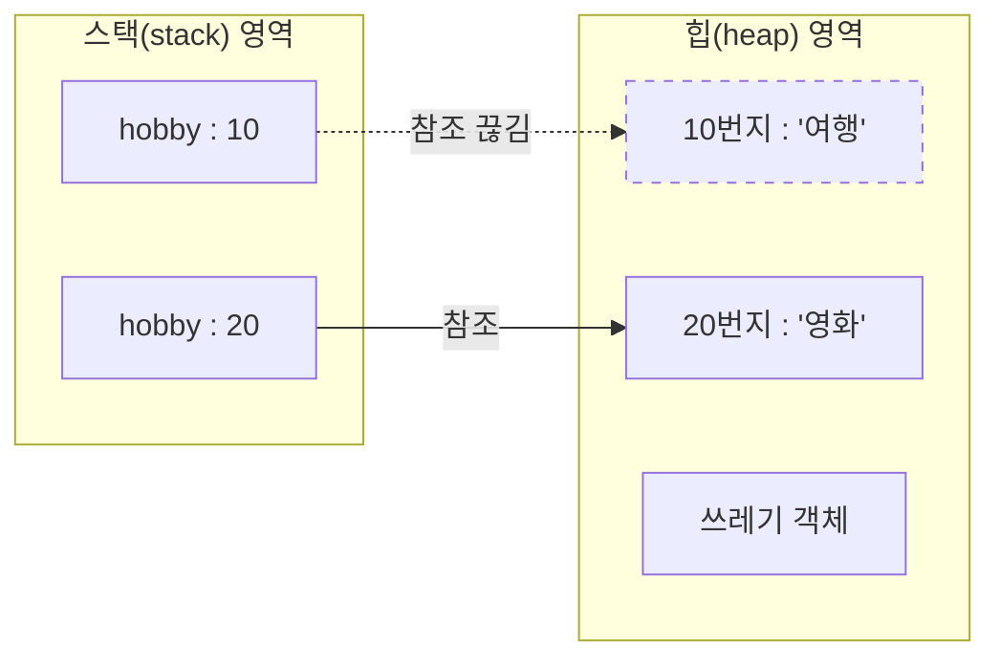

# 5.4 null과 NullPointerException

참조 타입 변수는 아직 번지를 저장하고 있지 않다는 뜻으로 `null`(널) 값을 가질 수 있다. `null`도 초기값으로 사용할 수 있기 때문에 `null`로 초기화된 참조 변수는 스택 영역에 생성된다. 

```java
String refVar1 = "자바";
String refVar2 = null;

```





참조 타입 변수가 `null` 값을 가지는지 확인하려면 다음과 같이 `==`, `!=` 연산을 수행할 수 있다. 

```java
refVar1 == null //결과: false
refVar1 != null //결과: true

refVar2 == null //결과: true
refVar2 != null //결과: false

```


자바는 프로그램 실행 도중에 발생하는 오류를 예외(Exception)라고 부른다. 참조 변수를 사용하면서 가장 많이 발생하는 예외 중 하나는 `NullPointerException`이다. 변수가 `null`인 상태에서 객체의 데이터나 메소드를 사용하려 할 때 이 예외가 발생한다. 다음 코드를 보자. 

```java
int[] intArray = null;
intArray[0] = 10; //NullPointerException

```


배열 변수 `intArray`에 `null`을 대입한 상태에서 배열 객체의 0 인덱스 항목에 10을 대입하는 코드를 실행하면 `NullPointerException`이 발생한다. 이유는 `intArray`가 참조하는 배열 객체가 없으므로 10을 저장할 수 없기 때문이다. 다음 코드도 보자. 

```java
String str = null;
System.out.println("총 문자 수: " + str.length()); //NullPointerException

```


`str` 변수에 `null`을 대입한 상태에서 문자열의 길이를 얻기 위해 `length()` 메소드를 호출하면 `NullPointerException`이 발생한다. 이유는 `str` 변수가 참조하는 `String` 객체가 없으므로 문자열의 길이를 구할 수 없기 때문이다. 

다음 예제에서 6라인과 9라인을 번갈아 가며 주석 처리하고 실행해 보면 `NullPointerException`이 발생하는 것을 알 수 있다. 

**[예제: NullPointerExceptionExample.java]**

```java
package ch05.sec04;

public class NullPointerExceptionExample {
    public static void main(String[] args) {
        int[] intArray = null;
        //intArray[0] = 10; //NullPointerException

        String str = null;
        //System.out.println("총 문자 수: " + str.length()); //NullPointerException
    }
}

```


**실행 결과**

```
Exception in thread "main" java.lang.NullPointerException: Cannot store to int array because "intArray" is null ...
Exception in thread "main" java.lang.NullPointerException: Cannot invoke "String.length()" because "str" is null ...

```


앞으로 `NullPointerException`이 발생하면 예외가 발생된 곳에서 `null`인 상태의 참조 변수가 사용되고 있음을 알아야 한다. 이것을 해결하려면 참조 변수가 객체를 정확히 참조하도록 번지를 대입해야 한다. 

경우에 따라서는 참조 타입 변수에 일부러 `null`을 대입하기도 한다. 프로그램에서 객체를 사용하려면 해당 객체를 참조하는 변수를 이용해야 하는데, 변수에 `null`을 대입하면 번지를 잃게 되므로 더 이상 객체를 사용할 수 없게 된다. 

```java
String hobby = "여행";
hobby = null;

```





어떤 변수에서도 객체를 참조하지 않으면 해당 객체는 프로그램에서 사용할 수 없는 객체가 된다. 즉 힙 메모리에는 있지만, 위치 정보를 모르기 때문에 사용할 수 없게 된다. 자바는 이러한 객체를 쓰레기로 취급하고, 쓰레기 수집기(Garbage Collector)를 실행시켜 자동으로 제거한다. 

사실 자바는 코드를 이용해서 객체를 직접 제거하는 방법을 제공하지 않는다. 객체를 제거하는 유일한 방법은 객체의 모든 참조를 없애는 것이다. 

다음 코드에서 "여행"에 해당하는 `String` 객체는 쓰레기가 된다. `hobby` 변수에 "영화"가 대입되면서 다른 `String` 객체의 번지가 대입되어 이전 번지를 잃어버리기 때문이다. 

```java
String hobby = "여행";
hobby = "영화";

```





**[예제: GarbageObjectExample.java]**

```java
package ch05.sec04;

public class GarbageObjectExample {
    public static void main(String[] args) {
        String hobby = "여행";
        hobby = null; // "여행"에 해당하는 String 객체를 쓰레기로 만듦

        String kind1 = "자동차";
        String kind2 = kind1; // kind1 변수에 저장되어 있는 번지를 kind2 변수에 대입
        kind1 = null; // "자동차"에 해당하는 String 객체는 쓰레기가 아님
        System.out.println("kind2: " + kind2);
    }
}

```


**실행 결과**

```
kind2: 자동차

```


10라인에서 `kind1` 변수에 `null`을 대입한다고 해서 "자동차"에 해당하는 `String` 객체가 쓰레기가 되지는 않는다. 그 이유는 `kind2` 변수가 여전히 참조하고 있기 때문이다. 

---
